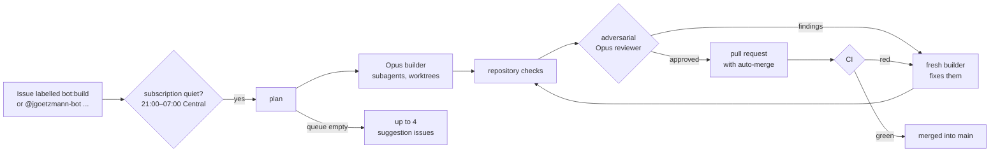

# JackiOh

A 1v1 card game: Hearthstone-style mana, combat and keywords played on Yu-Gi-Oh-style lanes with
a hidden trap backrow. Games are short: 20-card decks with no duplicates, 4 max mana, 30 health
and a 30-turn cap. Every card has a stronger Radiant form. A pure, seeded rules engine runs every
match, so any game replays exactly from its seed and action log. You can play hotseat, online, or
against a practice AI.

| Read | For |
|---|---|
| [`SPEC.md`](SPEC.md) | The rules, all 100 Core cards and 11 tokens, the architecture and the engine design. The only source of rules |
| [`BUILD.md`](BUILD.md) | The work order: milestones, acceptance criteria, the definition of done |
| [`REVIEW.md`](REVIEW.md) | The audit procedure |
| [`CLAUDE.md`](CLAUDE.md) | How the codebase is laid out and the rules every change follows |
| [`bot/README.md`](bot/README.md) | The night bot that builds issues while nobody is awake |

## Running it

Node 22.13 or newer and pnpm 11.

```sh
pnpm install
pnpm dev          # the client at http://localhost:5173 (hotseat at /dev/hotseat, AI at /practice)
pnpm test         # every vitest project
pnpm lint && pnpm typecheck
```

`CLAUDE.md` lists every command, including the server, the database suites and the Cypress specs.

## The night bot

`@jgoetzmann-bot` works from 21:00 to 07:00 Central. Label an issue `bot:build`, assign it the bot,
or comment `@jgoetzmann-bot <what you want>`. Overnight, Claude Opus builds it, the repository's
checks run, and an independent Opus reviewer tries to find every reason it should not ship. When
the reviewer approves, the bot opens a pull request that merges itself once CI passes.
`/harness status`, `/harness halt` and `/harness start` work in any comment. When the queue is
empty, the bot suggests improvements as issues, at most four at a time. It starts only when the
Claude subscription is quiet. It reads the usage twice, ten minutes apart, and holds back while
you or another agent are using it. The exception is its partner bot, bright-bots-harness, which
it may run alongside.



[`bot/README.md`](bot/README.md) has the full picture: commands, labels, safety, setup and
operations.
