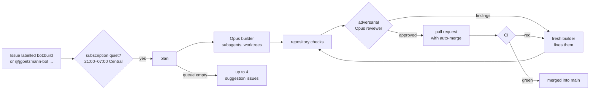

# JackiOh

A 1v1 card game: Hearthstone-style mana, combat and keywords played on Yu-Gi-Oh-style lanes with
a hidden trap backrow. Games are short: 20-card decks with no duplicates, 4 max mana, 30 health
and a 30-turn cap. Every card has a stronger Radiant form. A pure, seeded rules engine runs every
match, so any game replays exactly from its seed and action log. You can play hotseat, online, or
against a practice AI.

| Read | For |
|---|---|
| [`SPEC.md`](SPEC.md), [`spec/`](spec/README.md) | The rules, all 370 cards and 80 tokens of Core, Classic, Classic+ and Meditative, the architecture and the engine design, one note per section and per ruling. The only source of rules |
| [`BUILD.md`](BUILD.md) | The work order: milestones, acceptance criteria, the definition of done |
| [`REVIEW.md`](REVIEW.md) | The audit procedure |
| [`CLAUDE.md`](CLAUDE.md) | How the codebase is laid out, the rules every change follows, and every command |
| [`bot/README.md`](bot/README.md) | The night bot that builds issues while nobody is awake |

## How it is built

The rules engine, the 318 card scripts, the deck validator, the practice AI, the server and every
tool are Rust, in one Cargo workspace; the browser client is TypeScript and React, and runs the
engine and the AI as WebAssembly.

| Path | What |
|---|---|
| [`crates/engine`](crates/engine/README.md) | the rules, the wire types and the deck validator: pure and seeded |
| [`crates/cards`](crates/cards/README.md) | `catalog.json`, one script per card with its tests, the patch history |
| [`crates/ai`](crates/ai/README.md) | the practice opponent |
| [`crates/wasm`](crates/wasm/README.md) | the engine, cards and AI as WebAssembly for the browser |
| [`crates/server`](crates/server/README.md) | the HTTP API and the match actors, one binary in a Docker image |
| [`crates/tools`](crates/tools/README.md) | `jackioh`: fuzz, replay, the catalog and spec checks, the AI's gates, the training arena |
| [`apps/web`](apps/web/README.md) | the client (Vite, React) |
| [`e2e`](e2e/README.md) | the Cypress specs |
| [`training`](training/README.md) | the AI training lanes |

## Running it

Rust 1.97 (pinned in `rust-toolchain.toml`), Node 22.13 or newer and pnpm 11.

```sh
cargo test --workspace --features jackioh-engine/testkit   # every crate's tests
cargo jackioh fuzz --seeds 200                              # seeded random games, each replayed to its hash
pnpm install
pnpm --dir apps/web dev        # the client at http://localhost:5173 (hotseat at /dev/hotseat, AI at /practice)
pnpm --dir apps/web test       # the client's tests
```

`CLAUDE.md` lists every command, including the server, the database suites and the Cypress specs.

## The night bot

`@jgoetzmann-bot` works from 21:00 to 07:00 Central. Label an issue `bot:build`, assign it the bot,
or comment `@jgoetzmann-bot <what you want>`. Overnight, Claude Opus builds it, the repository's
checks run, and an independent Opus reviewer tries to find every reason it should not ship. When
the reviewer approves, the bot opens a pull request that merges itself once CI passes.
`/harness status`, `/harness halt` and `/harness start` work in any comment. When the queue is
empty, the bot suggests improvements as issues, at most four at a time. It starts only when the
Claude subscription is quiet. It reads the usage twice, ten minutes apart, and holds back while
you or another agent are using it. The exception is its partner bot, bright-bots-harness, which
it may run alongside.



[`bot/README.md`](bot/README.md) has the full picture: commands, labels, safety, setup and
operations.
