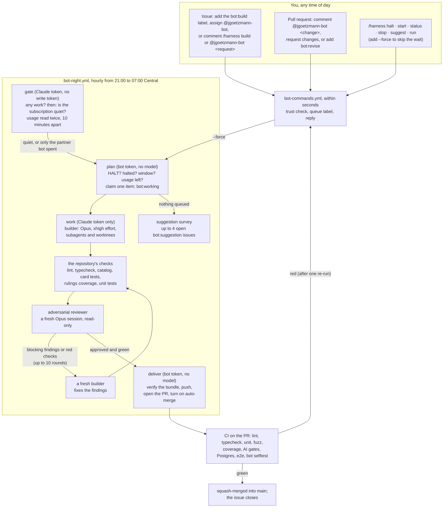

# The JackiOh night bot

While you sleep, `@jgoetzmann-bot` works through the issues you hand it. It builds each one with
Claude Opus at extra-high effort, runs the repository's checks, and has a second, independent
Opus session review the change adversarially. It goes round that loop until the reviewer
approves, then opens a pull request that merges itself into `main` once CI passes. When it has
nothing to do, it proposes improvements to the game as issues, at most four open at a time.

It runs entirely on GitHub Actions and is modelled on
[bright-bots-harness](https://github.com/jgoetzmann/bright-bots-harness), cut down to one
repository and reshaped around an adversarial review loop and auto-merge.



## Giving it work

Any of these queues an issue for the next night window (21:00 to 07:00 America/Chicago):

- add the **`bot:build`** label;
- **assign** `@jgoetzmann-bot`;
- comment **`/harness build`**, or **`@jgoetzmann-bot <what you want>`**. Your words become part
  of the request.

To change one of its pull requests, comment **`@jgoetzmann-bot <what to change>`** or
**`/harness revise <notes>`** on it, submit a review that requests changes, or add **`bot:revise`**.
It also revises its own pull requests without being asked: when CI fails twice on the same
commit (it re-runs the failed jobs once first, in case the failure was flaky), and when `main`
moves on and leaves the branch with conflicts. After three tries at fixing CI on one pull request
it stops and labels it `bot:blocked`. Asking for a revision turns auto-merge off until the
revision lands. It can revise a pull request a person opened too, as long as the branch is in this
repository. It never turns on auto-merge for someone else's pull request.

A comment you leave while it is working on the thread is not lost: once the run ends, it queues
another pass to answer it. Auto-merge waits for that pass.

Add **`--force`** to `build`, `revise` or `suggest` to start now instead of waiting for the window.
A forced item stays forced until it is done, so it runs even if a later scheduled run picks it up
outside the window.

The issue is the spec, so write it the way you would for a careful contributor: what should
happen, where, and how you would check it. The builder reads the issue body, every comment from
people on the trust list, `CLAUDE.md` and `SPEC.md`. Comments from anyone else are left out.

## No request is lost

Every way of asking either gets an answer at once, or is found again later:

- **Commands** in a comment, a line comment on a pull request's diff, or an edit that adds a
  command. The bot puts 👀 on the comment, replies, and adds 🚀; a request for model work also gets
  👍, and later reactions follow it to its answer ([what the reactions mean](#what-the-reactions-mean)).
  If a command fails, the reply says so; the other commands in the same comment still run.
- **Naming the bot mid-sentence** ("thanks @jgoetzmann-bot, could you…") gets a reply explaining
  how to phrase a request. The bot does not guess a build from it, and does not ignore it.
- **The sweep** runs every half hour (`harness sweep`, and on demand from the Actions tab). It
  reads the last three days back from GitHub and answers anything no handler answered:
  - a trusted command (in a comment, a diff comment or a review) that nobody claimed;
  - an assignment nothing queued;
  - a review asking for changes on a bot pull request, newer than anything the bot acted on;
  - a failed, cancelled or broken CI or `bot selftest` run on a bot pull request's head.

  It leaves anything younger than ten minutes to the handler that may still be running, so
  nothing is answered twice.
- **Labels are the queue**, so a `bot:build` or `bot:revise` label is never lost, even if no
  handler ever saw it being added.
- **A request made while the bot is working** on the thread gets another pass once the run
  ends, and auto-merge waits for it. A request means a command, naming the bot, a review asking
  for changes, or a queue label. A plain comment is read as part of the thread, but it does not
  start a pass of its own. This applies to requests on the issue, on its pull request, and on
  the issue a pull request closes. A `/harness stop` holds the thread until the run has stopped,
  so "stop, then do this instead" gets built.
- **Each request runs once.** A comment, edit or review is claimed in the state file before it
  runs, so the event handler and the sweep never both act on it. An edit runs only the lines it
  added, and only when the comment's author made the edit.
- **Commands are read the way people write them**: in a list, in backticks, in bold. A control
  word in plain words ("@jgoetzmann-bot start with option A") is a request, not a command, unless
  a colon follows it ("@jgoetzmann-bot halt: away this week"). One word that is a near miss of a
  verb ("stauts") runs nothing and gets a "did you mean", rather than a build of the typo.
- **A run that dies without a result** goes to the back of the queue and is blocked after two
  in a row. A failure outside any item (the CLI refusing to start, a broken install on `main`)
  charges nothing and pauses runs for 50 minutes.
- **A stop or halt said after the last checkpoint** still counts: deliver checks again, so
  nothing merges that you stopped.
- **`--force`** and **`/harness run`** start a run at once. Both are written down first, so if
  GitHub refuses to start one, or a newer run replaces it, the next hourly run picks it up
  (`bot-night` fires every hour, all day).
- **A run that dies** (cancelled, timed out, crashed) leaves its item for the next run, which
  requeues it. A failure outside any item (a missing secret, the CLI refusing to start) is
  never charged to the item.

## Commands

Put one command per line in any issue or PR comment, as `/harness <verb>`, `/harness-<verb>` or
`@jgoetzmann-bot <verb>`; the three read the rest of the line the same way. Quoted lines and fenced
code blocks are ignored, so quoting the bot back at it runs nothing.

| Verb | What it does | Where | Level |
|---|---|---|---|
| `build [notes]` | queue this issue (on a PR, same as `revise`) | issue | 2 |
| `revise <notes>` | queue a revision of this pull request | PR | 2 |
| `stop` | take it out of the queue; a running job gives up at its next checkpoint | issue or PR | 2 |
| `suggest` | ask for a suggestion survey the next time the queue is empty | anywhere | 2 |
| `status` | halt state, window, usage, what is running and queued | anywhere | 1 |
| `help [verb]` | the commands, or one of them in detail with an example | anywhere | 1 |
| `halt [reason]` | stop all model work until `start` | anywhere | 3 |
| `start` | lift a halt (`start --force` also starts a run) | anywhere | 3 |
| `run [#n]` | start a night run now, outside the window if need be | anywhere | 3 |

Aliases: `work` (build), `fix` and `update` (revise), `resume` and `unhalt` (start), `go` (run).

- **Anything else is a request**, after either prefix: a build on an issue, a revision on a PR,
  with your words as the notes. `/harness make the Coin spin` and `@jgoetzmann-bot make the Coin
  spin` are the same request.
- **A misspelt verb runs nothing.** One word that is a letter or two off a verb or alias
  (`stauts`, `biuld --force`, `rnu #5`) gets "did you mean `status`?" instead of a build of the typo.
- **Plain English after the bot's name.** After `@jgoetzmann-bot`, a control verb (`stop`,
  `status`, `start`, `suggest`, `halt`, `run`, `help`) followed by words that do not fit it is read
  as a request: `@jgoetzmann-bot stop using the old sprite` asks for a change, it does not stop
  anything. Write the verb alone for the command, or put a colon after it to make the words its
  own: `@jgoetzmann-bot halt: away this week`. After `/harness` the verb always wins.

### What the reactions mean

The bot reacts to your comment as your request moves along, so you can see that a model has it
without reading the thread:

| Reaction | Meaning |
|---|---|
| 👀 | seen; the bot is answering |
| 👍 | a model will read it: it is queued, or noted for the next pass of a run already going |
| 🚀 | answered: the bot replied (the sweep reads this as "handled") |
| ❤️ | a run has it: a model is reading it now |
| 🎉 | done: the run that read it finished with an answer (a pull request opened or updated, a revision pushed, a survey done) |
| 😕 | it ended without an answer: blocked, stopped, or given up on after too many failures |

A command that needs no model (`status`, `help`, `halt`, `start`, `run`, `stop`) gets 👀 and 🚀
only. When a run is interrupted (the time budget, the usage limit, a halt), its requests go back to
waiting and get ❤️ again from the next run. A request left on an issue while it is being built
moves to the pull request the build opens. A review cannot take a reaction, so a request made in a
review's body gets the reply but not the reactions.

**Who may do what** comes from [`.harness/trust.txt`](../.harness/trust.txt): 3 operator,
2 maintainer, 1 asker. A command from anyone else is ignored without a reply. A line with
`id:<number>` counts only for that exact GitHub account; a line without one counts only when
GitHub says the person is an owner, member or collaborator of the repository. `--force` always
needs level 3.

## Labels

| Label | Meaning |
|---|---|
| `bot:build` | an issue waiting for the night window |
| `bot:revise` | a pull request waiting for a revision |
| `bot:working` | a run holds it right now |
| `bot:blocked` | it needs a person: a question, findings the reviewer would not let go of, or repeated failures |
| `bot:pr-open` | the issue has an open bot pull request |
| `bot:pr` | a pull request the bot opened |
| `bot:suggestion` | an improvement the bot proposes; add `bot:build` to have it built, close it to say no |
| `bot:needs-review` | a bot pull request that touches a review-only path; a person merges it |

## It waits for the subscription to be quiet

The bot shares one Claude subscription with you and with
[bright-bots-harness](https://github.com/jgoetzmann/bright-bots-harness). So before a run claims
anything, the `gate` job checks two things:

1. **Is there work?** (`harness peek`, which reads and changes nothing). If not, the run ends
   here and spends nothing.
2. **Is anyone else using the subscription?** (`harness quiet`). It reads the subscription's
   usage with the smallest call there is (one turn of Haiku in an empty folder), waits 10
   minutes, and reads it again.
   - If usage did not rise, nobody else is working, and the run goes ahead.
   - If it rose while bright-bots-harness was in one of its spending steps ("Run planned items",
     "Discover and propose", "Sweep keywords", "Reconcile stale"), the rise is the partner's.
     The bot goes ahead anyway, so the two bots can run at the same time.
   - Any other rise is you or another agent, so it waits another 10 minutes and looks again.
     It keeps looking for up to two hours, then gives up until the next run.

bright-bots-harness applies the same rule the other way round: its partner is this bot's "Build,
check and review" step. The gate's own step, "Wait until the subscription is quiet", never counts
as spending. A forced run (`--force`, `/harness run`, or an item queued with `--force`) skips the
wait. The settings are `quiet` in `.harness/config.json`.

There are two things it cannot tell apart. It cannot separate you from the partner while the
partner is spending. And it cannot see a run of either bot that happens somewhere other than
GitHub Actions, such as the harness's local `bb` container.

## One night, step by step

1. **plan** (seconds, no model). It runs only after the gate says go. It stops at once if `.harness/HALT` is on `main`, if someone
   said `/harness halt`, if the window is closed (unless forced), or if the last usage reading is
   over a stop (`usage_stop`: 98% of the 5-hour session, 90% of the week). It requeues anything a
   dead run left `bot:working` and queues a revision for any bot pull request that conflicts with
   `main`. Then it claims one item in this order: forced requests, revisions, oldest builds. With
   nothing queued, it runs a suggestion survey if one is due (at most one every 20 hours, and only
   while fewer than four are open).
2. **work** (up to about five and a half hours). A worktree on `bot/issue-<n>` (or the pull
   request's own branch, with `main` merged in), then `pnpm install`. Then up to ten rounds:
   - a builder session (`claude --model opus --effort xhigh`) that can read, edit, run commands,
     start subagents and make worktrees;
   - the repository's checks from `.harness/config.json`, with any check that is also red on
     untouched `main` marked as not this change's fault;
   - a reviewer session with the same model, allowed to read and run things but not to edit, told
     to find every reason the change should not ship;
   - on blocking findings or red checks, a **fresh** builder gets both and fixes them.

   The harness also puts back anything the builder changed under `.github/`, `.harness/` or
   `bot/`, and records that as a blocking finding. Between steps it checks for a halt, a `stop`,
   the usage stop and the clock. When any of those says stop, it commits what it has as work in
   progress so the next run can pick it up. An item that runs out of time three runs in a row is
   blocked as too big for one night. A failure that is not the item's fault (an expired Claude
   token, the CLI refusing to start, dependencies that will not install on untouched `main`)
   leaves the item queued without counting against it, and starts no further run that night.
   Anything the model's session leaves running is killed when it ends. An approved change is
   delivered exactly as the reviewer saw it: a commit that appears after the review is dropped.
3. **deliver** (seconds, no model). It trusts nothing the model job wrote. The bundle's branch
   must be the head the result names and descend from where the work started, the branch on
   GitHub must not have moved meanwhile, and no forbidden path may change. Only then does it push
   (never with force) and open or update the pull request. It turns on auto-merge only when no
   review-only path changed and `main`'s protection requires every CI check. A change the
   reviewer never approved becomes a draft PR labelled `bot:blocked`, with the findings, and never
   merges by itself. Then, if more work is queued and the window is still open, it starts the next
   run at once.

## Safety

- **Two gates before `main`.** An independent reviewer approves the change inside the run. Then
  every CI check must pass before auto-merge merges anything. The deliver job turns auto-merge on
  only after reading `main`'s branch protection and finding every check in `required_checks`
  there. If protection is missing, it leaves the pull request for a person.
- **Some changes always wait for a person.** A change that touches a review-only path
  (`review_paths`) still becomes a pull request, but it is labelled `bot:needs-review`, you are
  asked to review it, and auto-merge stays off. The review-only paths are the files that define
  what the checks do or how the game deploys: every `package.json`, the lockfile, the vitest,
  vite, eslint, TypeScript and Cypress configs, `scripts/`, `vercel.json`, `render.yaml` and the
  database migrations.
- **It cannot change its own rules.** `.github/`, `.harness/`, `bot/`, `.claude/`, `.mcp.json`,
  editor and devcontainer config, git hooks, `.gitattributes` and `.gitmodules` are forbidden
  paths (`forbidden_paths`). They are enforced twice: in the work job, which puts such a change
  back and tells the next builder, and in the deliver job, which refuses to push a bundle that
  has one. Untracked Claude settings and `.mcp.json` are deleted before every model call, and the
  calls run with `--strict-mcp-config`.
- **The model never holds a GitHub write token.** The `work` job has the Claude token and a
  read-only Actions token, and the model's own environment has neither GitHub token. Pushing,
  commenting and labelling happen in `plan` and `deliver`, which run no model.
- **Text from GitHub is data.** Issue text (the title included), comments, reviews and CI logs
  reach the model fenced and labelled as data. Comments from people outside the trust list are
  left out, and their commands never start a runner.
- **Three off switches.** `/harness halt` (with `start` to undo it), `/harness stop` for one item,
  and a committed `.harness/HALT` file, which only someone who can push to `main` can lift.
- **Usage.** Every model call reports the subscription's 5-hour and 7-day usage. Past the stops
  in `usage_stop`, no new call starts, and a refused call pauses the item until the limit resets.

**What it cannot rule out.** The model has a shell and the Claude token, because it needs the
token to run. Network tools such as `curl`, `wget` and `ssh` are denied, but that only slows a
determined model down. And anything the model writes into a pull request is public once it is
pushed. So a prompt injection that fools the model could, in principle, leak the Claude token.
The defences are upstream of that: only people on the trust list can start work, text from
anyone else is left out, and the token is a `claude setup-token` token that you can revoke and
replace at any time. Read an issue from a stranger before you label it `bot:build`.

Transcripts of the model's sessions stay on the runner unless `upload_transcripts` is on. The
repository is public, so an uploaded artifact is readable by anyone. `result.json` (the builder's
report, the review findings and the check output) and the git bundle are always uploaded, for 14
days.

## Setting it up

1. **Secrets** (Settings → Secrets and variables → Actions):
   - `CLAUDE_CODE_OAUTH_TOKEN`: from `claude setup-token` on a machine logged in to the Claude
     subscription the bot should spend.
   - `BOT_GITHUB_TOKEN`: a classic token for the `jgoetzmann-bot` account, which must be a
     collaborator with write access. It needs the `public_repo` and `workflow` scopes, and
     nothing else. It needs `workflow` because merging `main` into a branch can carry a
     workflow change along. A fine-grained token will not do: it cannot reach a repository its
     account only collaborates on. Starting runs and re-running CI jobs use the job's own
     Actions token, so the bot's token needs no `repo` scope. Without this token the bot falls
     back to the Actions token: its comments come from `github-actions[bot]`, and its pull
     requests do not start CI, so auto-merge never fires.
2. **Labels, the state branch and the repository settings**, once, with an admin token (a
   logged-in `gh` works):

   ```sh
   cd bot
   python3 -m harness setup --repo-settings   # labels, bot-state branch, auto-merge, branch protection
   python3 -m harness doctor                  # says what is still missing
   ```

   `--repo-settings` allows auto-merge, deletes merged branches, and protects `main` so that
   every check in `required_checks` must pass before anything merges. Admins can still push to
   `main` directly.
3. **Try it**: open an issue, comment `/harness build --force`, and watch the `bot-night` run in
   the Actions tab. `workflow_dispatch` on `bot-night` also takes `dry_run`, which records every
   GitHub write instead of sending it.

## Operating it

| I want to | Do this |
|---|---|
| see what it is doing | `/harness status` anywhere, or `python3 -m harness status` in `bot/` |
| stop everything now | `/harness halt`; for a lock nobody can lift by comment, commit `.harness/HALT` |
| start again | `/harness start` (and delete `.harness/HALT` if you committed it) |
| run now, outside the window | `/harness run`, `/harness build --force`, or Actions → bot-night → Run workflow |
| stop one item | `/harness stop` on its issue or pull request |
| retry something it gave up on | fix what it asked about, then `/harness build`; `python3 -m harness forget <n>` clears the failure count |
| read what the model did | the `work` artifact of the run: `result.json` and the bundle (set `upload_transcripts` to keep the full sessions too) |
| change the window, model, effort, rounds, stops or checks | edit `.harness/config.json` in a pull request |
| let someone else command it | add a line to `.harness/trust.txt` |

## Working on the bot

The bot is Python 3.12+ with the standard library only. The tests use fakes for GitHub and the
model, and real git.

```sh
cd bot
python3 -m unittest discover -s tests -t .   # the suite (about ten seconds)
python3 -m harness --help                     # every command
```

`bot selftest` in CI runs the suite on Python 3.12 and 3.13 and runs actionlint over the bot's
workflows. The prompts are in `bot/prompts/`, one per role: `system`, `build`, `fix`, `revise`,
`review` and `suggest`. The bot cannot edit anything in `bot/`, `.harness/` or
`.github/workflows/`, so changes there come from people.

| Module | Job |
|---|---|
| `config.py` | `.harness/config.json` and the environment; the only reader of `os.environ` |
| `gh.py` | the GitHub client; the only module that sends a token or writes to GitHub |
| `trust.py`, `commands.py` | who may command it, and how a comment is read |
| `events.py`, `queue.py` | the event workflow: commands, labels, assignment, reviews, CI |
| `asks.py` | the reactions that follow a request from its comment to its answer |
| `plan.py`, `work.py`, `deliver.py` | the jobs of a night run (`plan.peek` is the gate's first question) |
| `quiet.py` | the gate's second question: is anyone else spending the subscription |
| `runner.py` | `claude -p` with stream-json usage readings, plus the test fake |
| `git.py`, `gates.py` | worktrees, commits, bundles, pushes; the repository's checks |
| `threads.py`, `prompts.py`, `verdicts.py` | what the model is told, and reading what it answers |
| `state.py`, `status.py`, `clock.py` | the state file on `bot-state`, the status report, the window |
