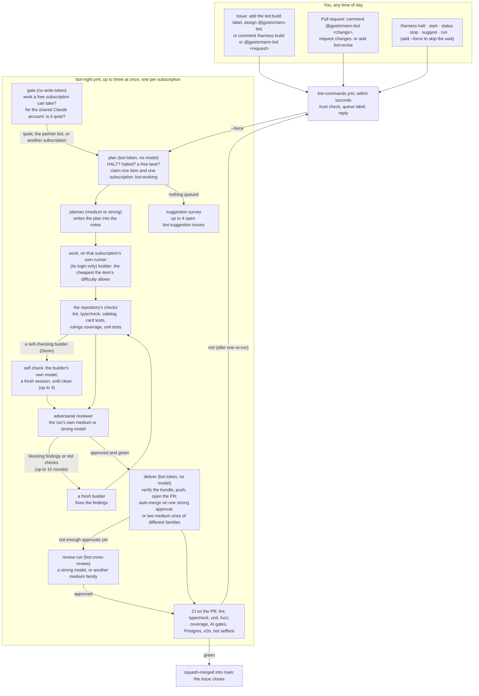

# The JackiOh night bot

`@jgoetzmann-bot` works through the issues you hand it, on whichever of your subscriptions is
free: up to four Claude accounts (Opus at extra-high effort), ChatGPT through the Codex CLI,
Google through the Antigravity CLI (`agy`), Meta through Muse Code and Cognition through the
Devin CLI, each with its own hours
and limits ([Subscriptions](#subscriptions)). Up to ten items run at once: the Claude accounts' on
GitHub's runners, and at most six on the bot's own machine. Every model has a tier (weak,
medium or strong) and every item a difficulty (easy, medium or hard), which decides who may plan,
build and review it ([Difficulty and tiers](#difficulty-and-tiers)). A medium or strong model plans
each item first; the cheapest builder the owner's usage order allows builds it, runs the
repository's checks, and an adversarial reviewer reads the change, going round until the reviewer
approves. A change merges itself into `main` once CI passes and one strong model, or two medium
models of different families, approved the same commit. When it has nothing to do, it proposes
improvements to the game as issues, at most four open at a time.

It runs on GitHub Actions. The model sessions run on the bot's own machine on AWS, where each
subscription is a Linux user of its own with its own runner ([`machine/`](machine/README.md));
everything that holds a GitHub write token runs on GitHub's runners. It is modelled on
[bright-bots-harness](https://github.com/jgoetzmann/bright-bots-harness), cut down to one
repository and reshaped around an adversarial review loop and auto-merge.



## Giving it work

Any of these queues an issue for the next run a free subscription can take (the reply says
when that is):

- add the **`bot:build`** label;
- **assign** `@jgoetzmann-bot`;
- comment **`/harness build`**, or **`@jgoetzmann-bot <what you want>`**. Your words become part
  of the request.

To change one of its pull requests, comment **`@jgoetzmann-bot <what to change>`** or
**`/harness revise <notes>`** on it, submit a review that requests changes, or add **`bot:revise`**.
It also revises its own pull requests without being asked: when CI fails twice on the same
commit (it re-runs the failed jobs once first, in case the failure was flaky), and when `main`
moves on and leaves the branch with conflicts. After three tries at fixing CI on one pull request
it stops and labels it `bot:blocked`. Asking for a revision turns auto-merge off until the
revision lands. It can revise a pull request a person opened too, as long as the branch is in this
repository. It never turns on auto-merge for someone else's pull request.

A comment you leave while it is working on the thread is not lost: once the run ends, it queues
another pass to answer it. Auto-merge waits for that pass.

Add **`--force`** to `build`, `revise` or `suggest` to start now, on a subscription outside its
hours if need be (its usage caps still hold). A forced item stays forced until it is done.

Label an issue **`difficulty:easy`**, **`difficulty:medium`** or **`difficulty:hard`** to say
how hard it is ([Difficulty and tiers](#difficulty-and-tiers)); with none it counts as medium.
`difficulty:hard` keeps it for Opus: planning, building, every revision and every review.

### Priority and `human`

Three labels set the order queued work is picked up in: **`priority:high`** first, then
**`priority:medium`**, then work with no priority label, then **`priority:low`**. On a thread with
more than one, the highest counts, and any other `priority:*` label counts as none. Inside a tier
the order is the usual one ([who takes what](#subscriptions)), and a forced item still goes before
every tier. A priority label never makes work eligible or ineligible.

**`human`** takes work away from the bot altogether: people do it. That is a decision, an
account or a secret, repository work the bot may not do (a change to `bot/`, `.harness/` or
`.github/`), or work a person is already building. No model picks it up, whatever else it is
labelled, forced or not, and the bot never touches it: it is never queued, planned or built,
gets no `bot:*` stage label, and a conflicted `human` pull request is not revised. A
`/harness build`, an assignment or a mention gets one reply saying so, and nothing else. Take
the label off to hand it to the bot.

**Dependencies.** An issue waits, unless it is forced, while something it waits for is still open:
an issue a line of its description names ("Blocked by #125", "Depends on #12 and #14", "Do not
start until #125 has merged"; the Plan section does not count), an issue GitHub's own issue
dependencies say blocks it, or an earlier part of the same patch (a title such as
`Patch v0.2.X (part 3 of 4): …` waits for parts 1 and 2 of 4 under the same name,
[docs/issues-and-patches.md](../docs/issues-and-patches.md)). Revisions and reviews never wait.

Label names match whatever their case. Labels are read afresh at every pickup, so a change counts
at the next run, and a run already going is never stopped. The pull request the bot opens for an
issue, a draft or not, starts with the issue's difficulty and priority labels, so its revisions and
its reviews follow the same rules. A label changed on the issue after that, `human` included, does
not reliably reach the pull request (a later build of the issue copies added labels again, never
removed ones): change it there too. The `peek` and `plan` steps of a night run log the chosen
item's priority tier and difficulty, the model and tier picked for each role, any step up in tier
and why, and every item passed over because of `human` or a dependency.

The issue is the spec, so write it the way you would for a careful contributor: what should
happen, where, and how you would check it. The builder reads the issue body, every comment from
people on the trust list, `CLAUDE.md` and `SPEC.md`. Comments from anyone else are left out.

## No request is lost

Every way of asking either gets an answer at once, or is found again later:

- **Commands** in a comment, a line comment on a pull request's diff, or an edit that adds a
  command. The bot puts 👀 on the comment, replies, and adds 🚀; a request for model work also gets
  👍, and later reactions follow it to its answer ([what the reactions mean](#what-the-reactions-mean)).
  If a command fails, the reply says so; the other commands in the same comment still run.
- **Naming the bot mid-sentence** ("thanks @jgoetzmann-bot, could you…") gets a reply explaining
  how to phrase a request. The bot does not guess a build from it, and does not ignore it.
- **The sweep** runs every ten minutes (`harness sweep`, and on demand from the Actions tab). It
  reads the last three days back from GitHub and answers anything no handler answered:
  - a trusted command (in a comment, a diff comment or a review) that nobody claimed;
  - an assignment nothing queued;
  - a review asking for changes on a bot pull request, newer than anything the bot acted on;
  - a failed, cancelled or broken CI or `bot selftest` run on a bot pull request's head.

  It leaves anything younger than ten minutes to the handler that may still be running, so
  nothing is answered twice. Last, it starts a night run when one should be going and none is:
  GitHub drops scheduled runs, sometimes a whole night of `bot-night`'s hourly ones, so when the
  gate's own question (`harness peek`) finds work and no `bot-night` run is queued or going, the
  sweep dispatches one. A dropped hourly run costs about ten minutes, not the night.
- **Labels are the queue**, so a `bot:build` or `bot:revise` label is never lost, even if no
  handler ever saw it being added.
- **A request made while the bot is working** on the thread gets another pass once the run
  ends, and auto-merge waits for it. A request means a command, naming the bot, a review asking
  for changes, or a queue label. A plain comment is read as part of the thread, but it does not
  start a pass of its own. This applies to requests on the issue, on its pull request, and on
  the issue a pull request closes. A `/harness stop` holds the thread until the run has stopped,
  so "stop, then do this instead" gets built.
- **Each request runs once.** A comment, edit or review is claimed in the state file before it
  runs, so the event handler and the sweep never both act on it. An edit runs only the lines it
  added, and only when the comment's author made the edit.
- **Commands are read the way people write them**: in a list, in backticks, in bold. A control
  word in plain words ("@jgoetzmann-bot start with option A") is a request, not a command, unless
  a colon follows it ("@jgoetzmann-bot halt: away this week"). One word that is a near miss of a
  verb ("stauts") runs nothing and gets a "did you mean", rather than a build of the typo.
- **A run that dies without a result** goes to the back of the queue and is blocked after two
  in a row. A failure outside any item (the CLI refusing to start, a broken install on `main`)
  charges nothing and pauses that subscription for 50 minutes, longer each time in a row
  ([who takes what](#subscriptions)).
- **A stop or halt said after the last checkpoint** still counts: deliver checks again, so
  nothing merges that you stopped.
- **`--force`** and **`/harness run`** start a run at once. Both are written down first, so if
  GitHub refuses to start one, or a newer run replaces it, the next hourly run picks it up
  (`bot-night` fires every hour, all day).
- **A run that dies** (cancelled, timed out, crashed) leaves its item for the next run, which
  requeues it. A failure outside any item (a missing secret, the CLI refusing to start) is
  never charged to the item.

## Commands

Put one command per line in any issue or PR comment, as `/harness <verb>`, `/harness-<verb>` or
`@jgoetzmann-bot <verb>`; the three read the rest of the line the same way. Quoted lines and fenced
code blocks are ignored, so quoting the bot back at it runs nothing.

| Verb | What it does | Where | Level |
|---|---|---|---|
| `build [notes]` | queue this issue (on a PR, same as `revise`) | issue | 2 |
| `revise <notes>` | queue a revision of this pull request | PR | 2 |
| `stop` | take it out of the queue; a running job gives up at its next checkpoint | issue or PR | 2 |
| `suggest` | ask for a suggestion survey the next time the queue is empty | anywhere | 2 |
| `status` | halt state; which subscriptions are running what, for how long, with each run's link; each subscription's hours and usage; the queue | anywhere | 1 |
| `help [verb]` | the commands, or one of them in detail with an example | anywhere | 1 |
| `halt [reason]` | stop all model work until `start` | anywhere | 3 |
| `start` | lift a halt (`start --force` also starts a run) | anywhere | 3 |
| `run [#n]` | start a run now, outside a subscription's hours if need be | anywhere | 3 |

Aliases: `work` (build), `fix` and `update` (revise), `resume` and `unhalt` (start), `go` (run).

- **Anything else is a request**, after either prefix: a build on an issue, a revision on a PR,
  with your words as the notes. `/harness make the Coin spin` and `@jgoetzmann-bot make the Coin
  spin` are the same request.
- **A misspelt verb runs nothing.** One word that is a letter or two off a verb or alias
  (`stauts`, `biuld --force`, `rnu #5`) gets "did you mean `status`?" instead of a build of the typo.
- **Plain English after the bot's name.** After `@jgoetzmann-bot`, a control verb (`stop`,
  `status`, `start`, `suggest`, `halt`, `run`, `help`) followed by words that do not fit it is read
  as a request: `@jgoetzmann-bot stop using the old sprite` asks for a change, it does not stop
  anything. Write the verb alone for the command, or put a colon after it to make the words its
  own: `@jgoetzmann-bot halt: away this week`. After `/harness` the verb always wins.

### What the reactions mean

The bot reacts to your comment as your request moves along, so you can see that a model has it
without reading the thread:

| Reaction | Meaning |
|---|---|
| 👀 | seen; the bot is answering |
| 👍 | a model will read it: it is queued, or noted for the next pass of a run already going |
| 🚀 | answered: the bot replied (the sweep reads this as "handled") |
| ❤️ | a run has it: a model is reading it now |
| 🎉 | done: the run that read it finished with an answer (a pull request opened or updated, a revision pushed, a survey done) |
| 😕 | it ended without an answer: blocked, stopped, or given up on after too many failures |

A command that needs no model (`status`, `help`, `halt`, `start`, `run`, `stop`) gets 👀 and 🚀
only. When a run is interrupted (the time budget, the usage limit, a halt), its requests go back to
waiting and get ❤️ again from the next run. A request left on an issue while it is being built
moves to the pull request the build opens. A review cannot take a reaction, so a request made in a
review's body gets the reply but not the reactions.

**Who may do what** comes from [`.harness/trust.txt`](../.harness/trust.txt): 3 operator,
2 maintainer, 1 asker. A command from anyone else is ignored without a reply. A line with
`id:<number>` counts only for that exact GitHub account; a line without one counts only when
GitHub says the person is an owner, member or collaborator of the repository. `--force` always
needs level 3.

## Labels

| Label | Meaning |
|---|---|
| `bot:build` | an issue waiting for a free subscription |
| `bot:needs-plan` | the Needs plan stage, beside `bot:build`: it waits for a strong model's plan, which goes into its description |
| `bot:planned` | it has a plan, in its description (the builder starts from it); it stays after the item leaves the queue |
| `bot:revise` | a pull request waiting for a revision |
| `bot:cross-review` | a bot pull request waiting for a review run before auto-merge: one strong model, or a second medium one |
| `bot:working` | a run holds it right now |
| `bot:blocked` | it needs a person: a question, findings the reviewer would not let go of, or repeated failures |
| `bot:stuck` | beside `bot:blocked`: a build or revision used every review round (`max_review_cycles`, 10) without an approval. Its comment says why, round by round (`harness/failures.py`): the builder's sessions, the checks that were red, the reviewer's verdicts and the findings that kept coming back. A person reads it before anyone tries again; an approval takes the label off |
| `bot:pr-open` | the issue has an open bot pull request |
| `bot:pr` | a pull request the bot opened |
| `bot:suggestion` | an improvement the bot proposes; add `bot:build` to have it built, close it to say no |
| `bot:needs-review` | a bot pull request that touches a review-only path; a person merges it |
| `difficulty:easy`, `difficulty:medium`, `difficulty:hard` | the weakest tier that may build it: weak, medium, strong; none counts as medium, and with several the hardest counts ([below](#difficulty-and-tiers)) |
| `priority:high`, `priority:medium`, `priority:low` | the pickup order: high, medium, none, low ([above](#priority-and-human)) |
| `human` | people do it; the bot never queues, plans, builds or labels it |

## Triage

`triage.yml` labels, assigns, titles, types and links every issue or pull request that someone
trusted opens, from a Devin call (`triage.py`). To run it on any thread again, with whatever it has
already: `gh workflow run triage.yml -f number=<n>` (or **Run workflow** on the triage workflow's
Actions page). Its Devin call runs on the bot's AWS machine either way.

- **Who:** the author must be an owner, member or collaborator, or on `.harness/trust.txt`, and not
  the bot. Anyone else's issue or pull request is left alone, so a stranger's text never reaches
  the machine.
- **Three jobs:**
  - **`gate`**, on GitHub's runner, decides whether to triage. A new thread with everything
    already set is skipped, unless its text names a blocker or it is a part of a patch; a thread a
    person called triage on always goes.
  - **`classify`**, on Devin's own runner (`night-vm-devin`), reads the title and body through the
    API with a read-only token. It fences them as data in a prompt and runs Devin read-only in an
    empty directory.
  - **`apply`**, on GitHub's runner, holds the write token and runs no model.
- **What `apply` changes:**
  - **Labels:** only the repository's own, never a `bot:` one.
  - **Assignees:** a human task goes to MaxGoetzmann and jgoetzmann, with `human`, which the
    night bot never touches. A bot task (an issue) is assigned to the bot, which queues it (the sweep answers
    the assignment).
  - **Title:** an issue's title follows `docs/issues-and-patches.md`, but only when its old title
    doesn't already, and only if every version number survives. A pull request keeps its title,
    which becomes the squash commit's subject, and is never assigned to the bot.
  - **Type:** an issue gets one of the organisation's issue types (Task, Bug or Feature; read from
    the org, or those three when the token can't read them) if it has none. A pull request has no
    type. GitHub drops a type it won't take without an error, so `apply` reads it back and says so.
  - **Dependencies** (issues only), as GitHub issue dependencies, which hold the night bot's build
    while the blocker is open ([Dependencies](#priority-and-human)):
    - **blocked by** each open issue its text names ("Blocked by #125", "Depends on #12", "Do not
      start until #125 has merged"), each earlier part of its patch that is still open (same name
      and same "of m"), and each open issue Devin says must come first;
    - **blocking** each open issue Devin says waits for it;
    - **a sub-issue of** its patch's open tracker, for a "part n of m" title with no parent yet,
      when Devin names it and the tracker shares its version.

    Only open issues, never the issue itself, never one linked already either way, at most five of
    each. The links from the issue's own text and title are made even when Devin gave no answer.
- **Issues triage never types.** The sweep (every ten minutes, in the status loop) types every
  open issue still without one: a bot's (the CI-duration alerts, the status issue), which never
  reaches triage, at once; anyone else's after three hours, so triage, which can wait that long
  for a free Devin runner, goes first. It reads the title and labels (`triage.fallback_type`):
  a failure is a Bug; tooling, CI, the bot and trackers a Task; something new a Feature.
- **It only adds.** A person's labels, assignees, conventional title, type and links stay. A priority or a model
  tier a person chose gets no second one.
- **When it can't:** a failure, or Devin past its `off_from` (2026-10-15), skips quietly.
- **Waiting:** `classify` shares `night-vm-devin` with Devin's bot jobs, so it waits while one runs.

## Subscriptions

The bot spends whichever of your subscriptions is free. They are listed in
[`.harness/providers.json`](../.harness/providers.json), the file to edit:

| Provider | CLI and model | Login | Hours | Limits |
|---|---|---|---|---|
| `claude-1` | Claude Code, `opus` at `xhigh` | the secret `CLAUDE_CODE_OAUTH_TOKEN` (the one the bot always had) | 21:00–07:00, and outside it while under 40% of 5 hours (`off_hours`) | 98% of 5 hours, 90% of the week |
| `claude-2` | the same | the secret `CLAUDE_CODE_OAUTH_TOKEN_2` | any time | 90% of 5 hours, 90% of the week |
| `claude-3` | the same | the secret `CLAUDE_CODE_OAUTH_TOKEN_3` | any time | none: until it refuses |
| `claude-4` | the same | the secret `CLAUDE_CODE_OAUTH_TOKEN_4` | 21:00–07:00 | 98% of 5 hours, 90% of the week |
| `gpt` | Codex (`codex exec`), `gpt-5.6-terra` at `xhigh` | on the machine, as `agent-gpt` | any time | 100% of the week (Codex reports it) |
| `agy` | Antigravity (`agy`), `gemini-3.8-flash-high` (Gemini 3.8 Flash) at `high` | on the machine, as `agent-agy` | any time | 100% of the week (agy reports none: until it refuses) |
| `devin` | Devin (`devin -p`), `swe-2-max` (SWE-2, free on the CLI until 2026-10-16) | on the machine, as `agent-devin` | any time until 2026-10-15 (`off_from`) | none: until it refuses |
| `muse` | Muse Code (`muse exec`), `muse-spark-1.3-contributor` at `xhigh` | on the machine, as `agent-muse` | any time | 100% of the week (Muse reports none: until it refuses) |

The Claude accounts' model jobs run on GitHub's runners (`ubuntu-latest`), which install their
CLI each time; every other subscription's runs on its own runner on the machine, `night-vm-<id>`.
A Claude account
works only once its secret is set (Settings → Secrets and variables → Actions), so the ones you
have not set up yet sit out. A login on the machine has no secret to check, so the bot counts it
as set up; turn one off with `enabled: false`. `python3 -m harness providers` in `bot/` prints
each one and whether it could start now, and `/harness status` does the same on GitHub.

**What each entry says.**
- `cli`, `model` and `effort`: the reasoning effort, where the CLI takes one. agy's model names
  carry their effort (`gemini-3.8-flash-high`; `agy models` lists them), and `effort` matches it.
- `tier`: `weak`, `medium` or `strong`, the tier of `model` ([below](#difficulty-and-tiers)).
- `extra_models`: other models the subscription runs for a role, each with its `model`, `effort`
  and `tier`. claude-3 and claude-1 run Sonnet (weak) for weak-tier builds as well as Opus.
- `self_check: true`: its builds check themselves before any review (Devin;
  [the self-check loop](#the-self-check-loop)).
- `login`: `secret`, a GitHub secret named by `secret` and handed to that run's model job alone,
  or `machine`, a login made once on the machine in that subscription's own home, which never
  leaves it. agy logs in only on the machine.
- `runs_on`: the runner its model job runs on. `night-vm-<id>` is its own runner on the machine;
  a secret login may also run on GitHub's `ubuntu-latest`, which installs its CLI each time. Two
  subscriptions never share a runner on the machine, since a runner is one user's home.
- `schedule`: `{"mode": "always"}`, or `{"mode": "window", "start": "21:00", "end": "07:00"}` in
  `America/Chicago`.
- `limits`: `{"mode": "none"}` uses whatever there is, and a refusal parks the subscription
  until its reset. `{"mode": "caps", ...}` takes any of these:
  - `five_hour` and `seven_day`: a fraction of the allowance, for the CLIs that report usage
    (Claude, and Codex through its session log);
  - `five_hour_minutes` and `seven_day_minutes`: minutes of model time the bot counts itself, for
    agy and Muse, which report none.

  How the caps hold:
  - **A fresh reading before the run.** A capped Claude account is pinged (one Haiku turn)
    before any model work, since the stored reading is the last run's, or nothing once its
    window has reset.
  - **Watched during each call.** Claude streams its usage as it works; a call stops once the
    reading crosses a cap. A call may run 150 minutes, so checking only between steps let runs
    go to 100%.
  - **Headroom to start.** A build or a revision starts only `start_headroom` under each cap
    (top level: 15 points of the 5-hour window, 5 of the week); a plan or a review, which is
    short, goes up to the cap.
  - **One run at a time** on a capped subscription, its planning run included: two runs
    deciding from one reading pass a cap together.
  - **A refusal** parks the subscription until the reset its message names ("resets in
    1h44m44s", "try again in 5 days 2 hours"). One that names none waits for the window the
    last reading had nearly full (85% or more), else an hour.
- `quiet_check: true`: it waits until nobody else is spending it
  ([below](#it-waits-for-the-subscription-to-be-quiet)).
- `roles`: what it may do (`plan`, `build`, `fix`, `revise`, `review`, `suggest`).
- `env`: non-secret environment for its CLI.
- `off_hours` (`{"five_hour": 0.4}`, say): with a `window` schedule, it may also work outside the
  window, but only under these tighter caps; a run there stops once past them.
- `enabled: false`: turns it off.
- `off_from` (a date) and `off_reason`: from that day, in the bot's time zone, it takes no new
  work, and the planner opens one issue with the reason, asking a person what it should do now.
  Devin's is 2026-10-15, the day before SWE-2 stops being free on its CLI.

At the top level, `max_parallel` is how many run at once, `machine_parallel` how many of them
may be on the bot's machine (its two vCPUs run each job's checks; GitHub's runners have four each
and no such limit), `plan_lanes` how many planning runs may go on top of those (the planning
lane, below; 2), `priority` the usage order (below), and `tiers` each tier's models in the
order the router tries them after `priority`. A subscription's own `lanes`
(default 1) is how many items it may work on at once; Devin's is 6, on six runners, so it can fill the machine's six alone. A `secret` must be one of the names the workflows hand over (the four Claude ones,
`CODEX_AUTH_JSON` and `MUSE_AUTH`; `providers.SECRETS`), because they hand over no other.

**Who takes what.** Each run takes one item on one subscription, and a subscription works on as
many items at a time as its `lanes`. Items go in this order: forced, the priority tier, reviews,
revisions, then builds, the harder difficulty first and then the oldest, so work already begun
finishes before new work starts. Which subscription and model take each role
is [Difficulty and tiers](#difficulty-and-tiers); on top of that, a subscription must be free, set
up, inside its hours (unless the item is forced) and under its limits. A run that claims an item
starts another run while a lane and more work are free, and a run that finishes starts the next,
so the lanes fill up. A run that could not work at all (its login refused, its CLI would not
install or start) leaves its subscription alone for 50 minutes, and the item goes to another one
meanwhile. Each such failure in a row waits longer (50 minutes, 2 hours, then 8 hours each time),
and after the third the bot opens an issue labelled `night bot` and `human` asking a person to
renew the login or switch the subscription off; it closes that issue itself once a run there gets
a model call through. A failure that was not the subscription's own (an install red on untouched
`main`, a push GitHub refused) waits 50 minutes without lengthening the streak.

### Difficulty and tiers

Every model is a tier, set by `tier` in providers.json and nothing else (a model's name means
nothing):

| Tier | Models |
|---|---|
| strong | Claude Opus, on every Claude account |
| medium | Codex (`gpt`), Gemini through agy, Muse |
| weak | Claude Sonnet (on claude-3 and claude-1 only), Devin |

Every item has a difficulty, from its labels: `difficulty:easy`, `difficulty:medium` or
`difficulty:hard`. No label counts as medium; with several, the hardest counts. A bot pull request
keeps its issue's. The difficulty sets the weakest tier that may build it:

| Difficulty | Builds it | Reviews it |
|---|---|---|
| easy | weak or stronger | one strong, or two medium of different families |
| medium | medium or stronger | the same |
| hard | strong only | strong only |

**The usage order** (`priority`) is the owner's: spend claude-3 and claude-1 first, up to their
caps; then the medium models, in any order (agy, Muse, Codex); then claude-2, kept back mostly for
planning and reviewing; and Devin last. claude-4 sits with claude-1 until it is set up. For
building alone, claude-2 is `build_last`: it builds only when no other subscription that may is
free, Devin included. Devin is `easy_first`: it may build only easy items, so it takes them ahead
of everyone while it has a free lane, and the stronger models keep the medium and hard items only
they may build. With its six lanes it fills whatever room on the machine the medium models leave.

- **Planning: the Needs plan stage.** Every build starts from a plan. A queued item with no plan
  carries `bot:needs-plan`, and so does an easy one whose plan no strong model wrote. A strong
  model (Opus, in the usage order: claude-3, claude-1, claude-4, claude-2) plans those first, on
  the **planning lane**: `plan_lanes` runs on top of `max_parallel`, which take no build lane, so a
  Claude account plans one item while it builds another. claude-1 is the exception: the quiet
  check cannot tell a second run of the bot's from its owner, so it plans only while it holds
  nothing else, and builds nothing while it plans. The lane takes the easy items first (Devin
  waits on those), then the rest in the usual order, ahead of every build. The planner reads the
  task and the code, writes nothing, and must leave a weak builder no gap to fill
  (`bot/prompts/plan.md`): the files to touch by path, the steps in order, the tests and commands,
  and a checklist for done. Its plan goes into the issue's description, in a **Plan** section
  (`harness/issueplan.py`), and into the handoff. The builder starts from that section as it
  stands then, so a person can correct the plan in the description before anyone builds it.
  A person (or a session they run) can also write the plan: put it in the description between
  `<!-- jackioh-bot:plan -->` and `<!-- /jackioh-bot:plan -->`. With no planning run of the bot's
  on record, that section counts as a strong plan, so the item leaves the Needs plan stage and
  the bot does not plan over it (`queue.plan_of`).
  Devin, which cannot plan, builds only from a strong model's plan. When no strong model is free
  on the lane and a medium or strong builder takes an unplanned item, it plans it first in its own
  run, on its strongest model; that plan goes into the description too. A revision is not planned
  again.
- **Building, fixing, revising.** The first free subscription in the usage order with a model that
  meets the item's tier builds it, on its weakest such model: claude-3 builds an easy item with
  Sonnet, never Opus, and a medium one with Opus, since it has no medium model. When that is above
  the item's tier (none of that tier is free, or the usage order puts a stronger one first), the
  run's log says so and why. An easy item goes to Devin first while it has a free lane. Otherwise
  claude-3 or claude-1 builds it with Sonnet (Sonnet builds only while one of them is free), then
  the medium models, and claude-2 (with Opus, never Sonnet) only when Devin's six lanes are taken
  too. A medium item passes Devin by, so claude-2 builds it once the medium models are busy.
- **Reviewing in the run.** The run's own strongest model of at least medium (strong for a hard
  item) reviews the change adversarially, in a fresh session. Weak models never review: a run
  with none (Devin's) hands the change to a review run.
- **Review runs.** A strong model whenever one is free, else a medium one of a family whose
  approval the commit does not have yet. A hard item waits for a strong one.

**The review rule.** A commit ships when one strong model approved it, or two medium models of
different families did (a hard item takes the strong approval), and no model's rejection of it
stands.
- Votes are kept per commit and per family, with the tier of the model that cast them, from the
  plan job's own record of who ran, never from the model job.
- A change still short of the rule is labelled `bot:cross-review`, and a review run reads it from
  scratch. The reviewer reads the change but installs and runs nothing: it holds another
  subscription's login, which the builder's code must never run beside. CI runs every check.
- When the rule holds, auto-merge turns on, pinned to that commit: GitHub will not merge a head
  that moved after the approval.
- Blocking findings queue a revision, built by the building rule above (through the self-check
  loop again if that builder checks itself), which goes round the same way. A rejection stands
  against that commit until the same model approves it or the commit changes. After three such
  rounds the bot stops and asks you.
- Whenever the rule is not met, auto-merge is off, even if an earlier strong approval had turned
  it on for an older commit. A review of a commit that moved in the meantime does not count.
- If no subscription that could give the missing review is set up, the change waits in
  `bot:cross-review` until one is, or until you merge it yourself.

### The self-check loop

A builder with `self_check` (Devin) checks its own change before any reviewer sees it: build,
the repository's checks, then a **self check**, a fresh session of the same model allowed to read
and run things but not edit, told to find every reason its own change should not ship, in the
review's prompt and verdict format. If it flags anything (or a check this change turned red), the
same model fixes it, the checks run, and the self check goes again, until one comes back clean.
`max_self_check_rounds` in `.harness/config.json` (3) caps it; at the cap the change goes to review
anyway, with the self check's open findings attached for the reviewer. A clean self check is never
an approval and never counts toward the review rule. Devin has no model that may review, so its
change then waits for a review run; its pull request opens ready, not a draft.

**Handing work over.** A run can stop half-way: its subscription runs out, the clock runs out, or
the bot is halted. Its work so far is pushed to the branch, as always. Every builder also keeps
running notes in an ignored `.bot-notes.md` (plan, done, next, decisions, dead ends), and the
harness keeps the end of its session. Both are saved on the item. The next run, on any
subscription, starts with a "Picking up from another agent" section in its prompt. So a task
agy started when its quota ran out can be finished by Codex the same hour.

### Setting up each subscription

None of these is an API key: each is the login of one account.

- **Claude** (`claude-1` to `claude-4`), a GitHub secret each.
  1. Log in to the account with `claude`.
  2. Run `claude setup-token` and paste the token it prints (good for a year) into the secret.

  `claude-1` is the existing `CLAUDE_CODE_OAUTH_TOKEN`; each further account gets its own secret.
  The token reaches only that account's model job, which runs on GitHub's runners, and is
  written only into a private directory for that job.
- **ChatGPT, Google and Meta** (`gpt`, `agy`, `muse`), once, on the machine, as each one's own
  user. Open a shell with `aws ssm start-session --target <instance>` and run:
  - `sudo -iu agent-gpt codex login --device-auth`, then Sign in with ChatGPT;
  - `sudo -iu agent-agy agy`, then sign in with the Google account and quit;
  - `sudo -iu agent-muse muse login`;
  - `sudo -iu agent-devin devin auth login --force-manual-token-flow`, then paste the token the
    page gives you.

  Each CLI refreshes its own login in that home from then on, so don't copy those files
  anywhere else. [`machine/README.md`](machine/README.md) has the rest: building the machine,
  registering the runners, and the starter that wakes it.

Codex and Muse can also log in from a secret on GitHub's runners: set `"login": "secret"`,
`"runs_on": "ubuntu-latest"` and a `secret` (`CODEX_AUTH_JSON`: the whole of `~/.codex/auth.json`
after `codex login`; `MUSE_AUTH`: `~/.config/muse/auth.json` after `muse login` on Linux, or a
Meta API key, which Meta bills per token). Codex replaces its refresh token every time it
refreshes, so after each such run the bot keeps the refreshed file encrypted on the `bot-state`
branch (**the vault**), under a key derived from that subscription's own secret; pasting a fresh
login makes the old vault unreadable, so the fresh one wins.

**Provider policies.** Each provider has its own policy on scripted use of a personal
subscription:
- OpenAI recommends API keys for CI and advises against this setup on public repositories.
- Google steers headless use towards API keys.
- Anthropic's limits assume ordinary individual use per account.

## It waits for the subscription to be quiet

`claude-1` is shared with you and with
[bright-bots-harness](https://github.com/jgoetzmann/bright-bots-harness) (`quiet_check` in
`providers.json`). So before a run claims anything, the `gate` job checks two things:

1. **Is there work a free subscription can take?** (`harness peek`, which reads and changes
   nothing). If not, the run ends here and spends nothing. If the best subscription for it is
   not the shared one, the run goes ahead at once.
2. **Is anyone else using the shared subscription?** (`harness quiet`). It reads the subscription's
   usage with the smallest call there is (one turn of Haiku in an empty folder), waits 10
   minutes, and reads it again.
   - If usage did not rise, nobody else is working, and the run goes ahead.
   - If it rose while bright-bots-harness was in one of its spending steps ("Run planned items",
     "Discover and propose", "Sweep keywords", "Reconcile stale"), the rise is the partner's.
     The bot goes ahead anyway, so the two bots can run at the same time.
   - Any other rise is you or another agent, so it waits another 10 minutes and looks again.
     It keeps looking for up to two hours. If it never turns quiet, the run takes other work on
     another subscription instead, if there is some, or gives up until the next run.

   Only one run waits at a time: while one does, the others go to the other subscriptions. And
   when another Claude account can take the same work, the run goes ahead on that one instead of
   waiting.

bright-bots-harness applies the same rule the other way round: its partner is this bot's "Build,
check and review" step, which only a run on `claude-1` has. A run on any other subscription
names its step "Work on another subscription", so it never excuses a rise on the shared account. The gate's own step, "Wait until the subscription is quiet", never counts
as spending. A forced run (`--force`, `/harness run`, or an item queued with `--force`) skips the
wait. The settings are `quiet` in `.harness/config.json`.

There are two things it cannot tell apart. It cannot separate you from the partner while the
partner is spending. And it cannot see a run of either bot that happens somewhere other than
GitHub Actions, such as the harness's local `bb` container.

## One night, step by step

1. **plan** (seconds, no model; one at a time across all runs). It runs only after the gate says
   go. It stops at once if `.harness/HALT` is on `main` or someone said `/harness halt`. It
   requeues anything a dead run left `bot:working` and queues a revision for any bot pull request
   that conflicts with `main`. Then, if a lane is free, it claims one item and the subscription
   that takes it ([who takes what](#subscriptions)), and starts another run if another lane and
   more work are free. With nothing queued, it runs a suggestion survey if one is due (at most one
   every 20 hours, and only while fewer than four are open).
2. **work** (up to about five and a half hours, holding only the chosen subscription's secret).
   It runs on that subscription's own runner, where the CLI is installed and a machine login
   already sits in its user's home; a Claude token is written only into a private directory for
   the job ([setting up](#setting-up-each-subscription)). After the job, the runner deletes its
   working files and package store. A worktree on `bot/issue-<n>` (or the pull
   request's own branch, with `main` merged in), then `pnpm install`. A build with no plan yet
   starts with a planning session on the planner's model. Then up to ten rounds:
   - a builder session on the builder's model (`claude --model sonnet --effort xhigh`, say) that
     can read, edit and run commands;
   - the repository's checks from `.harness/config.json`, with any check that is also red on
     untouched `main` marked as not this change's fault. The test check runs only the tests the
     change can affect (`vitest run --changed origin/main`, without the AI gates and the fuzz
     wave, which CI runs in jobs of their own). A check that runs out of time is inconclusive:
     it neither blocks the change nor runs again on `main`, and CI decides. On the bot's machine
     a run skips the checks marked `"machine": false` (lint and the tests), which CI on the pull
     request runs anyway, and its builder and reviewer are told to check only what they changed:
     every job there shares two vCPUs, so the heavy suites run on GitHub's runners instead;
   - for a self-checking builder, [the self-check loop](#the-self-check-loop);
   - a reviewer session on the run's reviewing model, allowed to read and run things but not to
     edit, told to find every reason the change should not ship (or, with none, the change goes to
     a review run);
   - on blocking findings or red checks, a **fresh** builder gets both and fixes them.

   A planning run of its own plans and builds nothing; its plan goes back as the item's handoff.

   The harness also puts back anything the builder changed under `.github/`, `.harness/` or
   `bot/`, and records that as a blocking finding; a build whose whole change was there ends at
   once, asking a person, since nothing of it could be delivered. A run whose issue or pull
   request is closed stops at its next checkpoint. Between steps it checks for a halt, a `stop`,
   the usage stop and the clock. When any of those says stop, it commits what it has as work in
   progress so the next run can pick it up. An item that runs out of time three runs in a row is
   blocked as too big for one night. A failure that is not the item's fault (an expired Claude
   token, the CLI refusing to start, dependencies that will not install on untouched `main`)
   leaves the item queued without counting against it, and starts no further run that night.
   Anything the model's session leaves running is killed when it ends. An approved change is
   delivered exactly as the reviewer saw it: a commit that appears after the review is dropped.
3. **deliver** (seconds, no model). It trusts nothing the model job wrote. The bundle's branch
   must be the head the result names and descend from where the work started, the branch on
   GitHub must not have moved meanwhile, and no forbidden path may change. Only then does it push
   (never with force) and open or update the pull request. It turns on auto-merge only when the
   review rule holds, no review-only path changed and `main`'s protection requires every CI
   check, with the pull request's title (and number) as the squash commit's title; otherwise the change waits for a review run (`bot:cross-review`) or for you. A change
   the reviewer never approved becomes a draft PR labelled `bot:blocked`, with the findings, the
   rounds it really took and why it stopped, and never merges by itself. It records the subscription's usage and minutes, keeps a refreshed
   login and a handoff, and starts the next run if a lane is free and there is work.

## Safety

- **Two gates before `main`.** Independent reviewers approve the change: one strong model, or
  two medium models of different families, the second in a run of its own. Then
  every CI check must pass before auto-merge merges anything. The deliver job turns auto-merge on
  only after reading `main`'s branch protection and finding every check in `required_checks`
  there. If protection is missing, it leaves the pull request for a person.
- **Some changes always wait for a person.** A change that touches a review-only path
  (`review_paths`) still becomes a pull request, but it is labelled `bot:needs-review`, you are
  asked to review it, and auto-merge stays off. The review-only paths are the files that define
  what the checks do or how the game deploys: every `package.json`, the lockfile, the vitest,
  vite, eslint, TypeScript and Cypress configs, `scripts/`, `vercel.json`, `render.yaml` and the
  database migrations.
- **It cannot change its own rules.** `.github/`, `.harness/`, `bot/`, `.claude/`, `.mcp.json`,
  editor and devcontainer config, git hooks, `.gitattributes` and `.gitmodules` are forbidden
  paths (`forbidden_paths`). They are enforced twice: in the work job, which puts such a change
  back and tells the next builder, and in the deliver job, which refuses to push a bundle that
  has one. Untracked Claude settings and `.mcp.json` are deleted before every model call, and the
  calls run with `--strict-mcp-config`.
- **The model never holds a GitHub write token.** The `work` job has one model secret, the
  chosen subscription's (picked by name, `secrets[...]`), and a read-only Actions token, and the
  model's own environment has neither GitHub token nor any other subscription's login. Pushing,
  commenting and labelling happen in `plan` and `deliver`, which run no model, run on GitHub's
  runners and see only whether each model secret is set.
- **Each subscription is walled off on the machine.** It is a Linux user of its own whose home,
  with its login, no other user can read; none of them has `sudo` or Docker; and its runner,
  labelled `night-vm-<id>` alone, takes only its own jobs. The machine accepts no inbound
  connection, and the repository makes outside contributors' pull requests wait for approval
  before any workflow runs, so a stranger's pull request cannot reach these runners.
- **Text from GitHub is data.** Issue text (the title included), comments, reviews and CI logs
  reach the model fenced and labelled as data. Comments from people outside the trust list are
  left out, and their commands never start a runner.
- **Three off switches.** `/harness halt` (with `start` to undo it), `/harness stop` for one item,
  and a committed `.harness/HALT` file, which only someone who can push to `main` can lift.
- **Usage.** Claude and Codex report each subscription's 5-hour and 7-day usage; the bot counts
  minutes for the others. Past a subscription's caps no new call starts on it, and a refused call
  parks it until the limit resets while the item moves to another subscription.
- **Refreshed logins** from a secret (Codex rotates its own) are kept on `bot-state` only
  encrypted (AES-256 with an HMAC, through `openssl`), under a key derived from that
  subscription's secret. A login on the machine never leaves it.

**What it cannot rule out.** The model has a shell and its subscription's login, because it
needs the login to run. Network tools such as `curl`, `wget` and `ssh` are denied, but that only slows a
determined model down. And anything the model writes into a pull request is public once it is
pushed. So a prompt injection that fools the model could, in principle, leak that login, or, on
the machine, leave something in its user's home for that subscription's next run (never
another's).
The defences are upstream of that: only people on the trust list can start work, text from
anyone else is left out, and each login is one you can revoke and replace at any time. Read an issue from a stranger before you label it `bot:build`.

Transcripts of the model's sessions stay on the runner unless `upload_transcripts` is on. The
repository is public, so an uploaded artifact is readable by anyone. `result.json` (the builder's
report, the review findings and the check output) and the git bundle are always uploaded, for 14
days.

## Setting it up

1. **The machine** ([`machine/README.md`](machine/README.md)): build it, log each machine
   subscription in, register the runners, and deploy the starter.
2. **Secrets** (Settings → Secrets and variables → Actions):
   - The Claude accounts' tokens, one secret each
     ([setting up each subscription](#setting-up-each-subscription)). `CLAUDE_CODE_OAUTH_TOKEN`
     alone is enough to start.
   - `BOT_GITHUB_TOKEN`: a classic token for the `jgoetzmann-bot` account, which must be a
     collaborator with write access. It needs the `public_repo` and `workflow` scopes, and
     nothing else. It needs `workflow` because merging `main` into a branch can carry a
     workflow change along. A fine-grained token will not do: it cannot reach a repository its
     account only collaborates on. Starting runs and re-running CI jobs use the job's own
     Actions token, so the bot's token needs no `repo` scope. Without this token the bot falls
     back to the Actions token: its comments come from `github-actions[bot]`, and its pull
     requests do not start CI, so auto-merge never fires.
3. **Labels, the state branch and the repository settings**, once, with an admin token (a
   logged-in `gh` works):

   ```sh
   cd bot
   python3 -m harness setup --repo-settings   # labels, bot-state branch, auto-merge, branch protection
   python3 -m harness doctor                  # says what is still missing
   ```

   `--repo-settings` allows auto-merge, deletes merged branches, and protects `main` so that
   every check in `required_checks` must pass before anything merges. Admins can still push to
   `main` directly.
4. **Try it**: open an issue, comment `/harness build --force`, and watch the `bot-night` run in
   the Actions tab. `workflow_dispatch` on `bot-night` also takes `dry_run`, which records every
   GitHub write instead of sending it.

## Operating it

| I want to | Do this |
|---|---|
| see what it is doing | the pinned issue **Night bot status**, which `bot-status.yml` rewrites every ten minutes (one job loops for five and a half hours, then starts the next loop; an hourly schedule restarts it if it stops, since GitHub fires schedules here only every few hours; each tick also runs the sweep, so a broken chain of night runs restarts within ten minutes) with what each lane is doing and when it started (a clock time linking to its run; hover it for how long it had run), a timeline of the runs going now, the lanes as boxes (each Claude account, open or why not, and each of the machine's slots with the run in it), each subscription's usage as bars, the queue and the last runs; or `/harness status` anywhere, or `python3 -m harness status` in `bot/`: its "Running now" lists each subscription at work, on what, for how long, and its run |
| see what it has done | the pinned issue **Night bot statistics** (`bot/harness/stats.py`), which the same loop rewrites every two hours (`dashboard --stats`), or `python3 -m harness stats --force` in `bot/`: runs, pull requests, merges, commits, closed issues and lines; per subscription and model, its runs by kind, pull requests opened and merged, pauses, failures and model time; what runs end in; and charts of each, over the last two weeks too. Runs and builders come from the bot's own comments, so pull requests from before its comments named a builder show as "not recorded" |
| stop everything now | `/harness halt`; for a lock nobody can lift by comment, commit `.harness/HALT` |
| start again | `/harness start` (and delete `.harness/HALT` if you committed it) |
| run now, outside a subscription's hours | `/harness run`, `/harness build --force`, or Actions → bot-night → Run workflow |
| see each subscription | `/harness status`, or `python3 -m harness providers` in `bot/` |
| add a subscription, or change its hours, limits or model | set its secret or log it in on the machine, and edit `.harness/providers.json` in a pull request; a new one on the machine also needs `setup.sh` and `register-runners.sh` ([`machine/`](machine/README.md)) |
| look at the machine | `aws ssm start-session --target <instance>`; it powers off after 30 idle minutes and the starter wakes it within five minutes of a job |
| set how hard an item is | label it `difficulty:easy`, `difficulty:medium` (the default) or `difficulty:hard` (Opus only) |
| keep the bot off an item altogether | label it `human` |
| change which subscription is spent first | reorder `priority` in `.harness/providers.json` |
| have an item picked up sooner or later | label it `priority:high`, `priority:medium` or `priority:low` |
| stop one item | `/harness stop` on its issue or pull request |
| drop an item it is working on | close the issue or pull request: the run goes on until it ends, holding its lane, but nothing it made is delivered or queued again |
| retry something it gave up on | fix what it asked about, then `/harness build`; `python3 -m harness forget <n>` clears the failure count |
| read what the model did | the `work` artifact of the run: `result.json` and the bundle (set `upload_transcripts` to keep the full sessions too) |
| change the rounds, budgets or checks | edit `.harness/config.json` in a pull request |
| let someone else command it | add a line to `.harness/trust.txt` |

## Working on the bot

The bot is Python 3.12+ with the standard library only. The tests use fakes for GitHub and the
model, and real git.

```sh
cd bot
python3 -m unittest discover -s tests -t .   # the suite (about ten seconds)
python3 -m harness --help                     # every command
```

`bot selftest` in CI runs the suite on Python 3.12 and 3.13 and runs actionlint over the bot's
workflows. The prompts are in `bot/prompts/`, one per role: `system`, `plan`, `build`, `fix`, `revise`,
`review` and `suggest` (the self check runs `review` with a header saying it is a self check). The bot cannot edit anything in `bot/`, `.harness/` or
`.github/workflows/`, so changes there come from people.

| Module | Job |
|---|---|
| `config.py` | `.harness/config.json` and the environment; the only reader of `os.environ` |
| `gh.py` | the GitHub client; the only module that sends a token or writes to GitHub |
| `trust.py`, `commands.py` | who may command it, and how a comment is read |
| `events.py`, `queue.py` | the event workflow: commands, labels, assignment, reviews, CI |
| `asks.py` | the reactions that follow a request from its comment to its answer |
| `plan.py`, `work.py`, `deliver.py` | the jobs of a night run (`plan.peek` is the gate's first question) |
| `quiet.py` | the gate's second question: is anyone else spending the subscription |
| `providers.py` | `.harness/providers.json`: the subscriptions, their hours and limits, whether each is free |
| `runner.py` | one backend per CLI (`claude`, `codex`, `agy`, `muse`): run it, read its answer, usage and refusals; plus the test fake |
| `logins.py`, `vault.py` | a subscription's secret written as its CLI's login, or its login on the machine left where it is; a refreshed login kept encrypted |
| `machine/` | the machine: its setup, its runners, and the starter that wakes it (not part of the `harness` package) |
| `git.py`, `gates.py` | worktrees, commits, bundles, pushes; the repository's checks |
| `triage.py` | labels, assigns, titles, types and links (blocked by, blocks, parent) a new issue or pull request, or one a person calls it on, from a Devin call (`triage.yml`) |
| `threads.py`, `prompts.py`, `verdicts.py` | what the model is told, and reading what it answers |
| `dashboard.py` | the pinned status issue: opened and pinned once, rewritten every ten minutes by `bot-status.yml` (`harness dashboard --sweep --every 600 --for 19800`, which sweeps first each time) and after every sweep |
| `state.py`, `status.py`, `clock.py` | the state file on `bot-state`, the status report, time and windows |
