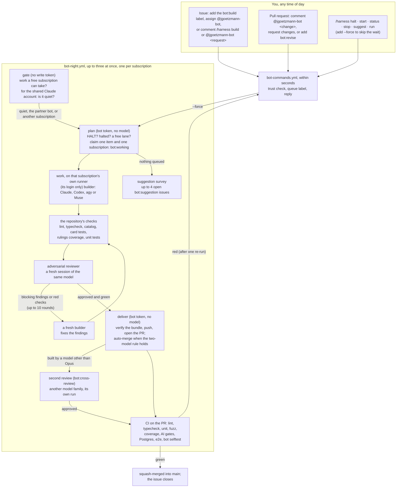

# The JackiOh night bot

`@jgoetzmann-bot` works through the issues you hand it, on whichever of your subscriptions is
free: up to four Claude accounts (Opus at extra-high effort), ChatGPT through the Codex CLI,
Google through the Antigravity CLI (`agy`), Meta through Muse Code and Cognition through the
Devin CLI, each with its own hours
and limits ([Subscriptions](#subscriptions)). Up to three items run at once, one per subscription. Each run
builds its item, runs the repository's checks, and has a second, independent session of the same
model review the change adversarially, going round that loop until the reviewer approves. Opus's
approval is enough; a change another model built also needs a second model's approval. Then the
pull request merges itself into `main` once CI passes. When it has nothing to do, it proposes
improvements to the game as issues, at most four open at a time.

It runs on GitHub Actions. The model sessions run on the bot's own machine on AWS, where each
subscription is a Linux user of its own with its own runner ([`machine/`](machine/README.md));
everything that holds a GitHub write token runs on GitHub's runners. It is modelled on
[bright-bots-harness](https://github.com/jgoetzmann/bright-bots-harness), cut down to one
repository and reshaped around an adversarial review loop and auto-merge.



## Giving it work

Any of these queues an issue for the next run a free subscription can take (the reply says
when that is):

- add the **`bot:build`** label;
- **assign** `@jgoetzmann-bot`;
- comment **`/harness build`**, or **`@jgoetzmann-bot <what you want>`**. Your words become part
  of the request.

To change one of its pull requests, comment **`@jgoetzmann-bot <what to change>`** or
**`/harness revise <notes>`** on it, submit a review that requests changes, or add **`bot:revise`**.
It also revises its own pull requests without being asked: when CI fails twice on the same
commit (it re-runs the failed jobs once first, in case the failure was flaky), and when `main`
moves on and leaves the branch with conflicts. After three tries at fixing CI on one pull request
it stops and labels it `bot:blocked`. Asking for a revision turns auto-merge off until the
revision lands. It can revise a pull request a person opened too, as long as the branch is in this
repository. It never turns on auto-merge for someone else's pull request.

A comment you leave while it is working on the thread is not lost: once the run ends, it queues
another pass to answer it. Auto-merge waits for that pass.

Add **`--force`** to `build`, `revise` or `suggest` to start now, on a subscription outside its
hours if need be (its usage caps still hold). A forced item stays forced until it is done.

Label an issue **`difficult`** to keep it for Opus: only a Claude account builds, revises and
reviews it, and Opus takes `difficult` items before anything else in their priority tier.

### Priority, `human` and `shitter`

Three labels set the order queued work is picked up in: **`priority:high`** first, then
**`priority:medium`**, then work with no priority label, then **`priority:low`**. On a thread with
more than one, the highest counts, and any other `priority:*` label counts as none. Inside a tier
the order is the usual one ([who takes what](#subscriptions)), and a forced item still goes before
every tier. A priority label never makes work eligible or ineligible.

Two labels take work away from models:

- **`human`**: a person will do it. No model picks it up, whatever else it is labelled, forced or
  not.
- **`shitter`**: low-tier models only. A high-tier model, Claude Opus or OpenAI Astra (any
  version: `opus` or `astra` anywhere in the `model` in `providers.json`), never picks it up; any
  other model may, an unknown one included. With `difficult` as well, no model can take it.

Label names match whatever their case. Labels are read afresh at every pickup, so a change counts
at the next run, and a run already going is never stopped. The pull request the bot opens for an
issue, a draft or not, starts with the issue's `shitter` and priority labels, so its revisions and
its second review follow the same rules. A label changed on the issue after that, `human`
included, does not reliably reach the pull request (a later build of the issue copies added
labels again, never removed ones): change it there too. The `peek` and `plan` steps of a night run
log the chosen item's tier and every item passed over because of `human` or `shitter`.

The issue is the spec, so write it the way you would for a careful contributor: what should
happen, where, and how you would check it. The builder reads the issue body, every comment from
people on the trust list, `CLAUDE.md` and `SPEC.md`. Comments from anyone else are left out.

## No request is lost

Every way of asking either gets an answer at once, or is found again later:

- **Commands** in a comment, a line comment on a pull request's diff, or an edit that adds a
  command. The bot puts 👀 on the comment, replies, and adds 🚀; a request for model work also gets
  👍, and later reactions follow it to its answer ([what the reactions mean](#what-the-reactions-mean)).
  If a command fails, the reply says so; the other commands in the same comment still run.
- **Naming the bot mid-sentence** ("thanks @jgoetzmann-bot, could you…") gets a reply explaining
  how to phrase a request. The bot does not guess a build from it, and does not ignore it.
- **The sweep** runs every ten minutes (`harness sweep`, and on demand from the Actions tab). It
  reads the last three days back from GitHub and answers anything no handler answered:
  - a trusted command (in a comment, a diff comment or a review) that nobody claimed;
  - an assignment nothing queued;
  - a review asking for changes on a bot pull request, newer than anything the bot acted on;
  - a failed, cancelled or broken CI or `bot selftest` run on a bot pull request's head.

  It leaves anything younger than ten minutes to the handler that may still be running, so
  nothing is answered twice. Last, it starts a night run when one should be going and none is:
  GitHub drops scheduled runs, sometimes a whole night of `bot-night`'s hourly ones, so when the
  gate's own question (`harness peek`) finds work and no `bot-night` run is queued or going, the
  sweep dispatches one. A dropped hourly run costs about ten minutes, not the night.
- **Labels are the queue**, so a `bot:build` or `bot:revise` label is never lost, even if no
  handler ever saw it being added.
- **A request made while the bot is working** on the thread gets another pass once the run
  ends, and auto-merge waits for it. A request means a command, naming the bot, a review asking
  for changes, or a queue label. A plain comment is read as part of the thread, but it does not
  start a pass of its own. This applies to requests on the issue, on its pull request, and on
  the issue a pull request closes. A `/harness stop` holds the thread until the run has stopped,
  so "stop, then do this instead" gets built.
- **Each request runs once.** A comment, edit or review is claimed in the state file before it
  runs, so the event handler and the sweep never both act on it. An edit runs only the lines it
  added, and only when the comment's author made the edit.
- **Commands are read the way people write them**: in a list, in backticks, in bold. A control
  word in plain words ("@jgoetzmann-bot start with option A") is a request, not a command, unless
  a colon follows it ("@jgoetzmann-bot halt: away this week"). One word that is a near miss of a
  verb ("stauts") runs nothing and gets a "did you mean", rather than a build of the typo.
- **A run that dies without a result** goes to the back of the queue and is blocked after two
  in a row. A failure outside any item (the CLI refusing to start, a broken install on `main`)
  charges nothing and pauses runs for 50 minutes.
- **A stop or halt said after the last checkpoint** still counts: deliver checks again, so
  nothing merges that you stopped.
- **`--force`** and **`/harness run`** start a run at once. Both are written down first, so if
  GitHub refuses to start one, or a newer run replaces it, the next hourly run picks it up
  (`bot-night` fires every hour, all day).
- **A run that dies** (cancelled, timed out, crashed) leaves its item for the next run, which
  requeues it. A failure outside any item (a missing secret, the CLI refusing to start) is
  never charged to the item.

## Commands

Put one command per line in any issue or PR comment, as `/harness <verb>`, `/harness-<verb>` or
`@jgoetzmann-bot <verb>`; the three read the rest of the line the same way. Quoted lines and fenced
code blocks are ignored, so quoting the bot back at it runs nothing.

| Verb | What it does | Where | Level |
|---|---|---|---|
| `build [notes]` | queue this issue (on a PR, same as `revise`) | issue | 2 |
| `revise <notes>` | queue a revision of this pull request | PR | 2 |
| `stop` | take it out of the queue; a running job gives up at its next checkpoint | issue or PR | 2 |
| `suggest` | ask for a suggestion survey the next time the queue is empty | anywhere | 2 |
| `status` | halt state; which subscriptions are running what, for how long, with each run's link; each subscription's hours and usage; the queue | anywhere | 1 |
| `help [verb]` | the commands, or one of them in detail with an example | anywhere | 1 |
| `halt [reason]` | stop all model work until `start` | anywhere | 3 |
| `start` | lift a halt (`start --force` also starts a run) | anywhere | 3 |
| `run [#n]` | start a run now, outside a subscription's hours if need be | anywhere | 3 |

Aliases: `work` (build), `fix` and `update` (revise), `resume` and `unhalt` (start), `go` (run).

- **Anything else is a request**, after either prefix: a build on an issue, a revision on a PR,
  with your words as the notes. `/harness make the Coin spin` and `@jgoetzmann-bot make the Coin
  spin` are the same request.
- **A misspelt verb runs nothing.** One word that is a letter or two off a verb or alias
  (`stauts`, `biuld --force`, `rnu #5`) gets "did you mean `status`?" instead of a build of the typo.
- **Plain English after the bot's name.** After `@jgoetzmann-bot`, a control verb (`stop`,
  `status`, `start`, `suggest`, `halt`, `run`, `help`) followed by words that do not fit it is read
  as a request: `@jgoetzmann-bot stop using the old sprite` asks for a change, it does not stop
  anything. Write the verb alone for the command, or put a colon after it to make the words its
  own: `@jgoetzmann-bot halt: away this week`. After `/harness` the verb always wins.

### What the reactions mean

The bot reacts to your comment as your request moves along, so you can see that a model has it
without reading the thread:

| Reaction | Meaning |
|---|---|
| 👀 | seen; the bot is answering |
| 👍 | a model will read it: it is queued, or noted for the next pass of a run already going |
| 🚀 | answered: the bot replied (the sweep reads this as "handled") |
| ❤️ | a run has it: a model is reading it now |
| 🎉 | done: the run that read it finished with an answer (a pull request opened or updated, a revision pushed, a survey done) |
| 😕 | it ended without an answer: blocked, stopped, or given up on after too many failures |

A command that needs no model (`status`, `help`, `halt`, `start`, `run`, `stop`) gets 👀 and 🚀
only. When a run is interrupted (the time budget, the usage limit, a halt), its requests go back to
waiting and get ❤️ again from the next run. A request left on an issue while it is being built
moves to the pull request the build opens. A review cannot take a reaction, so a request made in a
review's body gets the reply but not the reactions.

**Who may do what** comes from [`.harness/trust.txt`](../.harness/trust.txt): 3 operator,
2 maintainer, 1 asker. A command from anyone else is ignored without a reply. A line with
`id:<number>` counts only for that exact GitHub account; a line without one counts only when
GitHub says the person is an owner, member or collaborator of the repository. `--force` always
needs level 3.

## Labels

| Label | Meaning |
|---|---|
| `bot:build` | an issue waiting for a free subscription |
| `bot:revise` | a pull request waiting for a revision |
| `bot:cross-review` | a bot pull request its builder's model approved, waiting for a second model's review before auto-merge |
| `bot:working` | a run holds it right now |
| `bot:blocked` | it needs a person: a question, findings the reviewer would not let go of, or repeated failures |
| `bot:pr-open` | the issue has an open bot pull request |
| `bot:pr` | a pull request the bot opened |
| `bot:suggestion` | an improvement the bot proposes; add `bot:build` to have it built, close it to say no |
| `bot:needs-review` | a bot pull request that touches a review-only path; a person merges it |
| `difficult` | Opus only, and Opus takes it first (`difficult_label` in `providers.json`) |
| `priority:high`, `priority:medium`, `priority:low` | the pickup order: high, medium, none, low ([above](#priority-human-and-shitter)) |
| `human` | a person will do it; no model picks it up |
| `shitter` | low-tier models only: never Opus or Astra |

## Subscriptions

The bot spends whichever of your subscriptions is free. They are listed in
[`.harness/providers.json`](../.harness/providers.json), the file to edit:

| Provider | CLI and model | Login | Hours | Limits |
|---|---|---|---|---|
| `claude-1` | Claude Code, `opus` at `xhigh` | the secret `CLAUDE_CODE_OAUTH_TOKEN` (the one the bot always had) | 21:00–07:00 | 98% of 5 hours, 90% of the week |
| `claude-2` | the same | the secret `CLAUDE_CODE_OAUTH_TOKEN_2` | any time | 90% of 5 hours, 90% of the week |
| `claude-3` | the same | the secret `CLAUDE_CODE_OAUTH_TOKEN_3` | any time | none: until it refuses |
| `claude-4` | the same | the secret `CLAUDE_CODE_OAUTH_TOKEN_4` | 21:00–07:00 | 98% of 5 hours, 90% of the week |
| `gpt` | Codex (`codex exec`), `gpt-5.6-terra` at `xhigh` | on the machine, as `agent-gpt` | any time | none: until it refuses |
| `agy` | Antigravity (`agy`), `gemini-3.8-flash-high` (Gemini 3.8 Flash) at `high` | on the machine, as `agent-agy` | any time | none: until it refuses |
| `devin` | Devin (`devin -p`), `swe-2-max` (SWE-2, free on the CLI until 2026-10-16) | on the machine, as `agent-devin` | any time until 2026-10-15 (`off_from`) | none: until it refuses |
| `muse` | Muse Code (`muse exec`), `muse-spark-1.3-contributor` at `xhigh` | on the machine, as `agent-muse` | any time | none: until it refuses |

Each one's model job runs on its own runner on the machine, `night-vm-<id>`. A Claude account
works only once its secret is set (Settings → Secrets and variables → Actions), so the ones you
have not set up yet sit out. A login on the machine has no secret to check, so the bot counts it
as set up; turn one off with `enabled: false`. `python3 -m harness providers` in `bot/` prints
each one and whether it could start now, and `/harness status` does the same on GitHub.

**What each entry says.**
- `cli`, `model` and `effort`: the reasoning effort, where the CLI takes one. agy's model names
  carry their effort (`gemini-3.8-flash-high`; `agy models` lists them), and `effort` matches it.
- `login`: `secret`, a GitHub secret named by `secret` and handed to that run's model job alone,
  or `machine`, a login made once on the machine in that subscription's own home, which never
  leaves it. agy logs in only on the machine.
- `runs_on`: the runner its model job runs on. `night-vm-<id>` is its own runner on the machine;
  a secret login may also run on GitHub's `ubuntu-latest`, which installs its CLI each time. Two
  subscriptions never share a runner on the machine, since a runner is one user's home.
- `schedule`: `{"mode": "always"}`, or `{"mode": "window", "start": "21:00", "end": "07:00"}` in
  `America/Chicago`.
- `limits`: `{"mode": "none"}` uses whatever there is, and a refusal parks the subscription
  until its reset. `{"mode": "caps", ...}` takes any of these:
  - `five_hour` and `seven_day`: a fraction of the allowance, for the CLIs that report usage
    (Claude, and Codex through its session log);
  - `five_hour_minutes` and `seven_day_minutes`: minutes of model time the bot counts itself, for
    agy and Muse, which report none.
- `self_review: true`: its own approval is enough to merge (Opus).
- `difficult: true`: it may take `difficult` items.
- `quiet_check: true`: it waits until nobody else is spending it
  ([below](#it-waits-for-the-subscription-to-be-quiet)).
- `roles`: what it may do (`build`, `fix`, `revise`, `review`, `suggest`).
- `env`: non-secret environment for its CLI.
- `enabled: false`: turns it off.
- `off_from` (a date) and `off_reason`: from that day, in the bot's time zone, it takes no new
  work, and the planner opens one issue with the reason, asking a person what it should do now.
  Devin's is 2026-10-15, the day before SWE-2 stops being free on its CLI.

At the top level, `max_parallel` is how many run at once and `priority` the order they are tried
in. A `secret` must be one of the names the workflows hand over (the four Claude ones,
`CODEX_AUTH_JSON` and `MUSE_AUTH`; `providers.SECRETS`), because they hand over no other.

**Who takes what.** Each run takes one item on one subscription, and a subscription works on one
item at a time. Items go in this order: forced, the priority tier, `difficult`, second reviews,
revisions, then the oldest builds. Each goes to the first subscription in `priority` that is free,
set up, inside its hours (unless the item is forced) and under its limits, and that may take it
(`difficult` and `shitter`). A run that claims an item starts another
run while a lane and more work are free, and a run that finishes starts the next, so the lanes
fill up. By night that is usually Opus; by day, whoever else is set up. A run that could not work
at all (its login refused, its CLI would not install or start) leaves its subscription alone for
50 minutes, and the item goes to another one meanwhile.

**The two-model rule.** Every run reviews its own work with a fresh session of its own model.
- **Built by Opus:** its approval is enough, and auto-merge turns on.
- **Built by another model:** the pull request is labelled `bot:cross-review`, and a later run on
  a different model family reads it from scratch.
  - The second reviewer reads the change but installs and runs nothing: it holds another
    subscription's login, which the builder's code must never run beside. CI runs every check.
  - If that second model approves the same commit, auto-merge turns on, pinned to that commit:
    GitHub will not merge a head that moved after the approval.
  - If it has blocking findings, a revision is queued, and the revision goes round the same way.
    Its rejection stands against that commit until the same model approves it or the commit
    changes. After three such rounds the bot stops and asks you.
  - Whenever the rule is not met, auto-merge is off, even if an earlier Opus approval had turned
    it on for an older commit.
  - A second review of a commit that moved in the meantime does not count.
  - If no subscription of another family is set up, such a change waits in `bot:cross-review`
    until one is, or until you merge it yourself.

**Handing work over.** A run can stop half-way: its subscription runs out, the clock runs out, or
the bot is halted. Its work so far is pushed to the branch, as always. Every builder also keeps
running notes in an ignored `.bot-notes.md` (plan, done, next, decisions, dead ends), and the
harness keeps the end of its session. Both are saved on the item. The next run, on any
subscription, starts with a "Picking up from another agent" section in its prompt. So a task
agy started when its quota ran out can be finished by Codex the same hour.

### Setting up each subscription

None of these is an API key: each is the login of one account.

- **Claude** (`claude-1` to `claude-4`), a GitHub secret each.
  1. Log in to the account with `claude`.
  2. Run `claude setup-token` and paste the token it prints (good for a year) into the secret.

  `claude-1` is the existing `CLAUDE_CODE_OAUTH_TOKEN`; each further account gets its own secret.
  The token reaches only that account's model job, which runs as `agent-claude-<n>` on the
  machine, and is never written to its home.
- **ChatGPT, Google and Meta** (`gpt`, `agy`, `muse`), once, on the machine, as each one's own
  user. Open a shell with `aws ssm start-session --target <instance>` and run:
  - `sudo -iu agent-gpt codex login --device-auth`, then Sign in with ChatGPT;
  - `sudo -iu agent-agy agy`, then sign in with the Google account and quit;
  - `sudo -iu agent-muse muse login`;
  - `sudo -iu agent-devin devin auth login --force-manual-token-flow`, then paste the token the
    page gives you.

  Each CLI refreshes its own login in that home from then on, so don't copy those files
  anywhere else. [`machine/README.md`](machine/README.md) has the rest: building the machine,
  registering the runners, and the starter that wakes it.

Codex and Muse can also log in from a secret on GitHub's runners: set `"login": "secret"`,
`"runs_on": "ubuntu-latest"` and a `secret` (`CODEX_AUTH_JSON`: the whole of `~/.codex/auth.json`
after `codex login`; `MUSE_AUTH`: `~/.config/muse/auth.json` after `muse login` on Linux, or a
Meta API key, which Meta bills per token). Codex replaces its refresh token every time it
refreshes, so after each such run the bot keeps the refreshed file encrypted on the `bot-state`
branch (**the vault**), under a key derived from that subscription's own secret; pasting a fresh
login makes the old vault unreadable, so the fresh one wins.

**Provider policies.** Each provider has its own policy on scripted use of a personal
subscription:
- OpenAI recommends API keys for CI and advises against this setup on public repositories.
- Google steers headless use towards API keys.
- Anthropic's limits assume ordinary individual use per account.

## It waits for the subscription to be quiet

`claude-1` is shared with you and with
[bright-bots-harness](https://github.com/jgoetzmann/bright-bots-harness) (`quiet_check` in
`providers.json`). So before a run claims anything, the `gate` job checks two things:

1. **Is there work a free subscription can take?** (`harness peek`, which reads and changes
   nothing). If not, the run ends here and spends nothing. If the best subscription for it is
   not the shared one, the run goes ahead at once.
2. **Is anyone else using the shared subscription?** (`harness quiet`). It reads the subscription's
   usage with the smallest call there is (one turn of Haiku in an empty folder), waits 10
   minutes, and reads it again.
   - If usage did not rise, nobody else is working, and the run goes ahead.
   - If it rose while bright-bots-harness was in one of its spending steps ("Run planned items",
     "Discover and propose", "Sweep keywords", "Reconcile stale"), the rise is the partner's.
     The bot goes ahead anyway, so the two bots can run at the same time.
   - Any other rise is you or another agent, so it waits another 10 minutes and looks again.
     It keeps looking for up to two hours. If it never turns quiet, the run takes other work on
     another subscription instead, if there is some, or gives up until the next run.

   Only one run waits at a time: while one does, the others go to the other subscriptions. And
   when another Claude account can take the same work, the run goes ahead on that one instead of
   waiting.

bright-bots-harness applies the same rule the other way round: its partner is this bot's "Build,
check and review" step, which only a run on `claude-1` has. A run on any other subscription
names its step "Work on another subscription", so it never excuses a rise on the shared account. The gate's own step, "Wait until the subscription is quiet", never counts
as spending. A forced run (`--force`, `/harness run`, or an item queued with `--force`) skips the
wait. The settings are `quiet` in `.harness/config.json`.

There are two things it cannot tell apart. It cannot separate you from the partner while the
partner is spending. And it cannot see a run of either bot that happens somewhere other than
GitHub Actions, such as the harness's local `bb` container.

## One night, step by step

1. **plan** (seconds, no model; one at a time across all runs). It runs only after the gate says
   go. It stops at once if `.harness/HALT` is on `main` or someone said `/harness halt`. It
   requeues anything a dead run left `bot:working` and queues a revision for any bot pull request
   that conflicts with `main`. Then, if a lane is free, it claims one item and the subscription
   that takes it ([who takes what](#subscriptions)), and starts another run if another lane and
   more work are free. With nothing queued, it runs a suggestion survey if one is due (at most one
   every 20 hours, and only while fewer than four are open).
2. **work** (up to about five and a half hours, holding only the chosen subscription's secret).
   It runs on that subscription's own runner, where the CLI is installed and a machine login
   already sits in its user's home; a Claude token is written only into a private directory for
   the job ([setting up](#setting-up-each-subscription)). After the job, the runner deletes its
   working files and package store. A worktree on `bot/issue-<n>` (or the pull
   request's own branch, with `main` merged in), then `pnpm install`. Then up to ten rounds:
   - a builder session on that CLI (`claude --model opus --effort xhigh`, say) that can read,
     edit and run commands;
   - the repository's checks from `.harness/config.json`, with any check that is also red on
     untouched `main` marked as not this change's fault;
   - a reviewer session with the same model, allowed to read and run things but not to edit, told
     to find every reason the change should not ship;
   - on blocking findings or red checks, a **fresh** builder gets both and fixes them.

   The harness also puts back anything the builder changed under `.github/`, `.harness/` or
   `bot/`, and records that as a blocking finding. Between steps it checks for a halt, a `stop`,
   the usage stop and the clock. When any of those says stop, it commits what it has as work in
   progress so the next run can pick it up. An item that runs out of time three runs in a row is
   blocked as too big for one night. A failure that is not the item's fault (an expired Claude
   token, the CLI refusing to start, dependencies that will not install on untouched `main`)
   leaves the item queued without counting against it, and starts no further run that night.
   Anything the model's session leaves running is killed when it ends. An approved change is
   delivered exactly as the reviewer saw it: a commit that appears after the review is dropped.
3. **deliver** (seconds, no model). It trusts nothing the model job wrote. The bundle's branch
   must be the head the result names and descend from where the work started, the branch on
   GitHub must not have moved meanwhile, and no forbidden path may change. Only then does it push
   (never with force) and open or update the pull request. It turns on auto-merge only when the
   two-model rule holds, no review-only path changed and `main`'s protection requires every CI
   check; otherwise the change waits for a second model (`bot:cross-review`) or for you. A change
   the reviewer never approved becomes a draft PR labelled `bot:blocked`, with the findings, and
   never merges by itself. It records the subscription's usage and minutes, keeps a refreshed
   login and a handoff, and starts the next run if a lane is free and there is work.

## Safety

- **Two gates before `main`.** An independent reviewer approves the change inside the run (and,
  for a change a model other than Opus built, a second model in a run of its own). Then
  every CI check must pass before auto-merge merges anything. The deliver job turns auto-merge on
  only after reading `main`'s branch protection and finding every check in `required_checks`
  there. If protection is missing, it leaves the pull request for a person.
- **Some changes always wait for a person.** A change that touches a review-only path
  (`review_paths`) still becomes a pull request, but it is labelled `bot:needs-review`, you are
  asked to review it, and auto-merge stays off. The review-only paths are the files that define
  what the checks do or how the game deploys: every `package.json`, the lockfile, the vitest,
  vite, eslint, TypeScript and Cypress configs, `scripts/`, `vercel.json`, `render.yaml` and the
  database migrations.
- **It cannot change its own rules.** `.github/`, `.harness/`, `bot/`, `.claude/`, `.mcp.json`,
  editor and devcontainer config, git hooks, `.gitattributes` and `.gitmodules` are forbidden
  paths (`forbidden_paths`). They are enforced twice: in the work job, which puts such a change
  back and tells the next builder, and in the deliver job, which refuses to push a bundle that
  has one. Untracked Claude settings and `.mcp.json` are deleted before every model call, and the
  calls run with `--strict-mcp-config`.
- **The model never holds a GitHub write token.** The `work` job has one model secret, the
  chosen subscription's (picked by name, `secrets[...]`), and a read-only Actions token, and the
  model's own environment has neither GitHub token nor any other subscription's login. Pushing,
  commenting and labelling happen in `plan` and `deliver`, which run no model, run on GitHub's
  runners and see only whether each model secret is set.
- **Each subscription is walled off on the machine.** It is a Linux user of its own whose home,
  with its login, no other user can read; none of them has `sudo` or Docker; and its runner,
  labelled `night-vm-<id>` alone, takes only its own jobs. The machine accepts no inbound
  connection, and the repository makes outside contributors' pull requests wait for approval
  before any workflow runs, so a stranger's pull request cannot reach these runners.
- **Text from GitHub is data.** Issue text (the title included), comments, reviews and CI logs
  reach the model fenced and labelled as data. Comments from people outside the trust list are
  left out, and their commands never start a runner.
- **Three off switches.** `/harness halt` (with `start` to undo it), `/harness stop` for one item,
  and a committed `.harness/HALT` file, which only someone who can push to `main` can lift.
- **Usage.** Claude and Codex report each subscription's 5-hour and 7-day usage; the bot counts
  minutes for the others. Past a subscription's caps no new call starts on it, and a refused call
  parks it until the limit resets while the item moves to another subscription.
- **Refreshed logins** from a secret (Codex rotates its own) are kept on `bot-state` only
  encrypted (AES-256 with an HMAC, through `openssl`), under a key derived from that
  subscription's secret. A login on the machine never leaves it.

**What it cannot rule out.** The model has a shell and its subscription's login, because it
needs the login to run. Network tools such as `curl`, `wget` and `ssh` are denied, but that only slows a
determined model down. And anything the model writes into a pull request is public once it is
pushed. So a prompt injection that fools the model could, in principle, leak that login, or, on
the machine, leave something in its user's home for that subscription's next run (never
another's).
The defences are upstream of that: only people on the trust list can start work, text from
anyone else is left out, and each login is one you can revoke and replace at any time. Read an issue from a stranger before you label it `bot:build`.

Transcripts of the model's sessions stay on the runner unless `upload_transcripts` is on. The
repository is public, so an uploaded artifact is readable by anyone. `result.json` (the builder's
report, the review findings and the check output) and the git bundle are always uploaded, for 14
days.

## Setting it up

1. **The machine** ([`machine/README.md`](machine/README.md)): build it, log each machine
   subscription in, register the runners, and deploy the starter.
2. **Secrets** (Settings → Secrets and variables → Actions):
   - The Claude accounts' tokens, one secret each
     ([setting up each subscription](#setting-up-each-subscription)). `CLAUDE_CODE_OAUTH_TOKEN`
     alone is enough to start.
   - `BOT_GITHUB_TOKEN`: a classic token for the `jgoetzmann-bot` account, which must be a
     collaborator with write access. It needs the `public_repo` and `workflow` scopes, and
     nothing else. It needs `workflow` because merging `main` into a branch can carry a
     workflow change along. A fine-grained token will not do: it cannot reach a repository its
     account only collaborates on. Starting runs and re-running CI jobs use the job's own
     Actions token, so the bot's token needs no `repo` scope. Without this token the bot falls
     back to the Actions token: its comments come from `github-actions[bot]`, and its pull
     requests do not start CI, so auto-merge never fires.
3. **Labels, the state branch and the repository settings**, once, with an admin token (a
   logged-in `gh` works):

   ```sh
   cd bot
   python3 -m harness setup --repo-settings   # labels, bot-state branch, auto-merge, branch protection
   python3 -m harness doctor                  # says what is still missing
   ```

   `--repo-settings` allows auto-merge, deletes merged branches, and protects `main` so that
   every check in `required_checks` must pass before anything merges. Admins can still push to
   `main` directly.
4. **Try it**: open an issue, comment `/harness build --force`, and watch the `bot-night` run in
   the Actions tab. `workflow_dispatch` on `bot-night` also takes `dry_run`, which records every
   GitHub write instead of sending it.

## Operating it

| I want to | Do this |
|---|---|
| see what it is doing | `/harness status` anywhere, or `python3 -m harness status` in `bot/`: its "Running now" lists each subscription at work, on what, for how long, and its run |
| stop everything now | `/harness halt`; for a lock nobody can lift by comment, commit `.harness/HALT` |
| start again | `/harness start` (and delete `.harness/HALT` if you committed it) |
| run now, outside a subscription's hours | `/harness run`, `/harness build --force`, or Actions → bot-night → Run workflow |
| see each subscription | `/harness status`, or `python3 -m harness providers` in `bot/` |
| add a subscription, or change its hours, limits or model | set its secret or log it in on the machine, and edit `.harness/providers.json` in a pull request; a new one on the machine also needs `setup.sh` and `register-runners.sh` ([`machine/`](machine/README.md)) |
| look at the machine | `aws ssm start-session --target <instance>`; it powers off after 30 idle minutes and the starter wakes it within five minutes of a job |
| keep an item for Opus | label it `difficult` |
| keep an item from Opus and Astra, or from every model | label it `shitter`, or `human` |
| have an item picked up sooner or later | label it `priority:high`, `priority:medium` or `priority:low` |
| stop one item | `/harness stop` on its issue or pull request |
| drop an item it is working on | close the issue or pull request: the run goes on until it ends, holding its lane, but nothing it made is delivered or queued again |
| retry something it gave up on | fix what it asked about, then `/harness build`; `python3 -m harness forget <n>` clears the failure count |
| read what the model did | the `work` artifact of the run: `result.json` and the bundle (set `upload_transcripts` to keep the full sessions too) |
| change the rounds, budgets or checks | edit `.harness/config.json` in a pull request |
| let someone else command it | add a line to `.harness/trust.txt` |

## Working on the bot

The bot is Python 3.12+ with the standard library only. The tests use fakes for GitHub and the
model, and real git.

```sh
cd bot
python3 -m unittest discover -s tests -t .   # the suite (about ten seconds)
python3 -m harness --help                     # every command
```

`bot selftest` in CI runs the suite on Python 3.12 and 3.13 and runs actionlint over the bot's
workflows. The prompts are in `bot/prompts/`, one per role: `system`, `build`, `fix`, `revise`,
`review` and `suggest`. The bot cannot edit anything in `bot/`, `.harness/` or
`.github/workflows/`, so changes there come from people.

| Module | Job |
|---|---|
| `config.py` | `.harness/config.json` and the environment; the only reader of `os.environ` |
| `gh.py` | the GitHub client; the only module that sends a token or writes to GitHub |
| `trust.py`, `commands.py` | who may command it, and how a comment is read |
| `events.py`, `queue.py` | the event workflow: commands, labels, assignment, reviews, CI |
| `asks.py` | the reactions that follow a request from its comment to its answer |
| `plan.py`, `work.py`, `deliver.py` | the jobs of a night run (`plan.peek` is the gate's first question) |
| `quiet.py` | the gate's second question: is anyone else spending the subscription |
| `providers.py` | `.harness/providers.json`: the subscriptions, their hours and limits, whether each is free |
| `runner.py` | one backend per CLI (`claude`, `codex`, `agy`, `muse`): run it, read its answer, usage and refusals; plus the test fake |
| `logins.py`, `vault.py` | a subscription's secret written as its CLI's login, or its login on the machine left where it is; a refreshed login kept encrypted |
| `machine/` | the machine: its setup, its runners, and the starter that wakes it (not part of the `harness` package) |
| `git.py`, `gates.py` | worktrees, commits, bundles, pushes; the repository's checks |
| `threads.py`, `prompts.py`, `verdicts.py` | what the model is told, and reading what it answers |
| `state.py`, `status.py`, `clock.py` | the state file on `bot-state`, the status report, time and windows |
