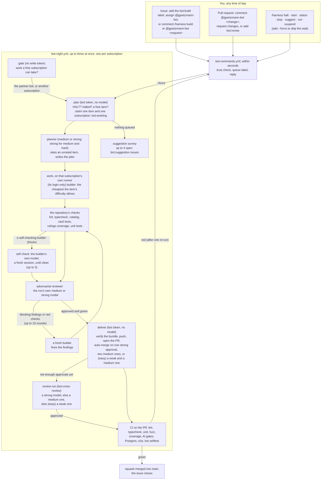

# The JackiOh night bot

`@jgoetzmann-bot` works through the issues you hand it, on whichever of your subscriptions is
free: up to six Claude accounts (Opus at extra-high effort), ChatGPT through the Codex CLI,
Google through the Antigravity CLI (`agy`), Meta through Muse Code and Cognition through the
Devin CLI, each with its own hours
and limits ([Subscriptions](#subscriptions)). Up to ten items run at once: the Claude accounts' on
GitHub's runners, and at most seven on the bot's own machines (six on the night box, one on
the training box). Every model has a tier (weak,
medium or strong) and every item a difficulty (easy, medium or hard), which decides who may plan,
build and review it ([Difficulty and tiers](#difficulty-and-tiers)). A medium or strong model plans
each item first (a strong one for medium and hard items) and rates an item nobody rated, under a
strict [easy rule](#the-easy-rule); the cheapest builder the owner's usage order allows builds it,
runs the repository's checks, and an adversarial reviewer reads the change, going round until the
reviewer approves. Three failures of an item's own raise its difficulty a step and rebuild it from
`main` ([Rating, strikes and the step up](#rating-strikes-and-the-step-up)). A change merges itself into `main` once CI passes and one strong model, or two medium
ones (the same model may give both), or for an easy item one weak and one medium one, approved the
same commit. When it has nothing to do, it proposes
improvements to the game as issues, at most four open at a time.

It runs on GitHub Actions. The model sessions run on the bot's own machine on AWS, where each
subscription is a Linux user of its own with its own runner ([`machine/`](machine/README.md));
everything that holds a GitHub write token runs on GitHub's runners. It is modelled on
[bright-bots-harness](https://github.com/jgoetzmann/bright-bots-harness), cut down to one
repository and reshaped around an adversarial review loop and auto-merge.



## Giving it work

Any of these queues an issue for the next run a free subscription can take (the reply says
when that is):

- add the **`method:use-bot`** label: two minutes later triage queues it, assigns the bot and gives
  it a priority ([Triage](#triage)); **`method:manual`** hands it to people instead;
- add the **`bot:build`** label;
- **assign** `@jgoetzmann-bot`;
- comment **`/harness build`**, or **`@jgoetzmann-bot <what you want>`**. Your words become part
  of the request.

To change one of its pull requests, comment **`@jgoetzmann-bot <what to change>`** or
**`/harness revise <notes>`** on it, submit a review that requests changes, or add **`bot:revise`**.
It also revises its own pull requests without being asked: when CI fails twice on the same
commit (it re-runs the failed jobs once first, in case the failure was flaky), and when `main`
moves on and leaves the branch with conflicts (once the reviews approved a change, resolving its
conflicts takes no review run again: [the review rule](#difficulty-and-tiers)). After three
tries at fixing CI on one pull request
it stops and labels it `bot:blocked`. Asking for a revision turns auto-merge off until the
revision lands. It can revise a pull request a person opened too, as long as the branch is in this
repository. It never turns on auto-merge for someone else's pull request.

A comment you leave while it is working on the thread is not lost: once the run ends, it queues
another pass to answer it. Auto-merge waits for that pass.

Add **`--force`** to `build`, `revise` or `suggest` to start now, on a subscription outside its
hours if need be (its usage caps still hold). A forced item stays forced until it is done.

Label an issue **`difficulty:easy`**, **`difficulty:medium`** or **`difficulty:hard`** to say
how hard it is ([Difficulty and tiers](#difficulty-and-tiers)); with none, the planner rates it
under [the easy rule](#the-easy-rule), and it counts as medium until then. `difficulty:hard` keeps
it for Opus: planning, building, every revision and every review. A label you set is never
changed by the bot.

### Priority and `human`

Three labels set the order queued work is picked up in: **`priority:high`** first, then
**`priority:medium`**, then work with no priority label, then **`priority:low`**. On a thread with
more than one, the highest counts, and any other `priority:*` label counts as none. Inside a tier
the order is the usual one ([who takes what](#subscriptions)), and a forced item still goes before
every tier. A priority label never makes work eligible or ineligible.

**`human`** takes work away from the bot altogether: people do it. That is a decision, an
account or a secret, repository work the bot may not do (a change to `bot/`, `.harness/` or
`.github/`), or work a person is already building. No model picks it up, whatever else it is
labelled, forced or not, and the bot never touches it: it is never queued, planned or built,
gets no `bot:*` stage label, and a conflicted `human` pull request is not revised. A
`/harness build`, an assignment or a mention gets one reply saying so, and nothing else. Take
the label off to hand it to the bot.

**Dependencies.** An issue waits, unless it is forced, while something it waits for is still open:
an issue a line of its description names ("Blocked by #125", "Depends on #12 and #14", "Do not
start until #125 has merged"; the Plan section does not count), an issue GitHub's own issue
dependencies say blocks it, or an earlier part of the same patch (a title such as
`Patch v0.2.X (part 3 of 4): …` waits for parts 1 and 2 of 4 under the same name,
[docs/issues-and-patches.md](../docs/issues-and-patches.md)). Revisions and reviews never wait.

Label names match whatever their case. Labels are read afresh at every pickup, so a change counts
at the next run, and a run already going is never stopped. The pull request the bot opens for an
issue, a draft or not, starts with the issue's difficulty and priority labels, so its revisions and
its reviews follow the same rules. A label changed on the issue after that, `human` included, does
not reliably reach the pull request (a later build of the issue copies added labels again, never
removed ones): change it there too. The `peek` and `plan` steps of a night run log the chosen
item's priority tier and difficulty, the model and tier picked for each role, any step up in tier
and why, and every item passed over because of `human` or a dependency.

The issue is the spec, so write it the way you would for a careful contributor: what should
happen, where, and how you would check it. The builder reads the issue body, every comment from
people on the trust list, `CLAUDE.md` and `SPEC.md`. Comments from anyone else are left out.

## No request is lost

Every way of asking either gets an answer at once, or is found again later:

- **Commands** in a comment, a line comment on a pull request's diff, or an edit that adds a
  command. The bot puts 👀 on the comment, replies, and adds 🚀; a request for model work also gets
  👍, and later reactions follow it to its answer ([what the reactions mean](#what-the-reactions-mean)).
  If a command fails, the reply says so; the other commands in the same comment still run.
- **Naming the bot mid-sentence** ("thanks @jgoetzmann-bot, could you…") gets a reply explaining
  how to phrase a request. The bot does not guess a build from it, and does not ignore it.
- **The sweep** runs every ten minutes (`harness sweep`, and on demand from the Actions tab). It
  reads the last three days back from GitHub and answers anything no handler answered:
  - a trusted command (in a comment, a diff comment or a review) that nobody claimed;
  - an assignment nothing queued;
  - a review asking for changes on a bot pull request, newer than anything the bot acted on;
  - a failed, cancelled or broken CI or `bot selftest` run on a bot pull request's head.

  It leaves anything younger than ten minutes to the handler that may still be running, so
  nothing is answered twice. Last, it starts a night run when one should be going and none is:
  GitHub drops scheduled runs, sometimes a whole night of `bot-night`'s hourly ones, so when the
  gate's own question (`harness peek`) finds work and no `bot-night` run is queued or going, the
  sweep dispatches one. A dropped hourly run costs about ten minutes, not the night.
- **Labels are the queue**, so a `bot:build` or `bot:revise` label is never lost, even if no
  handler ever saw it being added.
- **A request made while the bot is working** on the thread gets another pass once the run
  ends, and auto-merge waits for it. A request means a command, naming the bot, a review asking
  for changes, or a queue label. A plain comment is read as part of the thread, but it does not
  start a pass of its own. This applies to requests on the issue, on its pull request, and on
  the issue a pull request closes. A `/harness stop` holds the thread until the run has stopped,
  so "stop, then do this instead" gets built.
- **Each request runs once.** A comment, edit or review is claimed in the state file before it
  runs, so the event handler and the sweep never both act on it. An edit runs only the lines it
  added, and only when the comment's author made the edit.
- **Commands are read the way people write them**: in a list, in backticks, in bold. A control
  word in plain words ("@jgoetzmann-bot start with option A") is a request, not a command, unless
  a colon follows it ("@jgoetzmann-bot halt: away this week"). One word that is a near miss of a
  verb ("stauts") runs nothing and gets a "did you mean", rather than a build of the typo.
- **A run that dies without a result** goes to the back of the queue and is blocked after two
  in a row. A failure outside any item (the CLI refusing to start, a broken install on `main`)
  charges nothing and pauses that subscription for 50 minutes, longer each time in a row
  ([who takes what](#subscriptions)).
- **A stop or halt said after the last checkpoint** still counts: deliver checks again, so
  nothing merges that you stopped.
- **`--force`** and **`/harness run`** start a run at once. Both are written down first, so if
  GitHub refuses to start one, or a newer run replaces it, the next hourly run picks it up
  (`bot-night` fires every hour, all day).
- **A run that dies** (cancelled, timed out, crashed) leaves its item for the next run, which
  requeues it. A failure outside any item (a missing secret, the CLI refusing to start) is
  never charged to the item.

## Commands

Put one command per line in any issue or PR comment, as `/harness <verb>`, `/harness-<verb>` or
`@jgoetzmann-bot <verb>`; the three read the rest of the line the same way. Quoted lines and fenced
code blocks are ignored, so quoting the bot back at it runs nothing.

| Verb | What it does | Where | Level |
|---|---|---|---|
| `build [notes]` | queue this issue (on a PR, same as `revise`) | issue | 2 |
| `revise <notes>` | queue a revision of this pull request | PR | 2 |
| `review [strong\|medium] [notes]` | queue a review run of this bot pull request's head, by that tier or stronger, and no revision | PR | 2 |
| `rebuild` | close this bot pull request (or the issue's), keep its branch as `bot/old/issue-<n>-<date>`, and build the issue again from `main` | issue or PR | 2 |
| `stop` | take it out of the queue; a running job gives up at its next checkpoint | issue or PR | 2 |
| `suggest` | ask for a suggestion survey the next time the queue is empty | anywhere | 2 |
| `status` | halt state; which subscriptions are running what, for how long, with each run's link; each subscription's hours and usage; the queue | anywhere | 1 |
| `help [verb]` | the commands, or one of them in detail with an example | anywhere | 1 |
| `halt [reason]` | stop all model work until `start` | anywhere | 3 |
| `start [subscription]` | lift a halt (`start --force` also starts a run); with a subscription (`resume claude-3`), lift that one's suspension and leave a halt as it is | anywhere | 3 |
| `run [#n]` | start a run now, outside a subscription's hours if need be | anywhere | 3 |
| `suspend <subscription> [reason]` | start no new work on one subscription (an id `status` lists: `claude-3`, `gpt`, …) until `resume <subscription>`; a run already going on it stops at its next checkpoint, keeps its work, and its item goes back to the queue for another subscription (a run whose model work is done still hands its change on); `--force` does not lift it | anywhere | 3 |

Aliases: `work` (build), `fix` and `update` (revise), `resume` and `unhalt` (start), `go` (run).

- **Anything else is a request**, after either prefix: a build on an issue, a revision on a PR,
  with your words as the notes. `/harness make the Coin spin` and `@jgoetzmann-bot make the Coin
  spin` are the same request.
- **A misspelt verb runs nothing.** One word that is a letter or two off a verb or alias
  (`stauts`, `biuld --force`, `rnu #5`) gets "did you mean `status`?" instead of a build of the typo.
- **Plain English after the bot's name.** After `@jgoetzmann-bot`, a control verb (`stop`,
  `status`, `start`, `suggest`, `halt`, `run`, `suspend`, `help`) followed by words that do not
  fit it is read as a request: `@jgoetzmann-bot stop using the old sprite` asks for a change, it
  does not stop anything. Write the verb alone for the command, or put a colon after it to make
  the words its own: `@jgoetzmann-bot halt: away this week`. After `/harness` the verb always
  wins. `start` and `suspend` take one word after the bot's name, a subscription:
  `@jgoetzmann-bot resume claude-3` lifts that one's suspension, while `@jgoetzmann-bot start with
  option A` is still a request.

### What the reactions mean

The bot reacts to your comment as your request moves along, so you can see that a model has it
without reading the thread:

| Reaction | Meaning |
|---|---|
| 👀 | seen; the bot is answering |
| 👍 | a model will read it: it is queued, or noted for the next pass of a run already going |
| 🚀 | answered: the bot replied (the sweep reads this as "handled") |
| ❤️ | a run has it: a model is reading it now |
| 🎉 | done: the run that read it finished with an answer (a pull request opened or updated, a revision pushed, a survey done) |
| 😕 | it ended without an answer: blocked, stopped, or given up on after too many failures |

A command that needs no model (`status`, `help`, `halt`, `start`, `run`, `suspend`, `stop`) gets 👀
and 🚀 only. When a run is interrupted (the time budget, the usage limit, a halt), its requests go
back to waiting and get ❤️ again from the next run. A request left on an issue while it is being
built moves to the pull request the build opens. A review cannot take a reaction, so a request made
in a review's body gets the reply but not the reactions.

**Who may do what** comes from [`.harness/trust.txt`](../.harness/trust.txt): 3 operator,
2 maintainer, 1 asker. A command from anyone else is ignored without a reply. A line with
`id:<number>` counts only for that exact GitHub account; a line without one counts only when
GitHub says the person is an owner, member or collaborator of the repository. `--force` always
needs level 3.

## Labels

| Label | Meaning |
|---|---|
| `bot:build` | an issue waiting for a free subscription |
| `bot:needs-plan` | the Needs plan stage, beside `bot:build`: it waits for a plan its difficulty may build from (a medium or strong model's for an easy or unrated item, a strong one's for the rest), which goes into its description; the planner rates an unrated item |
| `bot:planned` | it has a plan, in its description (the builder starts from it); it stays after the item leaves the queue |
| `bot:revise` | a pull request waiting for a revision |
| `bot:cross-review` | a bot pull request waiting for a review run before auto-merge: one strong model, or a second medium one |
| `bot:working` | a run holds it right now |
| `bot:blocked` | it needs a person: a question, findings the reviewer would not let go of, or repeated failures |
| `bot:stuck` | beside `bot:blocked`: a build or revision used every review round (`max_review_cycles`, 10) without an approval. Its comment says why, round by round (`harness/failures.py`): the builder's sessions, the checks that were red, the reviewer's verdicts and the findings that kept coming back. A person reads it before anyone tries again; an approval takes the label off |
| `bot:pr-open` | the issue has an open bot pull request |
| `bot:pr` | a pull request the bot opened |
| `bot:suggestion` | an improvement the bot proposes; add `bot:build` to have it built, close it to say no |
| `bot:needs-review` | a bot pull request that touches a review-only path; a person merges it |
| `ready for merge` | the reviews approved the pull request's head, but auto-merge could not turn on (a review-only path, `main`'s protection, GitHub refusing it, or `auto_merge` off), so the bot @-mentions the operator to merge it. It comes off when the pull request goes back into the queue (a revision, a review run, a run that holds it, `bot:blocked`); triage never adds it |
| `difficulty:easy`, `difficulty:medium`, `difficulty:hard` | the weakest tier that may build it: weak, medium, strong. A person may set one; otherwise the planner rates the item, under [the easy rule](#the-easy-rule), and the bot labels it; three failures of its own raise it a step ([below](#rating-strikes-and-the-step-up)). With none it counts as medium, and with several the hardest counts |
| `priority:high`, `priority:medium`, `priority:low` | the pickup order: high, medium, none, low ([above](#priority-and-human)) |
| `human` | people do it; the bot never queues, plans, builds or labels it |
| `method:manual`, `method:use-bot` | a person's choice of who does an issue: two minutes after one goes on, triage makes the issue `human` and assigns both people (`method:manual`), or queues it and assigns the bot (`method:use-bot`). Triage takes no issue without one ([Triage](#triage)) |
| `Info` | for the record, nothing to build: migrations, statistics, the night bot's status |

## Triage

`triage.yml` labels, assigns, titles, types and links an issue once a person hands it on with a
method label, and every pull request someone trusted opens, from a Muse call (`triage.py`, #307).
To run it on a thread again: `gh workflow run triage.yml -f number=<n>` (or **Run workflow** on
the triage workflow's Actions page); an issue still needs a method label.

- **Who:** the author must be an owner, member or collaborator, or on `.harness/trust.txt`, and not
  the bot. Anyone else's issue or pull request is left alone, so a stranger's text never reaches
  the machine.
- **When:** an issue is triaged only once it carries exactly one of `method:manual` and
  `method:use-bot`, two minutes after the label goes on (`triage.METHOD_WAIT`): the issue is read
  again then, so a difficulty or a priority a person set in the meantime counts. Any other label
  starts a run of its own that ends at once, so it never cancels the method run; a newer method
  label cancels an older run and the wait starts again. An issue labelled `human` never goes to the
  bot. A pull request is triaged when it is opened, as before.
- **Three jobs:**
  - **`gate`**, on GitHub's runner, decides whether to triage: the method label (issues), the
    author, and Muse switched on. A pull request with type labels and assignees already is
    skipped unless a person called triage on it.
  - **`classify`**, on Muse's runner (`night-vm-muse`; it ran on Devin's until #317), reads the
    title and body through the API with a read-only token. It fences them as data in a prompt and
    runs Muse in an empty directory with no web tools and none of the job's secrets.
  - **`apply`**, on GitHub's runner, holds the write token and runs no model.
- **What `apply` changes:**
  - **The method:** `method:manual` adds `human`, assigns MaxGoetzmann and jgoetzmann, and
    unassigns the bot; `method:use-bot` adds `bot:build` (unless the queue has it already),
    assigns the bot and unassigns both people. These need no model, so they apply even when Muse
    gave no answer.
  - **Labels:** only the repository's own, never a `bot:` one, a `method:` one or a difficulty
    (the planner rates that, [below](#rating-strikes-and-the-step-up)). A `method:use-bot` issue
    always gets a priority; a `method:manual` one gets none of the model's labels, since people
    choose them.
  - **Title:** an issue's title follows `docs/issues-and-patches.md`, but only when its old title
    doesn't already, and only if every version number survives. A pull request keeps its title,
    which becomes the squash commit's subject, and is never assigned to the bot.
  - **Type:** an issue gets one of the organisation's issue types (Task, Bug or Feature; read from
    the org, or those three when the token can't read them) if it has none. A pull request has no
    type. GitHub drops a type it won't take without an error, so `apply` reads it back and says so.
  - **Dependencies** (issues only), as GitHub issue dependencies, which hold the night bot's build
    while the blocker is open ([Dependencies](#priority-and-human)):
    - **blocked by** each open issue its text names ("Blocked by #125", "Depends on #12", "Do not
      start until #125 has merged"), each earlier part of its patch that is still open (same name
      and same "of m"), and each open issue the model says must come first;
    - **blocking** each open issue the model says waits for it;
    - **a sub-issue of** its patch's open tracker, for a "part n of m" title with no parent yet,
      when the model names it and the tracker shares its version.

    Only open issues, never the issue itself, never one linked already either way, at most five of
    each. The links from the issue's own text and title are made even when Muse gave no answer.
- **Issues triage never types.** The sweep (every ten minutes, in the status loop) types every
  open issue still without one: a bot's (the CI-duration alerts, the status issue), which never
  reaches triage, at once; anyone else's after three hours, so triage, which can wait that long
  for a free Muse runner, goes first. It reads the title and labels (`triage.fallback_type`):
  a failure is a Bug; tooling, CI, the bot and trackers a Task; something new a Feature.
- **It adds, and moves only what a method label moves.** A person's labels, conventional title,
  type and links stay. A priority or a model tier a person chose gets no second one.
- **When it can't:** a failure, or Muse switched off, skips quietly.
- **Waiting:** `classify` shares `night-vm-muse` with Muse's bot jobs, so it waits while both of
  Muse's lanes are busy.

## Subscriptions

The bot spends whichever of your subscriptions is free. They are listed in
[`.harness/providers.json`](../.harness/providers.json), the file to edit:

| Provider | CLI and model | Login | Hours | Limits |
|---|---|---|---|---|
| `claude-1` | Claude Code, `opus` at `xhigh` (fix passes at `high`), and `sonnet` at `xhigh` (medium) | the secret `CLAUDE_CODE_OAUTH_TOKEN` (the one the bot always had) | 21:00–07:00, and outside it while under 40% of 5 hours (`off_hours`) | 98% of 5 hours, no weekly cap |
| `claude-2` | Claude Code, `opus` only | the secret `CLAUDE_CODE_OAUTH_TOKEN_2` | any time | 90% of 5 hours, 90% of the week |
| `claude-3` | the same as claude-1 | the secret `CLAUDE_CODE_OAUTH_TOKEN_3` | any time | none: until it refuses |
| `claude-4` | `opus`, and `sonnet` as Devin's stand-in (`takes_over`) | the secret `CLAUDE_CODE_OAUTH_TOKEN_4` | any time: 03:00–15:00 up to its cap, and outside it while under 50% of 5 hours (`off_hours`) | 70% of 5 hours, no weekly cap |
| `claude-5` | the same as claude-4 | the secret `CLAUDE_CODE_OAUTH_TOKEN_5` | any time | 40% of 5 hours, 60% of the week |
| `claude-6` | the same as claude-4 | the secret `CLAUDE_CODE_OAUTH_TOKEN_6` | any time: 03:00–15:00 up to its cap, and outside it while under 50% of 5 hours (`off_hours`) | 70% of 5 hours, no weekly cap |
| `gpt` | Codex (`codex exec`), `gpt-5.6-terra` at `xhigh` | on the machine, as `agent-gpt` | any time | 100% of the week (Codex reports it) |
| `agy` | Antigravity (`agy`), `gemini-3.8-flash-high` (Gemini 3.8 Flash) at `high` | on the machine, as `agent-agy` | any time | 95% of 5 hours, all of the week (its own `agy -p /usage`, the Gemini pool's row) |
| `devin` | Devin (`devin -p`), `swe-2-max` (SWE-2, free on the CLI until 2026-10-16) | on the machine, as `agent-devin` | any time until 2026-10-15 (`off_from`) | none: until it refuses |
| `muse` | Muse Code (`muse exec`), `muse-spark-1.3-contributor` at `xhigh`, on two lanes | on the machine, as `agent-muse` | any time | 95% of 5 hours, all of the week (its TUI's `/usage` panel) |
| `devin-train` | a second Devin login, `swe-2-max`, for ladder training only | on the training box, as `agent-devin-train` | any time | none: until it refuses |

The Claude accounts' model jobs run on GitHub's runners (`ubuntu-latest`), which install their
CLI each time; every other subscription's runs on its own runner on the machine, `night-vm-<id>`.
A Claude account
works only once its secret is set (Settings → Secrets and variables → Actions), so the ones you
have not set up yet sit out. A login on the machine has no secret to check, so the bot counts it
as set up; turn one off with `enabled: false`, or for a while, without a pull request, with
`/harness suspend <id>` (until `/harness resume <id>`). `python3 -m harness providers` in `bot/`
prints each one and whether it could start now, and `/harness status` does the same on GitHub.

**What each entry says.**
- `cli`, `model` and `effort`: the reasoning effort, where the CLI takes one. agy's model names
  carry their effort (`gemini-3.8-flash-high`; `agy models` lists them), and `effort` matches it.
- `tier`: `weak`, `medium` or `strong`, the tier of `model` ([below](#difficulty-and-tiers)).
- `extra_models`: other models the subscription runs for a role, each with its `model`, `effort`
  and `tier`. claude-3 and claude-1 run Sonnet at `xhigh` (medium, #317) for easy and medium
  builds as well as Opus. On claude-4, claude-6 and claude-5 Sonnet has `takes_over: "devin"`: it
  stands in for Devin, building only easy items and only while Devin cannot take them (off, backed
  off, or its lanes full), and it never plans or reviews.
- `fix_effort`: the effort a fix pass runs at (`high` on the Claude accounts), which answers named
  findings and needs less thought than the build; empty runs it at the seat's own.
- `self_check: true`: its builds check themselves before any review (Devin;
  [the self-check loop](#the-self-check-loop)).
- `login`: `secret`, a GitHub secret named by `secret` and handed to that run's model job alone,
  or `machine`, a login made once on the machine in that subscription's own home, which never
  leaves it. agy logs in only on the machine.
- `runs_on`: the runner its model job runs on. `night-vm-<id>` is its own runner on the machine;
  a secret login may also run on GitHub's `ubuntu-latest`, which installs its CLI each time. Two
  subscriptions never share a runner on the machine, since a runner is one user's home.
- `schedule`: `{"mode": "always"}`, or `{"mode": "window", "start": "21:00", "end": "07:00"}` in
  `America/Chicago`.
- `limits`: `{"mode": "none"}` uses whatever there is, and a refusal parks the subscription
  until its reset. `{"mode": "caps", ...}` takes any of these:
  - `five_hour` and `seven_day`: a fraction of the allowance, for the CLIs whose usage the bot
    can read: Claude (its stream), Codex (its session log), agy (`agy -p /usage`, no model call:
    the row for the pool its model draws on, Gemini or the Claude and GPT models it also serves)
    and Muse (its TUI's `/usage` panel, read in a pseudo-terminal, since `muse exec` runs no slash
    commands and neither its JSON events nor its session files carry the subscription's usage);
  - `five_hour_minutes` and `seven_day_minutes`: minutes of model time the bot counts itself, for
    a CLI that reports none.

  How the caps hold:
  - **A fresh reading before the run.** A capped Claude account is pinged (one Haiku turn)
    before any model work, since the stored reading is the last run's, or nothing once its
    window has reset; agy and Muse read their own `/usage`.
  - **Watched during each call.** Claude streams its usage as it works; a call stops once the
    reading crosses a cap. A call may run 150 minutes, so checking only between steps let runs
    go to 100%. agy's and Muse's calls stream none, so their `/usage` is read every ten minutes
    during a call (`POLL_SECONDS`) and once after it.
  - **Headroom to start.** A build or a revision starts only `start_headroom` under each cap
    (top level: 15 points of the 5-hour window, 5 of the week); a plan or a review, which is
    short, goes up to the cap.
  - **One run at a time** on a capped subscription, its planning run included: two runs
    deciding from one reading pass a cap together. A subscription given more `lanes` takes that
    many (Muse has two, on one login): each run takes its own reading before it starts and
    watches it during every call, so two of them pass a cap by at most one reading's worth.
  - **A refusal** parks the subscription until the reset its message names ("resets in
    1h44m44s", "try again in 5 days 2 hours"). One that names none waits for the window the
    last reading had nearly full (85% or more), else an hour.
- `quiet_check`: no subscription sets it. When one did (`true`), the gate waited until
  nobody else was spending it ([below](#it-no-longer-waits-for-the-subscription-to-be-quiet)).
- `roles`: what it may do (`plan`, `build`, `fix`, `revise`, `review`, `suggest`).
- `only_labels`: items carrying all of them are its alone (devin-train takes only `training`
  items), and no other subscription takes an item carrying a label some subscription claims.
- `env`: non-secret environment for its CLI.
- `off_hours` (`{"five_hour": 0.4}`, say): with a `window` schedule, it may also work outside the
  window, but only under these tighter caps; a run there stops once past them.
- `enabled: false`: turns it off.
- `off_from` (a date) and `off_reason`: from that day, in the bot's time zone, it takes no new
  work, and the planner opens one issue with the reason, asking a person what it should do now.
  Devin's is 2026-10-15, the day before SWE-2 stops being free on its CLI.

At the top level, `max_parallel` is how many run at once, `machine_parallel` how many of them
may be on the bot's machine (its two vCPUs run each job's checks; GitHub's runners have four each
and no such limit), `plan_lanes` how many planning runs may go on top of those (the planning
lane, below; 2), `priority` the usage order (below), and `tiers` each tier's models in the
order the router tries them after `priority`. A subscription's own `lanes`
(default 1) is how many items it may work on at once, each on its own runner: Devin's is 6, so it can nearly fill its box alone, Muse's is 2, and claude-1, claude-2 and claude-3 have 2 each. A `secret` must be one of the names the workflows hand over (the six Claude ones,
`CODEX_AUTH_JSON` and `MUSE_AUTH`; `providers.SECRETS`), because they hand over no other.

**Who takes what.** Each run takes one item on one subscription, and a subscription works on as
many items at a time as its `lanes`. Items go in this order: forced, the priority tier, reviews,
revisions, then builds, the harder difficulty first and then the oldest, so work already begun
finishes before new work starts. Which subscription and model take each role
is [Difficulty and tiers](#difficulty-and-tiers); on top of that, a subscription must be free, set
up, inside its hours (unless the item is forced) and under its limits. A run that claims an item
starts another run while a lane and more work are free, and a run that finishes starts the next,
so the lanes fill up. A run that could not work at all (its login refused, its CLI would not
install or start) leaves its subscription alone for 50 minutes, and the item goes to another one
meanwhile. Each such failure in a row waits longer (50 minutes, 2 hours, then 8 hours each time),
and after the third the bot opens an issue labelled `night bot` and `human` asking a person to
renew the login or switch the subscription off; it closes that issue itself once a run there gets
a model call through. A failure that was not the subscription's own (an install red on untouched
`main`, a push GitHub refused, the machine's disk too full to start) waits 50 minutes without
lengthening the streak. On the machine a job reads the disk before it starts, cleans it when short
and does no work under 3 GB free, and a disk that fills up during the work pauses the item and
keeps what it built; neither counts against the item. While the disk is 80% full or has under
3 GB free, the bot keeps one issue open about it, labelled `night bot` and `human`, and closes it
at 70% ([`harness/disk.py`](harness/disk.py), [`machine/`](machine/README.md), Disk).

### Difficulty and tiers

Every model is a tier, set by `tier` in providers.json and nothing else (a model's name means
nothing):

| Tier | Models |
|---|---|
| strong | Claude Opus, on every Claude account |
| medium | Muse, Gemini through agy, Claude Sonnet at `xhigh` (on claude-3 and claude-1; Devin's stand-in on claude-4, claude-6 and claude-5), Codex (`gpt`) |
| weak | Devin |

Every item has a difficulty, from its labels: `difficulty:easy`, `difficulty:medium` or
`difficulty:hard`. A person may set one; otherwise the planner rates the item when it plans it
([below](#rating-strikes-and-the-step-up)), and until then it counts as medium. With several, the
hardest counts. A bot pull request keeps its issue's. The difficulty sets the weakest tier that
may build it, and the weakest whose plan it builds from (`config.PLAN_FLOOR`, #317):

| Difficulty | Plan written by | Builds it | Approvals it needs |
|---|---|---|---|
| easy | medium or strong | weak or stronger | one strong, or two medium (the same model may give both), or one weak and one medium |
| medium | strong only | medium or stronger | one strong, or two medium (the same model may give both) |
| hard | strong only | strong only | the same as medium |
| (unrated) | medium or strong, who rates it | as medium | as medium |

**The usage order** (`priority`) is the owner's: spend claude-3 and claude-1 first, up to their
caps; then claude-4, claude-6 and then claude-5, last of the Claude accounts (claude-4 and
claude-6 held to half their 5-hour session outside 03:00–15:00 and to 70% of it inside it, with
no weekly cap, claude-5 to 40% of its 5-hour session and 60% of its week); then the medium models,
Muse first (the most reliable builder, #305), then agy and Codex; then claude-2, kept back mostly
for planning and reviewing; then Devin; and devin-train last, which takes only items labelled
`training` on the training box. For building alone, claude-2 is `build_last`: it builds only
when no other subscription that may is free, Devin included. Devin is `easy_first`: it may build
only easy items, so it takes them ahead of everyone while it has a free lane, and the stronger
models keep the medium and hard items only they may build. A `training` label reserves an item
for devin-train (`only_labels`): no other subscription takes it, and devin-train takes nothing
else. Its builds still need a plan first, like Devin's, and their reviews float to any reviewer.

- **Planning: the Needs plan stage.** Every build starts from a plan its difficulty may build
  from. A queued item without one carries `bot:needs-plan`: one with no plan, and one whose plan
  came from a model under its plan floor (a medium model's plan of a medium or hard item). A
  planner on the **planning lane** plans those first: `plan_lanes` runs on top of
  `max_parallel`, which take no build lane, so a subscription plans one item while it builds
  another. Each subscription offers its strongest seat; the strong ones go first, and an item
  takes the first that meets its floor (a medium planner takes only easy and unrated items). A
  subscription with usage caps plans only while it holds nothing else, and builds nothing while
  it plans. The lane takes the easy items first (Devin waits on those), then the rest in the usual
  order, ahead of every build. The planner reads the task and the code, writes nothing, and must
  leave a weak builder no gap to fill (`bot/prompts/plan.md`): the files to touch by path (the
  **Files to touch** table, which the harness reads), the steps in order, the tests and commands,
  and a checklist for done, in under 2,500 words (`issueplan.PLAN_WORDS`; the harness keeps the
  first 30,000 characters, `PLAN_CHARS`, #208). Its plan goes into the issue's description, in a
  **Plan** section (`harness/issueplan.py`), and into the handoff. The builder starts from that
  section as it stands then, so a person can correct the plan in the description before anyone
  builds it. A person (or a session they run) can also write the plan: put it in the description
  between `<!-- jackioh-bot:plan -->` and `<!-- /jackioh-bot:plan -->`. With no planning run of the
  bot's on record, that section counts as a strong plan, so the item leaves the Needs plan stage
  and the bot does not plan over it (`queue.plan_of`). Devin, which cannot plan, builds only from
  a plan that meets its floor. When no planner is free on the lane and a builder whose own
  strongest seat meets the floor takes an unplanned item, it plans it first in its own run; that
  plan goes into the description too, and when its rating puts the item beyond that run's
  builder or planner, the run stops after planning and the item goes back to the queue, rated. A
  revision is not planned again. The ten-minute sweep keeps `bot:needs-plan` in step, so an
  unrated issue is in the stage within one pass.
- **Building, fixing, revising.** The first free subscription in the usage order with a model that
  meets the item's tier builds it, on its weakest such model: claude-3 and claude-1 build an easy
  or medium item with Sonnet and a hard one with Opus. When that is above the item's tier (none of
  that tier is free, or the usage order puts a stronger one first), the run's log says so and
  why. An easy item goes to Devin first while it has a free lane and works. Otherwise claude-3 or
  claude-1 builds it with Sonnet, then claude-4, claude-6 and claude-5 with Sonnet as Devin's
  stand-in (`takes_over`, only while Devin cannot take it), then the medium models, and claude-2
  (with Opus) only when everyone else is busy. A medium item passes Devin by. A revision that
  resolves a conflict with `main` goes only to a builder with its own reviewer in the run, never
  to Devin (#317): SPEC §11 and the rulings index conflict on nearly every merge, and Devin
  committed markers there again and again (#203, #214, #287). A fix pass runs at `fix_effort`.
- **Reviewing in the run.** The run's own strongest model of at least medium reviews the change
  adversarially, in a fresh session (a hard item's builder is strong, so its reviewer is too). A
  run with none (Devin's, which checks itself instead) hands the change to a review run. Before a
  review, the run merges `main` again when it moved and merges cleanly, and runs the checks on the
  merged head, so what is approved still merges.
- **Review runs.** They go before every build and revision, whatever their priority, since they
  unblock merges. A strong model whenever one is free; else a medium one, a family that has not
  approved the commit yet before one that has (the same model may review it twice); else, for an
  easy item that has no weak approval yet, a weak one (Devin), but only once the review has waited
  30 minutes for a stronger one (`plan.WEAK_REVIEW_AFTER`). A weak model reviews nothing else, and
  a stand-in seat reviews nothing. `/harness review strong` (or `medium`) asks for a review run of
  a bot pull request's head at that tier or stronger, and no revision.

### The easy rule

`difficulty:easy` is the only difficulty Devin may build, so "easy" means "something Devin
finishes" (`harness/easy.py`, written from what Devin did here: it could not resolve the conflicts
in SPEC §11 and the rulings index, could not hold a big change together, cannot plan, runs no
tests where it works, and cannot judge what it cannot see; its clean merges were all 7–15 files and
under about 500 lines). An item is easy only if every line holds; if any fails, or the rater cannot
tell, it is medium at least:

1. **Small:** at most 10 files and 400 lines added plus removed (`easy` in `.harness/config.json`).
2. **One place:** one package or app, its own tests aside.
3. **None of the conflict hot spots:** `SPEC.md`, `BUILD.md`, `packages/engine/test/rulings.test.ts`.
4. **None of the shared surfaces:** `events.ts`, `script.ts`, `state.ts`, the effects barrel.
5. **No rules or data work:** nothing in `packages/engine/src/` or `packages/ai/src/`, no catalog,
   patch or card script change, no migration.
6. **No review-only or forbidden path,** and no new dependency.
7. **Checked by a unit test** in the same package; no e2e change, nothing judged by eye.
8. **No decisions left:** the plan names every file, change and test.
9. **Stands alone:** blocked by nothing open.

The harness holds a rating to it twice, trusting nothing the model said. **At rating**, deliver
reads the plan's **Files to touch** table: more than `max_files` files, or one under `off_limits`,
`review_paths` or `forbidden_paths`, makes it medium, and the comment names the line that failed
(`easy.plan_breach`). **At delivery**, a weak builder's change on an easy item is measured
(`git diff --numstat` against `main`): one past `max_files` or `max_lines`, or touching an
`off_limits` path, is not pushed (`easy.change_breach`). Its work is kept (a build's on its own
branch, a revision's on `bot/wip/<pr>`), the item becomes medium (its label, or a floor under a
person's label, `difficulty_floor`), and a medium or stronger model takes it.

### Rating, strikes and the step up

- **Rating** (#317 part 8). The planner of an item no person rated starts its answer with
  `<!-- bot: {"difficulty": "easy|medium|hard", "why": "…"} -->`, judged by the easy rule, which
  its prompt holds word for word. Deliver labels the item, records `difficulty_by`, and comments,
  for example "Rated `difficulty:easy` by `muse` (medium): …. Cleared and queued to build" or
  "… A strong model plans `difficulty:medium` work, so one plans it next". A rating is never
  lowered (a strong planner may raise one, never lower it), a person's label is never replaced
  (the planner is told not to rate it), and an easy rating whose plan breaks the rule is medium.
  Triage gives no difficulty.
- **Strikes** (`harness/stepup.py`). A run that failed for the item's own sake is a strike: a
  failed run, a build or revision its reviewer would not approve, a review run that rejected its
  head, CI still red after its fixes, a run that died. Infra, a usage pause, a halt or a stop is
  none. Strikes count on the issue (a bot pull request's on the issue it closes), and no request
  resets them: a head that meets the review rule, or a step up, does.
- **The step up.** At three strikes (`config.STEP_UP_AFTER`) the bot raises the item one step
  (easy to medium to hard), comments why, sends it back to the Needs plan stage when its plan's
  tier no longer meets the new floor, and, when a pull request is open, rebuilds it: the pull
  request closes, its branch is kept as `bot/old/issue-<n>-<date>`, and the issue is queued to
  build again from `main`, with the old pull request and what went wrong named in the new build's
  prompt. A difficulty a person set is never changed: the bot asks instead and blocks it; so it does
  at hard, where there is no step left. `/harness rebuild` on a bot pull request or its issue
  rebuilds at once, at the same difficulty. A run whose builder never worked opens no pull
  request.

**The review rule** (`harness/review_rule.py`). A commit ships when no model's rejection of it
stands and it has one strong model's approval, or two medium models' (the same model twice
counts: two Muse reviews are enough), or, for an easy item, one weak model's and one medium
model's. That holds at every difficulty: a hard item ships on two medium approvals too.
- Votes are kept per commit, one per review (each review run, and each run's own reviewer, is
  one; a deliver job run again does not count its review twice), with the tier of the model that
  cast them, from the plan job's own record of who ran, never from the model job.
- A change still short of the rule is labelled `bot:cross-review`, and a review run reads it from
  scratch. The reviewer reads the change but installs and runs nothing: it holds another
  subscription's login, which the builder's code must never run beside. CI runs every check.
- When the rule holds, auto-merge turns on, pinned to that commit: GitHub will not merge a head
  that moved after the approval.
- **A conflict does not undo the reviews.** A commit that meets the rule is recorded as cleared
  (`cleared` on its pull request's record). When `main` then leaves it with conflicts, while CI
  runs or before, the revision that resolves them needs no review run: its builder resolves the
  conflicts, its own run's reviewer (medium or strong) reviews the resolution adversarially,
  told that its approval is the only one the resolution gets, and if it approves, auto-merge
  turns on for the new commit, which is cleared in turn. That holds only when the revision
  started from the cleared commit and changed nothing but the files the merge left conflicted.
  The deliver job checks that itself: it redoes the merge of the cleared commit and `main` with
  git and compares the new commit with it, trusting nothing the model job says. A builder with
  its own reviewer in the run takes such a revision first (Devin has none). A revision that
  changes anything more, a branch someone pushed to after the reviews, or a change still short of
  the rule when the conflict came goes back under the rule, and the comment on the pull request
  says why.
- Blocking findings queue a revision, built by the building rule above (through the self-check
  loop again if that builder checks itself), which goes round the same way. A rejection stands
  against that commit until the same model approves it or the commit changes. Each rejection is a
  strike, so after three the item steps up and is rebuilt ([above](#rating-strikes-and-the-step-up)).
- Whenever the rule is not met, auto-merge is off, even if an earlier strong approval had turned
  it on for an older commit. A review of a commit that moved in the meantime does not count.
- If no subscription that could give the missing review is set up, the change waits in
  `bot:cross-review` until one is, or until you merge it yourself.

### The self-check loop

A builder with `self_check` (Devin) checks its own change before any reviewer sees it: build,
the repository's checks, then a **self check**, a fresh session of the same model allowed to read
and run things but not edit, told to find every reason its own change should not ship, in the
review's prompt and verdict format. If it flags anything (or a check this change turned red), the
same model fixes it, the checks run, and the self check goes again, until one comes back clean.
`max_self_check_rounds` in `.harness/config.json` (3) caps it; at the cap the change goes to review
anyway, with the self check's open findings attached for the reviewer, except for conflict markers
(#317): a change still holding one gets one more fix pass, and if a marker is left it ends not
approved and nothing is pushed. Deliver greps the bundle's changed files for markers itself too,
and refuses a push that holds one. A clean self check is never an approval and never counts toward
the review rule. Devin has no model that may review, so its change then waits for a review run;
its pull request opens ready, not a draft.

**Handing work over.** A run can stop half-way: its subscription runs out, the clock runs out, its
login breaks, or the bot is halted. A build's work so far is pushed to its branch; a revision's to
`bot/wip/<pr>` (#317: before that a revision cut off kept nothing, and #143 lost 16 Opus runs so),
never to the pull request's branch, which would start CI. The next revision starts its worktree
from `bot/wip/<pr>` when the pull request has not moved since, and is told so; the wip branch goes
once a revision delivers or the pull request closes. Every builder also keeps running notes in an
ignored `.bot-notes.md` (plan, done, next, decisions, dead ends), and the harness keeps the end of
its session. Both are saved on the item. The next run, on any subscription, starts with a
"Picking up from another agent" section in its prompt. So a task agy started when its quota ran
out can be finished by Codex the same hour. A cut-off run that moved its work on counts for
nothing; one that made no progress after a model call counts, whatever cut it off (a halt, the
machine's disk and a stop before any call aside), and three in a row block the item. Since a pause
loses nothing now, a build or revision starts only 5 points under a 5-hour cap
(`start_headroom`).

### Setting up each subscription

None of these is an API key: each is the login of one account.

- **Claude** (`claude-1` to `claude-6`), a GitHub secret each.
  1. Log in to the account with `claude`.
  2. Run `claude setup-token` and paste the token it prints (good for a year) into the secret.

  `claude-1` is the existing `CLAUDE_CODE_OAUTH_TOKEN`; each further account gets its own secret.
  The token reaches only that account's model job, which runs on GitHub's runners, and is
  written only into a private directory for that job.
- **ChatGPT, Google and Meta** (`gpt`, `agy`, `muse`), once, on the machine, as each one's own
  user. Open a shell with `aws ssm start-session --target <instance>` and run:
  - `sudo -iu agent-gpt codex login --device-auth`, then Sign in with ChatGPT;
  - `sudo -iu agent-agy agy`, then sign in with the Google account and quit;
  - `sudo -iu agent-muse muse login`;
  - `sudo -iu agent-devin devin auth login --force-manual-token-flow`, then paste the token the
    page gives you.

  Each CLI refreshes its own login in that home from then on, so don't copy those files
  anywhere else. [`machine/README.md`](machine/README.md) has the rest: building the machine,
  registering the runners, and the starter that wakes it.

Codex and Muse can also log in from a secret on GitHub's runners: set `"login": "secret"`,
`"runs_on": "ubuntu-latest"` and a `secret` (`CODEX_AUTH_JSON`: the whole of `~/.codex/auth.json`
after `codex login`; `MUSE_AUTH`: `~/.config/muse/auth.json` after `muse login` on Linux, or a
Meta API key, which Meta bills per token). Codex replaces its refresh token every time it
refreshes, so after each such run the bot keeps the refreshed file encrypted on the `bot-state`
branch (**the vault**), under a key derived from that subscription's own secret; pasting a fresh
login makes the old vault unreadable, so the fresh one wins.

**Provider policies.** Each provider has its own policy on scripted use of a personal
subscription:
- OpenAI recommends API keys for CI and advises against this setup on public repositories.
- Google steers headless use towards API keys.
- Anthropic's limits assume ordinary individual use per account.

## It no longer waits for the subscription to be quiet

`claude-1` is shared with you and with
[bright-bots-harness](https://github.com/jgoetzmann/bright-bots-harness), but the bot spends it
like any other subscription now: no subscription sets `quiet_check` in `providers.json`, so the
`gate` job asks only the one question it always asked first:

1. **Is there work a free subscription can take?** (`harness peek`, which reads and changes
   nothing). If not, the run ends here and spends nothing. Otherwise the run goes ahead at
   once, on the cheapest subscription the work allows.

The quiet machinery (`harness quiet`, the gate's "Wait until the subscription is quiet" step,
`quiet_check`, the `quiet` settings in `.harness/config.json`) stays in place but never fires.
A run on `claude-1` still names its model step "Build, check and review", as before: that name
is what bright-bots-harness reads as this bot spending the shared subscription, so it keeps
excusing the rise and the two bots still run at the same time. A run on any other subscription
names its step "Work on another subscription", so it never excuses a rise on the shared
account.

## One night, step by step

1. **plan** (seconds, no model; one at a time across all runs). It runs only after the gate says
   go. It stops at once if `.harness/HALT` is on `main` or someone said `/harness halt`. It
   requeues anything a dead run left `bot:working` and queues a revision for any bot pull request
   that conflicts with `main`. Then, if a lane is free, it claims one item and the subscription
   that takes it ([who takes what](#subscriptions)), and starts another run if another lane and
   more work are free. (One run at a time: the plan job's concurrency group keeps one running and
   one waiting, so runs started together would be cancelled; each claim starts the next, and six
   lanes fill in a few minutes.) With nothing queued, it runs a suggestion survey if one is due
   (at most one every 20 hours, and only while fewer than four are open). Once a day it prunes the
   state file: an item's record goes 7 days after its thread closed, and a closed thread's bulky
   parts at once (`plan.prune`; GitHub's Contents API stops returning a file past 1 MB).
2. **work** (up to about five and a half hours, holding only the chosen subscription's secret).
   It runs on that subscription's own runner, where the CLI is installed and a machine login
   already sits in its user's home; a Claude token is written only into a private directory for
   the job ([setting up](#setting-up-each-subscription)). After the job, the runner deletes its
   working files and package store. A worktree on `bot/issue-<n>` (or the pull
   request's own branch, with `main` merged in), then `pnpm install`. A build with no plan yet
   starts with a planning session on the planner's model. Then up to ten rounds:
   - a builder session on the builder's model (`claude --model sonnet --effort xhigh`, say) that
     can read, edit and run commands;
   - the repository's checks from `.harness/config.json`, with any check that is also red on
     untouched `main` marked as not this change's fault. The test check runs only the tests the
     change can affect (`vitest run --changed origin/main`, without the AI gates and the fuzz
     wave, which CI runs in jobs of their own). A check that runs out of time is inconclusive:
     it neither blocks the change nor runs again on `main`, and CI decides. On the bot's machine
     a run skips the checks marked `"machine": false` (lint and the tests), which CI on the pull
     request runs anyway, and its builder and reviewer are told to check only what they changed:
     every job there shares two vCPUs, so the heavy suites run on GitHub's runners instead;
   - for a self-checking builder, [the self-check loop](#the-self-check-loop);
   - when `main` moved since the run merged it and merges cleanly, it is merged again and the
     checks run on the merged head;
   - a reviewer session on the run's reviewing model, allowed to read and run things but not to
     edit, told to find every reason the change should not ship (or, with none, the change goes to
     a review run);
   - on blocking findings or red checks, a **fresh** builder gets both and fixes them.

   A planning run of its own plans and builds nothing; its plan goes back as the item's handoff.

   The harness also puts back anything the builder changed under `.github/`, `.harness/` or
   `bot/`, and records that as a blocking finding; a build whose whole change was there ends at
   once, asking a person, since nothing of it could be delivered. A run whose issue or pull
   request is closed stops at its next checkpoint. Between steps it checks for a halt, a `stop`,
   the usage stop and the clock. When any of those says stop, it commits what it has as work in
   progress so the next run can pick it up ([handing work over](#the-self-check-loop)). An item
   cut off three runs in a row without its work moving on is blocked. A failure that is not the
   item's fault (an expired Claude token, the CLI refusing to start, a call that fails within a
   minute with nothing to show, dependencies that will not install on untouched `main`) leaves the
   item queued without counting against it, and starts no further run that night; Devin's calls
   failed in seconds from 2026-10-05, and each was charged to its item before #317. A builder
   session that failed and changed nothing ends the run failed, rather than being checked as a
   pass.
   Anything the model's session leaves running is killed when it ends. An approved change is
   delivered exactly as the reviewer saw it: a commit that appears after the review is dropped.
3. **deliver** (seconds, no model). It trusts nothing the model job wrote. The bundle's branch
   must be the head the result names and descend from where the work started, the branch on
   GitHub must not have moved meanwhile, no forbidden path may change, and no changed file may hold
   a conflict marker. Only then does it push
   (never with force) and open or update the pull request. It turns on auto-merge only when the
   review rule holds, no review-only path changed and `main`'s protection requires every CI
   check, with the pull request's title (and number) as the squash commit's title; otherwise the change waits for a review run (`bot:cross-review`) or for you. A change
   the reviewer never approved becomes a draft PR labelled `bot:blocked`, with the findings, the
   rounds it really took and why it stopped, and never merges by itself. It records the subscription's usage and minutes, keeps a refreshed
   login and a handoff, and starts the next run if a lane is free and there is work.

## Safety

- **Two gates before `main`.** Adversarial reviewers approve the change: one strong model, or two
  medium ones (the same model may give both, the second in a run of its own), or for an easy item
  a weak and a medium one. Then
  every CI check must pass before auto-merge merges anything. The deliver job turns auto-merge on
  only after reading `main`'s branch protection and finding every check in `required_checks`
  there. If protection is missing, it leaves the pull request for a person.
- **Some changes always wait for a person.** A change that touches a review-only path
  (`review_paths`) still becomes a pull request, but it is labelled `bot:needs-review`, you are
  asked to review it, and auto-merge stays off. Once the reviews approve it, it is labelled
  `ready for merge` too, and the bot @-mentions you to merge it. The review-only paths are the files that define
  what the checks do or how the game deploys: every `package.json`, the lockfile, the vitest,
  vite, eslint, TypeScript and Cypress configs, `scripts/`, `vercel.json`, `render.yaml` and the
  database migrations.
- **It cannot change its own rules.** `.github/`, `.harness/`, `bot/`, `.claude/`, `.mcp.json`,
  editor and devcontainer config, git hooks, `.gitattributes` and `.gitmodules` are forbidden
  paths (`forbidden_paths`). They are enforced twice: in the work job, which puts such a change
  back and tells the next builder, and in the deliver job, which refuses to push a bundle that
  has one. Untracked Claude settings and `.mcp.json` are deleted before every model call, and the
  calls run with `--strict-mcp-config`.
- **The model never holds a GitHub write token.** The `work` job has one model secret, the
  chosen subscription's (picked by name, `secrets[...]`), and a read-only Actions token, and the
  model's own environment has neither GitHub token nor any other subscription's login. Pushing,
  commenting and labelling happen in `plan` and `deliver`, which run no model, run on GitHub's
  runners and see only whether each model secret is set.
- **Each subscription is walled off on the machine.** It is a Linux user of its own whose home,
  with its login, no other user can read; none of them has `sudo` or Docker; and its runner,
  labelled `night-vm-<id>` alone, takes only its own jobs. The machine accepts no inbound
  connection, and the repository makes outside contributors' pull requests wait for approval
  before any workflow runs, so a stranger's pull request cannot reach these runners.
- **Text from GitHub is data.** Issue text (the title included), comments, reviews and CI logs
  reach the model fenced and labelled as data. Comments from people outside the trust list are
  left out, and their commands never start a runner.
- **Four off switches.** `/harness halt` (with `start` to undo it), `/harness stop` for one item,
  `/harness suspend <subscription>` for one subscription (with `resume <subscription>` to undo
  it), and a committed `.harness/HALT` file, which only someone who can push to `main` can lift.
  A halt and a suspension are separate: neither lifts the other.
- **Usage.** Claude and Codex report each subscription's 5-hour and 7-day usage; the bot counts
  minutes for the others. Past a subscription's caps no new call starts on it, and a refused call
  parks it until the limit resets while the item moves to another subscription.
- **Refreshed logins** from a secret (Codex rotates its own) are kept on `bot-state` only
  encrypted (AES-256 with an HMAC, through `openssl`), under a key derived from that
  subscription's secret. A login on the machine never leaves it.

**What it cannot rule out.** The model has a shell and its subscription's login, because it
needs the login to run. Network tools such as `curl`, `wget` and `ssh` are denied, but that only slows a
determined model down. And anything the model writes into a pull request is public once it is
pushed. So a prompt injection that fools the model could, in principle, leak that login, or, on
the machine, leave something in its user's home for that subscription's next run (never
another's).
The defences are upstream of that: only people on the trust list can start work, text from
anyone else is left out, and each login is one you can revoke and replace at any time. Read an issue from a stranger before you label it `bot:build`.

Transcripts of the model's sessions stay on the runner unless `upload_transcripts` is on. The
repository is public, so an uploaded artifact is readable by anyone. `result.json` (the builder's
report, the review findings and the check output) and the git bundle are always uploaded, for 14
days.

## Setting it up

1. **The machine** ([`machine/README.md`](machine/README.md)): build it, log each machine
   subscription in, register the runners, and deploy the starter.
2. **Secrets** (Settings → Secrets and variables → Actions):
   - The Claude accounts' tokens, one secret each
     ([setting up each subscription](#setting-up-each-subscription)). `CLAUDE_CODE_OAUTH_TOKEN`
     alone is enough to start.
   - `BOT_GITHUB_TOKEN`: a classic token for the `jgoetzmann-bot` account, which must be a
     collaborator with write access. It needs the `public_repo` and `workflow` scopes, and
     nothing else. It needs `workflow` because merging `main` into a branch can carry a
     workflow change along. A fine-grained token will not do: it cannot reach a repository its
     account only collaborates on. Starting runs and re-running CI jobs use the job's own
     Actions token, so the bot's token needs no `repo` scope. Without this token the bot falls
     back to the Actions token: its comments come from `github-actions[bot]`, and its pull
     requests do not start CI, so auto-merge never fires.
3. **Labels, the state branch and the repository settings**, once, with an admin token (a
   logged-in `gh` works):

   ```sh
   cd bot
   python3 -m harness setup --repo-settings   # labels, bot-state branch, auto-merge, branch protection
   python3 -m harness doctor                  # says what is still missing
   ```

   `--repo-settings` allows auto-merge, deletes merged branches, and protects `main` so that
   every check in `required_checks` must pass before anything merges. Admins can still push to
   `main` directly.
4. **Try it**: open an issue, comment `/harness build --force`, and watch the `bot-night` run in
   the Actions tab. `workflow_dispatch` on `bot-night` also takes `dry_run`, which records every
   GitHub write instead of sending it.

## Operating it

| I want to | Do this |
|---|---|
| see what it is doing | the pinned issue **Night bot status**, which `bot-status.yml` rewrites every ten minutes (one job loops for five and a half hours, then starts the next loop; an hourly schedule restarts it if it stops, since GitHub fires schedules here only every few hours; each tick also runs the sweep, so a broken chain of night runs restarts within ten minutes; each tick also reads `.harness/providers.json` from `main` again and takes which secrets are set from the newest plan job's record, `secrets` in the state file, since GitHub fixes a run's secrets when the run is created, hours before a queued loop starts, so a subscription added or changed shows within ten minutes) with what each lane is doing and when it started (a clock time linking to its run; hover it for how long it had run), a timeline of the runs going now, the lanes as boxes (each Claude account, open or why not, and each of the machine's slots with the run in it), each subscription's usage as bars, the queue and the last runs; or `/harness status` anywhere, or `python3 -m harness status` in `bot/`: its "Running now" lists each subscription at work, on what, for how long, and its run |
| see what it has done | the pinned issue **Night bot statistics** (`bot/harness/stats.py`), which the same loop rewrites every hour (`dashboard --stats`), or `python3 -m harness stats --force` in `bot/`. One table sets the last 6 hours, the last 24 hours, the last 7 days and all time side by side: runs by kind, outcomes, pull requests opened and merged, issues closed, lines added and removed, files, commits, time to merge, model hours. Each window then has its own section: per subscription and model, its runs by kind, outcomes, pull requests opened and merged, lines merged, pauses, failures and model time; bar charts of runs and lines by subscription; and every pull request merged in it with who planned, built, revised and approved it (all time adds model hours, outcomes and the last two weeks day by day). Charts are bars and lines, never pies. Runs and builders come from the bot's own comments; a pull request from before its comments named a builder takes the last build started on its issue before it was opened, and shows as "not recorded" when there was none |
| stop everything now | `/harness halt`; for a lock nobody can lift by comment, commit `.harness/HALT` |
| start again | `/harness start` (and delete `.harness/HALT` if you committed it) |
| stop spending one subscription for a while | `/harness suspend <subscription> [reason]`, with its id as `/harness status` lists it; `/harness resume <subscription>` lifts it. For good, set `"enabled": false` in `.harness/providers.json` |
| run now, outside a subscription's hours | `/harness run`, `/harness build --force`, or Actions → bot-night → Run workflow |
| see each subscription | `/harness status`, or `python3 -m harness providers` in `bot/` |
| add a subscription, or change its hours, limits or model | set its secret or log it in on the machine, and edit `.harness/providers.json` in a pull request; a new one on the machine also needs `setup.sh` and `register-runners.sh` ([`machine/`](machine/README.md)) |
| look at the machine | `aws ssm start-session --target <instance>`; it powers off after 30 idle minutes and the starter wakes it within five minutes of a job |
| set how hard an item is | label it `difficulty:easy`, `difficulty:medium` or `difficulty:hard` (Opus only), or leave it to the planner's rating ([the easy rule](#the-easy-rule)) |
| hand an issue to people or to the bot | label it `method:manual` or `method:use-bot` ([Triage](#triage)) |
| start a failing pull request over from `main` | `/harness rebuild` on it or its issue; three strikes do it by themselves, a step up ([below](#rating-strikes-and-the-step-up)) |
| ask for a review only | `/harness review [strong\|medium] [notes]` on the bot's pull request |
| keep the bot off an item altogether | label it `human` |
| change which subscription is spent first | reorder `priority` in `.harness/providers.json` |
| have an item picked up sooner or later | label it `priority:high`, `priority:medium` or `priority:low` |
| stop one item | `/harness stop` on its issue or pull request |
| drop an item it is working on | close the issue or pull request: the run goes on until it ends, holding its lane, but nothing it made is delivered or queued again |
| retry something it gave up on | fix what it asked about, then `/harness build`; `python3 -m harness forget <n>` clears the failure count |
| read what the model did | the `work` artifact of the run: `result.json` and the bundle (set `upload_transcripts` to keep the full sessions too) |
| change the rounds, budgets or checks | edit `.harness/config.json` in a pull request |
| let someone else command it | add a line to `.harness/trust.txt` |

## Working on the bot

The bot is Python 3.12+ with the standard library only. The tests use fakes for GitHub and the
model, and real git.

```sh
cd bot
python3 -m unittest discover -s tests -t .   # the suite (about ten seconds)
python3 -m harness --help                     # every command
```

`bot selftest` in CI runs the suite on Python 3.12 and 3.13 and runs actionlint over the bot's
workflows. The prompts are in `bot/prompts/`, one per role: `system`, `plan`, `build`, `fix`, `revise`,
`review` and `suggest` (the self check runs `review` with a header saying it is a self check). The bot cannot edit anything in `bot/`, `.harness/` or
`.github/workflows/`, so changes there come from people.

| Module | Job |
|---|---|
| `config.py` | `.harness/config.json` and the environment; the only reader of `os.environ` |
| `gh.py` | the GitHub client; the only module that sends a token or writes to GitHub |
| `trust.py`, `commands.py` | who may command it, and how a comment is read |
| `events.py`, `queue.py` | the event workflow: commands, labels, assignment, reviews, CI |
| `asks.py` | the reactions that follow a request from its comment to its answer |
| `plan.py`, `work.py`, `deliver.py` | the jobs of a night run (`plan.peek` is the gate's first question) |
| `quiet.py` | the retired gate wait: is anyone else spending the subscription (no subscription waits now) |
| `providers.py` | `.harness/providers.json`: the subscriptions, their hours and limits, whether each is free |
| `runner.py` | one backend per CLI (`claude`, `codex`, `agy`, `muse`): run it, read its answer, usage and refusals; plus the test fake |
| `logins.py`, `vault.py` | a subscription's secret written as its CLI's login, or its login on the machine left where it is; a refreshed login kept encrypted |
| `machine/` | the machine: its setup, its runners, and the starter that wakes it (not part of the `harness` package) |
| `git.py`, `gates.py` | worktrees, commits, bundles, pushes; the repository's checks |
| `triage.py` | labels, assigns, titles, types and links (blocked by, blocks, parent) an issue with a method label, a new pull request, or one a person calls it on, from a Muse call (`triage.yml`) |
| `easy.py`, `stepup.py` | the easy rule and its checks on a plan and a change; strikes, the step up and the rebuild (#317) |
| `threads.py`, `prompts.py`, `verdicts.py` | what the model is told, and reading what it answers |
| `dashboard.py` | the pinned status issue: opened and pinned once, rewritten every ten minutes by `bot-status.yml` (`harness dashboard --sweep --every 600 --for 19800`, which sweeps first each time) and after every sweep |
| `state.py`, `status.py`, `clock.py` | the state file on `bot-state`, the status report, time and windows |
