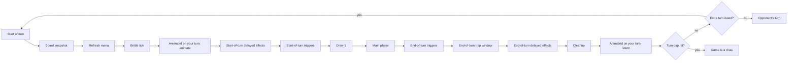

## 2. Core systems

A game is two players with 30-health heroes and 20-card decks, alternating turns until a hero hits 0 or the turn cap ends it in a draw.

### 2.1 Setup

1. Both decks are shuffled with the match seed.
2. Player 1 draws 3, Player 2 draws 4 (the Nth player draws N+2, so the engine should treat this as a table, not two constants). Any Quickdraw card in a deck replaces one of these draws (section 6), so a player is dealt at most as many Quickdraw cards as they have draws, and the rest stay in the deck (**Ruling**, [[R640]]). A card that casts on draw is not dealt while another card can be: it is set aside while the hands are dealt and mulliganed, and shuffled into the deck once the mulligan is done (**Ruling**, [[R635]]). A hand the other cards cannot fill takes Cast on Draw cards, uncast; each is cast at the start of the game (**Ruling**, [[R748]]).
3. Mulligan: each player sees their opening hand, marks any subset to return, draws that many replacements from the top of the library, then the returned cards are shuffled back in. **Ruling:** replacements are drawn before the returned cards go back, which is what "without replacement" means in the source. Once both mulligans have resolved, each player's set-aside Cast on Draw cards are shuffled into their deck ([[R635]]); the first draw that can meet one is turn 1's. Both players mulligan at the same time (**Ruling**, Hearthstone convention): either may answer first, an answer is sealed until both are in, and the other player learns only that it is in; then both resolve, Player 1's first, so the game is the same whichever answered first ([[R265]]–[[R267]]). The mulligans share one clock, and a player whose clock runs out keeps their hand ([[R268]]). Once both players have answered, Player 2, who goes second, adds The Coin ([[§7]]) to their hand, so it is never part of the mulligan (**Ruling**, Hearthstone convention; [[R244]]).
4. Start-of-game effects resolve: every Heroic Power in either player's hand or library picks its random power, including one the mulligan returned ([[R43]]).
5. Player 1 takes the first turn and does draw on turn 1 (**Ruling**, Hearthstone convention).

### 2.2 Turn loop

An extra turn owed to the player whose turn just ended starts that player's turn again in place of the opponent's, spending one ([[R846]]).

This is the only turn sequence; [[§6.2]] and [[§10.3]] follow it ([[R62]]). The start of a turn first records a snapshot of the field for C+ #35 Rollback ([[R419]]), then refreshes mana; then every Brittle count of the active player's cards that is due drops by 1, and a card whose count reaches 0 crumbles ([[§6.1]], [[R385]]); then the active player's "Animated on your turn" cards step from their backrow zones into unit zones ([[§6.1]], [[R383]]); then start-of-turn delayed effects (K-Pop Fanatic's steal) resolve, then start-of-turn triggers in queue order ([[R68]]), then the draw, so start-of-turn triggers fire before the draw. At the end of the turn, end-of-turn triggers resolve first (Combo-Index and the "add this back to your hand" spells included); then the end-of-turn trap window, where the Field Traps that watch turn ends (Bread and Butter, Intern Stimmy) fire on both sides; then end-of-turn delayed effects (Recycling Initiative, /fullsend's exile, CN-Virus's copies, [[R350]]); then cleanup, which discards the active player's Temporary cards from their hand ([[R637]]) and whose last step returns the active player's animated "Animated on your turn" cards to their backrow zones ([[R383]]), so their own end-of-turn text has run while they were Units. Main-phase actions are: play a card (pay cost, pick modes and targets), attack with a unit, switch a unit's position, activate a card's ability (Activate, [[§6.2]], [[R384]], Heroic Power's power among them), offer or answer a draw, concede, end turn. Actions resolve one at a time; the engine never has two in flight. Cleanup expires every "this turn" effect (the Lunar Eclipse discount, /fullsend's modifiers, Professor Curvature's discount on its turn); Twinspell's pending Echo is not turn-scoped and survives cleanup.

### 2.3 Mana

- Max mana = min(number of turns you have started, 4), plus persistent modifiers. It refreshes to max at the start of your turn. Turn 1: 1 mana; turn 4 onward: 4.
- Temporary mana (Mana Well, Fed Fauci, Efficiency Dividend, Genn's Greed, Call to Chaos, The Coin) adds to current mana and can exceed 4. A Refresh (/fullsend) gives back spent mana instead and never takes current above max ([[R364]]). GIGA Glowy Jelly Bean costs 6 and is castable only after such gains.
- Hinder subtracts from the opponent's next refresh. Mana never goes below 0.
- Jlarna's credit line ([[R1223]]): while it acts on its controller's field, any mana they spend may go past what they have, owing up to 4 at once; one turn's debt is split into 4 instalments as evenly as possible, larger first, one falling due at each of the borrower's next four refreshes, which give that much less mana; an instalment that finds too little mana takes what there is and the rest is forgiven ([[R1224]]). Mana never goes below 0.
- Lost refreshes ("lose all mana next N turns"): each of the player's next N refreshes gives 0 mana and spends the next-turn rider with it; mana gained later in the turn still adds; overlapping losses keep the latest end ([[R844]]).
- X-cost cards: X is chosen at play time, 1 ≤ X ≤ current mana (`MIN_CHOSEN_X`, [[R348]]), and is stored on the played instance, so a card whose X the player chooses cannot be cast for X = 0, and with no mana it cannot be played at all. Heroic Power costs (0); each of its powers pays its own X in mana as it is activated ([[R752]]). Cost modifiers never apply to an X-cost card ([[R65]]). On the field an X-cost card costs the X it was played for wherever a rule compares or counts costs, and 0 when it arrived without a chosen X ([[R396]]). A Unit may print its stats in X (C+ #69 Buff Billy's 3X/3X), which it is summoned with (`xStats`, [[§5]]). Embiggen cards offer two prices; the choice is stored the same way and drives the card's effect.
- Cost modifiers stack additively and floor at 0, in the order given by Cost in [[§6.3]] ([[R65]]); a temporary modifier ("this turn", "next turn") is stored with an expiry turn number. A card may also carry a floor of its own (C+ #14 Forever&'s "can't cost less than (2)"), applied after every discount, and a rule may forbid a play outright ("can't be played"), which is checked last ([[R65]]).

### 2.4 Drawing, fatigue, hand size

- One draw at the start of every turn. A draw limit ("your opponent can't draw more than 1 card each turn", C #4 Palantir, C #49) caps a player's draws in one turn, whoever's turn it is, the start-of-turn draw included: a draw beyond it does not happen at all, so no card moves, no fatigue is taken and nothing is cast on draw, and a public `drawLimited` reports it ([[R457]]); with several limits on one player the lowest holds. Cast-on-draw cards resolve immediately and the draw repeats, which can chain (CN-Virus into CN-Virus). A cast-on-draw card is cast even when the hand is full, since it never enters the hand. Setup casts none: the opening draw and the replacements skip them while another card is left, and one setup must deal waits uncast until the start of the game ([[R635]], [[R748]]). **Ruling ([[R58]]):** one draw casts at most `CAST_ON_DRAW_CHAIN_CAP` (20) cast-on-draw cards; the next cast-on-draw card drawn in that chain goes to the hand uncast (burned if the hand is full), which ends the chain. "Draw N" is N separate draws, each with its own chain, and "draw your whole library" draws the library size as it was when the effect started.
- Fatigue: the source names it but not its effect. **Ruling:** the Nth draw from an empty library deals N damage to your hero (Hearthstone). Infinite Reserves replaces each such draw with a Rush Token card. Each fatigue draw is reported by a `fatigue` event ahead of its hit, which both players see ([[R315]]).
- Hand size: unspecified. **Ruling:** 10. A card drawn or added to a full hand is sent to the graveyard ("burned"), and Call to Chaos's "draw your deck" respects this. Both players see which card burned ([[R317]]). Meditative #79 sets a player's for the rest of the game ([[R1143]]).
- Decks may exceed 20 during play (Unstable Clone Machine, CN-Virus, whose copies go in at the end of the turn it is cast on, [[R350]]); 20 is a deckbuilding limit only. **Ruling ([[R80]]):** a library holds at most `LIBRARY_CAP` (60) cards; a card that would be shuffled into a full library is not created, and an existing card goes to its owner's graveyard instead. Either way a `libraryOverflow` event reports the card the library turned away ([[R316]]).

### 2.5 Ending the game

| Condition | Result |
| --- | --- |
| A hero at 0 or less health at a state check | That player loses |
| Both heroes at 0 or less in the same check | Draw |
| Concede | That player loses |
| Disconnect grace period expires | That player loses (section 9.5) |
| Draw offered and accepted | Draw |
| End of the 60th turn | Draw ("auto-draw") |
| A player holding a win at the state check's game-end point | That player wins (`alt-win`, or `won-by-effect` for an effect's win) |
| Two players holding a win at the same point | Draw |
| Hard match ceiling reached (120 minutes) | Draw ([[R79]]) |
| A Glitch voids the match ([[§7]]) | No result: the match never happened ([[R679]]) |

At the state check's game-end point a hero at 0 or less loses first, even holding a win; otherwise a held win wins ([[R850]]).

**Ruling:** the cap counts player-turns, so 60 means 30 turns each (patch v0.2.0 doubled it from 30, [[R2]], [[R389]]). It is a backstop rather than the usual end of a long game: one draw a turn empties a 20-card deck on the first player's 17th turn and the second player's 16th (3 or 4 opening cards, [[§2.4]]), and fatigue, N damage on the Nth empty draw, then kills a hero at 30 health on the eighth, so two decks that do nothing end by fatigue on the second player's 24th turn, player-turn 48. Only a game that heals, gains Armor, refills a deck (C #30 Recycle) or replaces fatigue (#75 Infinite Reserves) reaches the cap, and CN-Virus, C #60 Pile On, C #37 Last Hurrah, C #26 Rapid Draw and C #28 Second Wind bring fatigue sooner. The hard match ceiling is 120 minutes, since 60 player-turns at a full 75-second clock take 75 ([[R79]]). Draw offers: once per player per turn, and a declined offer blocks that player from offering again for 3 of their turns; both numbers are config values. An offer stands until it is answered or its offerer's turn ends, both players see it standing, and one that lapses unanswered blocks nothing ([[R269]]). If at any point in their main phase a player's only legal actions are ending the turn, conceding and draw offers, the turn auto-ends ([[R82]]). Only the active player offers a draw, during their main phase; the opponent answers it ([[R36]]). When the active player's turn clock runs out, their open prompts are answered by the AI policy and the turn ends. A prompt held by the non-active player has its own clock, which on expiry answers only that prompt ([[R79]]).

### 2.6 Deckbuilding

Exactly 20 cards, no duplicate card ids, no Token-tagged cards. There is one format: a deck may mix Core, Classic, Classic+ and Meditative cards under these rules, and nothing is set-restricted ([[R380]], [[R1420]]). The three decks of a trio, which Conquest plays (section 9.5), share no card (section 9.4), so a trio needs 60 distinct cards, now from 370 non-token cards. A saved deck may be incomplete while it is being built; these rules are checked when it is queued ([[R250]], [[R253]]).
