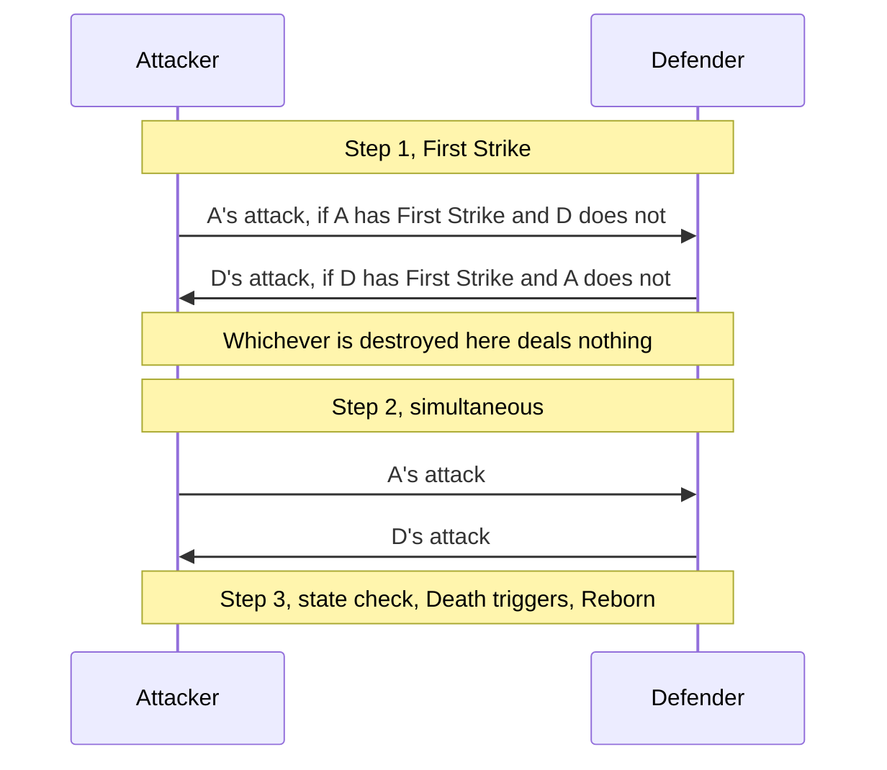

## 4. Combat

A unit has Attack, Max Health and Damage; current health = max health minus damage, and a unit at 0 or less is destroyed at the next state check. Damage stays on a unit between turns: no phase and no cleanup step clears it, and only a heal ([[§6.3]]) or leaving the field ([[R78]]) takes it off.

### 4.1 Positions and exertion

- Units enter in Attack Position. Defense Position grants Taunt and Armor +1, stacking with printed Armor and Big D-fender's aura. An Indestructible unit never has Taunt, so in Defense Position it gets only the Armor ([[R347]]).
- Each unit has one exertion per turn: one attack or one position switch. A unit with Deft may do both ([[R49]]). A unit with Windfury may attack twice ([[R636]]), and its first attack spends the exertion a switch needs.
- **Ruling:** only Attack-Position units may attack. A unit that switched to Attack this turn has spent its exertion and cannot attack (except one with Deft).
- Summoning sickness: a unit cannot attack the turn it entered the field. Rush lifts this for unit targets only; Charge lifts it for units and the hero. A sick unit may still switch to Defense. A unit that enters the field again, a Reborn body included, entered it on that turn like any other ([[R83]]). A unit whose controller changes (stolen, swapped with the board, or rotated across the centre line) has entered its new controller's side on that turn: it is summoning sick in exactly the same way, and its exertion is fresh for its new controller. A unit that only moves between lanes on its own side has not entered anything ([[R171]]).
- **Ruling:** a unit with 0 attack cannot declare an attack; it still deals 0 back when attacked. Spikey Pillow cannot be switched to Defense, nor can any unit whose text says "Cannot be in Defense Position" (C+ #19.1, C+ #48, C+ #51).
- A unit whose text lets it attack again (C+ #73.1 Classic Golem's transformed Unit after a kill) has a fresh exertion for that turn and is not summoning sick for it; nothing else gives a unit a second attack.

### 4.2 Declaring an attack

1. Choose an attacker that can attack (exertion unspent, Attack Position, not sick or has Rush/Charge, attack above 0, no "can't attack", not "can't attack or be attacked").
2. Choose a target: an enemy unit, or the enemy hero (not with Rush on the summon turn). The target's restrictions hold here ([[§6.1]]): a unit that "can't be attacked" (C+ #51) or "can't attack or be attacked" is never a target, and one that "only Units in this lane can attack" (C+ #19.1 Top Loser) is a target only for an attacker in the enemy unit zone of its own lane. Immune to Spells is no restriction on attacks.
3. Taunt check: if any enemy unit has Taunt (printed, granted, or from Defense Position; never an Indestructible unit, [[R347]]), the target must be one of them. Only a Taunt the attacker may legally attack under step 2 binds it.
4. Declaring the attack has now spent the attacker's exertion, before any damage. Trap window: My Pawn checks whether the hit would be lethal and, if so, cancels the attack; the exertion is not given back, so the attack is gone either way ([[R44]]).
5. Resolve combat, then run the state check.

Forced attacks (Moths to the Flame, Bear Honeypot) skip steps 1 to 3: the named units attack the named target in lane order, regardless of position or sickness, without spending their exertion, and stop when the target is gone. Each forced attack is a separate combat followed by its own state check ([[R53]]). A forced attack still obeys step 2's restrictions: one on a target its attacker may not attack does not happen, and a forced attack on "a random enemy" (C+ #19.2 Jungle Loser) is drawn from the targets its attacker may attack. A forced attack may be made on the attacker's own hero (C+ #19.5 Bot Loser while Berserk); a hero never strikes back.

### 4.3 Combat resolution

First Strike moves **that unit's** strike into step 1, on whichever side of the combat it is: an attacker with it hits a defender without it before that defender answers, and a defender with it hits an attacker without it before that attacker's blow lands. Either way the unit that struck in step 1 takes nothing back if its target falls there — [[§6.1]]'s "deals damage before non-First-Strike units", stated as a sequence. Both units with First Strike strike simultaneously in step 1. When the defender is a hero, only the attacker deals damage. A defender in Defense Position still strikes back with its full attack.

### 4.4 One damage instance

Every point of damage in the game (combat, Cry, spell, end-of-turn, fatigue) goes through this pipeline, in this order. A hit whose amount is 0 before step 0, such as a 0-attack unit striking back, is not a damage instance: nothing happens and Divine Shield stays ([[R63]]).

0. Spell Damage: if the source is a Spell (the Spell type, not a Field Spell or a Trap), add the Spell Damage of every unit on its controller's side (Spell Damage +X, [[§6.1]]; C+ #38 Solarius, C+ #38.1). It raises each hit the Spell deals, a split one's included, and not the hits its Units or the cards it summons deal.
1. Divine Shield: if the target has it, negate the whole hit and remove the shield. Stop.
2. Armor: subtract the target's total Armor (printed + Defense +1 + auras; hero uses Going Long's value). A source with Pierce skips this, on a unit and on a hero alike: a unit's Pierce through the layers, a spell's printed on its face (True Strike, [[R346]]). Floor at 0. What the Armor took off the hit, up to the whole of it, is the hit's `absorbed`, 0 for a hit that pierces ([[R1360]]). Then, on a hero, its damage multipliers: an aura that halves or quarters the damage its controller's hero takes (C #75 Argusland) divides the amount, rounded up, and several multiply; neither they nor step 3's cap are Armor, and they add nothing to `absorbed`.
3. Hit cap: the lowest cap on the target holds — a hero with Anti-oneshot Armor clamps to 5 (radiant 3), and C+ #11 Anime Armor's hero to 1.
4. Indestructible: takes no damage; stop.
4a. Lethal replacement: if the target is a hero and this hit alone would leave it at 0 or less — the amount after steps 0 to 3, judged as My Pawn judges an attack ([[R44]]) — a replacement that watches for lethal damage ([[§6.2]] Replacement; C #52 Final Gambit) acts here, before anything is dealt, and may re-aim the hit ([[§6.3]] Redirect). Fatigue is damage and counts; losing health ([[R18]]) is not damage and never opens it.
5. Apply damage; emit `damage` with source, target, amount dealt and the Armor's part of the hit (`absorbed`, absent at 0, [[R1360]]). The amount dealt is not capped at the target's health, except that a Trample source's damage to a unit counts only up to that unit's health, the rest being the step 9 instance ([[R63]]).
6. On-damage triggers (Fed Fauci gains a Plague Counter, Corpse Eater does not, that is a GY trigger).
7. Poisonous: if the source is a unit with Poisonous, the target is a unit, and 1 or more was dealt, mark the target destroyed.
8. Lifesteal: if the source has Lifesteal, or the effect stated that its own damage has Lifesteal ([[R85]]), heal the source's controller's hero by the amount dealt.
9. Trample: if the source is a unit with Trample, or a Spell that prints it (C #83 Flame Lance, read off its face as a spell's Pierce is, [[R346]]), and the target is a unit, the amount dealt beyond the target's health before this hit goes to the target's controller's hero as a new damage instance. This applies to any damage the unit deals, not only combat ([[R63]]).
10. Cleave (combat only): if the attacker has Cleave, deal its attack to each unit adjacent to the target as separate instances.

If the amount is 0 after step 3, the hit stops there, before step 4: no `damage` event and none of steps 5 to 9, so Fed Fauci gains no Plague Counter. A hit the target's Armor took whole at step 2 is reported by `damageAbsorbed`, with the whole hit as its `absorbed` ([[R1361]]): a report and no damage instance, which nothing answers (no trap, trigger or quest, and no Poisonous, Lifesteal, Trample or kill credit comes of it) and which takes no place in [[R68]]'s order. A fatigue draw whose hit Armor takes whole is reported the same way, from no source, the draw having happened ([[R240]], [[R1362]]). Cleave belongs to the attack rather than to the hit, so it still happens when step 1, step 4 or this zero rule stopped the hit on the defender ([[R63]]).

### 4.5 Deaths and the state check

The check runs after every resolved action, every fully resolved effect or trigger (a card's whole Cry, spell, trap or triggered script, or one cast-on-draw cast), and every combat (Trample and Cleave hits included; each forced attack is its own combat, [[R53]]). It never runs between the damage instances of a single effect, so every hit of Jlockeed Shredder lands before anything dies ([[R59]]); the one card that repeats an effect list with a check after each round is C+ #32.3 Blade Storm ([[R59]]).

1. Collect units with health 0 or less or marked destroyed, and backrow cards marked destroyed. Before anything moves, a replacement that watches for a death ([[§6.2]] Replacement: "would die", C #14 Shadowstep's Radiant face) acts on the units it names, which then leave the collection. Move the rest to their owners' graveyards at once (tokens vanish), each through any "would go to a graveyard" replacement ([[§6.2]]). A collected unit with Reborn reserves its zone until step 4 ([[R64]]). Indestructible units take no damage and ignore destroy marks; a marked Indestructible unit instead switches to Attack Position and loses Taunt until end of turn ([[R46]]). An Indestructible unit whose max health is 0 or less (Suppressive Aura) is collected like any other unit; one at 0 or less health whose max health is still above 0 stays ([[R69]]).
2. Check heroes: 0 or less health ends the game (both = draw).
3. Fire Death triggers of the collected units in [[R68]] order, a backrow card's included: a Field Spell, Trap or Field Trap that prints Death fires it when it goes from its backrow zone to a graveyard, as a Unit's does (C+ #12.8 Frostspatula); each reads its unit's last-known state from just before it left ([[R78]]); every other trigger reads the `destroyed` event instead, which carries what the unit was as it died ([[R89]]).
4. Reborn: each collected unit that had Reborn returns to its reserved zone (Locked meanwhile or not, [[R688]]) at 1 health without Reborn, as a reset instance ([[R78]]); its Cry does not fire, and because it has entered the field again it is summoning sick for the rest of that turn ([[R83]]).
5. Repeat until nothing changes, and at most `STATE_CHECK_PASS_CAP` (100) times. A check still finding work on the hundredth pass is an engine bug rather than a game state, so the engine throws there instead of returning a state no rule produced.

**Ruling:** Death triggers fire on both deaths of a Reborn unit, so radiant Right-house defender summons a base copy on its first death and again on its second.
