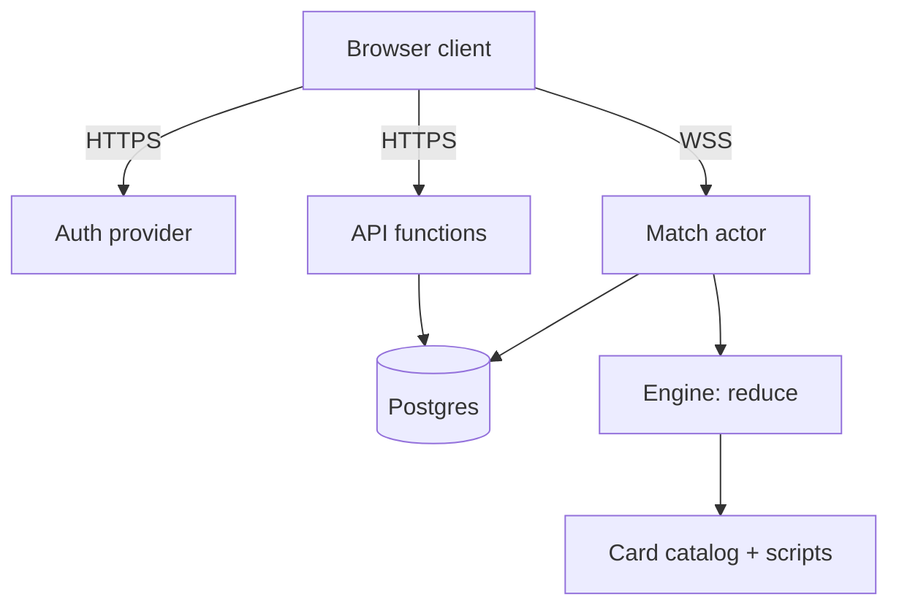

## 9. Architecture

The match runs on the server as a pure, seeded reducer inside one actor per match; the client sends intent and receives a filtered view.

### 9.1 Trust model

| Domain | Truth lives | Client may | JackiOh specifics |
| --- | --- | --- | --- |
| Identity and entitlement | Server | Read a projection | Everyone owns every card at launch; keep the ledger anyway |
| Usernames | Server validates and stores | Propose (after the server's preview), render | A base name with a `#n` tag when it is taken, unique by case fold, `Player#n` until the player picks one, changed once a day; a label only: a player is always keyed by profile id ([[R1432]]–[[R1436]]) |
| Decks and trios | Server validates and stores | Propose | Up to 10 named decks and 5 trios of 3 decks; a queued deck or trio passes [[§9.4]]'s rules, and a trio's decks share no card; an imported trio is checked and saved whole or not at all ([[R341]]) |
| Tutorial progress | Device, and the server for an active account | Propose (merged, never removed) | Lessons won and the Hide/Show choice; the union of both copies ([[R320]], [[R321]]) |
| Game settings | Device, and the server for an active account | Propose (the newer group wins) | The settings dialog's switches, volumes and choices, in four groups, each with the time it last changed; a group replaces the stored one only when later ([[R633]], [[R634]]) |
| Match | Server | Read `viewFor(state, playerId)`, submit actions | Hidden: library order, the opponent's library, a card in your own library you were never shown ([[R312]]), opponent hand, face-down traps, the other player's pending-choice options |

One rule: the client sends intent ("play instance 7 in zone 3 with target 12"), never state.

### 9.2 Topology



The match actor (Durable Object or equivalent) is the only stateful component: it holds the state in memory, one WebSocket per player, an alarm for the turn clock, and it appends every resolved action to the log. Idle actors hibernate.

### 9.3 Engine requirements (binding on section 10)

- `reduce(state, action, rng)` is pure: no I/O, no clock reads, no framework. Timestamps arrive as action data.
- Seeded RNG only, `Math.random` banned by lint. `(seed, log)` reconstructs any match.
- Mid-action choices are state, not callbacks: a choice made during resolution (Discover, mulligan, chained steps, Echo repeats, triggered effects) sets `state.pending` and returns; the answer is another action. The choices a card declares for its own play (zone, X, embiggen, Tribute, targets, modes) travel in the `play` action instead ([[R81]]). This is what makes prompts identical in live play, replays and tests.
- Every action carries a client nonce, deduped server-side.
- `reduce` refuses illegal actions itself and returns the reason; client greying-out is UX only.
- Append-only action log per match; snapshots are a later optimisation. A replay shows a seat each step exactly as `view_for` did, and is refused on another catalog version or a final-hash mismatch ([[R768]]).

### 9.4 Accounts, collection, loadouts

- Managed auth provider; `profiles.status` in pending, active, banned. A pending account can log in, verify its email and see the code screen, and nothing else: no collection, loadout, queue or match. Redeeming an invite code flips pending to active.
- Codes: 16 characters (80 bits) from a 32-symbol alphabet without 0/O/1/I/l, formatted `XXXX-XXXX-XXXX-XXXX`, stored hashed. Redemption is one server-side transaction: (1) reject unless the account is pending with a verified email; (2) reject if this profile made more than 5 attempts in the last hour; (3) reject if this IP hash made more than 20; (4) log the attempt either way; (5) look up by hash and reject if revoked, expired or exhausted; (6) increment uses and set the account active, atomically. Missing, expired and exhausted codes return an identical error in identical time. A global circuit breaker disables redemption and alerts when system-wide failures cross a threshold in a window. Trusted devices (a signed device token that skips the code screen after a reinstall) are optional and never authorise an account.
- The client's code screen and sign-in screens are UX over the rules above and decide nothing the server does not. The code is typed into one field drawn as four groups, read exactly as the server reads it ([[R191]]), and submitted only when complete, so a partial code costs no attempt. The screen shows how many attempts the account has left in the window and, with none left, when one comes back. A refusal at steps 2 or 3 is shown as a rate limit with its wait ([[R192]]), never as the identical error. A code refused with [[R145]]'s identical error is not sent again until the player changes it, since it cannot turn good and each try counts, and the field is locked while a code is being redeemed. Sign-in, sign-up, confirmation resend, password reset and a signed-in player's change of email (from the account page (`/account`), [[R663]]) go straight to the auth provider ([[§9.2]]). Every refusal is mapped to the client's own sentence, and none reveals whether an account exists ([[R160]], [[R192]]). Emailed links are read once and scrubbed from the address bar ([[R193]]), and a session is renewed or ended as [[R194]] says. Every screen on the way (landing, sign-in, reset, the code screen, the gate's own panels, a screen whose code failed to load, and a check that runs long) offers a way back. The per-IP limit of step 3 counts the address [[R190]] names.
- Usernames. Every account has a username: a base name and, when another player holds that name, a numeric tag (`Max`, `Max#1`, `Max#2`). The base is `USERNAME_MIN_LENGTH` (2) to `USERNAME_MAX_LENGTH` (16) user-perceived characters of letters, digits, `_` and a letter's combining marks, in one script or a mix a language needs, and is stored in its NFKC form ([[R1432]]). A light profanity filter is the only content check, and no name is reserved ([[R1433]]). Two names clash when their NFKC case folds match: the first player to pick one gets it bare and each after the lowest free tag, and a new account starts as `Player#n` ([[R1434]]). A player changes their username at most once every 24 hours, through a preview the server answers with the exact username a save gives or why it refuses, and an account that has just turned active is asked for one before anything else, with a way to skip ([[R1435]]). A username is a label only: the server, the database and every request key a player by profile id, and every read that shows a player carries both ([[R1436]]).
- Collection is an entitlement ledger (`collection` plus append-only `collection_grants`); catalog is static, versioned, shipped with the client; stale catalog version is rejected at save and queue. The catalog version is the latest card patch's ([[R105]], [[R388]]): every patch is kept as a snapshot of the whole catalog, in order, so an older version of a card can still be read (the collection's History, a public Patch notes page, and the server's `GET /api/catalog/:version`), and a match folds under the version it started with. A patch's new cards are granted to every account through `collection_grants`, as the launch grant was ([[R111]]). Every collection change writes `collection` and `collection_grants` in one transaction, and no client path writes either.
- Decks and trios. A player saves up to `MAX_SAVED_DECKS` (10) named decks and builds up to `MAX_SAVED_TRIOS` (5) trios from them; a trio is three of the player's saved decks, in order ([[R250]], [[R252]]). Both are drafts, so a save checks structure and never legality: a deck's **D1** name of 1 to `DECK_NAME_MAX_LENGTH` (40) characters, **D2** at most `DECK_SIZE` cards, **D3** every card a deckable card of the catalog, **D4** at most `MAX_COPIES` of a card, **D5** the deck's `portrait` `null` or a known portrait id ([[R641]]); a trio's **T1** name, **T2** three slots, any of them empty, **T3** no deck twice. An incomplete deck, a card the player does not own and a trio whose decks share a card are all kept, and judged when queued. A card is its catalog id: Radiant is a flag on a card in play ([[§5.2]]), never a second card ([[R251]]). Every deck and trio has an id the client mints, and saving one is an idempotent upsert of it alone ([[R256]]); deleting a deck empties the trio slots that held it. The catalog version the client holds is checked at save. A deck travels between players as a versioned deck code ([[R255]]), and a trio with its three decks as a versioned trio code ([[R339]]); both are at version 2 since patch v0.2.0, which writes each card's number with its set (Core n, Classic 1000 + n, Classic+ 2000 + n), and a version 1 code, which every code minted before it is, still reads as Core numbers; importing one makes the decks and the trio together, under both caps, or makes nothing and says how many slots it needs ([[R340]], [[R341]]). The single loadout of three decks that came before became three saved decks and one trio ([[R254]]).
- An active account also keeps its tutorial progress ([[§9.10]], [[R320]]): the player reads its own row, and the server merges into it and never removes a lesson.
- An active account also keeps its game settings ([[§10.11]], [[R633]]): the player reads its own row, and the server replaces a group of it only with a strictly later one ([[R634]]).
- Queue rules, checked by one validator module shared by client and server, when a deck or a trio is queued or brought to a room: **L1** a trio holds exactly 3 decks; **L2** exactly `DECK_SIZE` (20) cards per deck; **L3** at most `MAX_COPIES` (1) of a card per deck, no Token-tagged cards and no card of a set that has not shipped ([[R1420]]); **L4** a card id appears in at most one deck of a trio; **L5** copies never exceed the quantity owned; **L6** every card exists in the current catalog version and is not banned. A Best-of-1 deck must pass L2, L3, L5 and L6, and a Conquest trio all six ([[R253]]). A queue-time failure names the deck and the card. The chosen deck or trio is frozen into the queue ticket or the room.

### 9.5 Matchmaking and lifecycle

- Direct challenge by room code (6 characters from the invite-code alphabet) ships before the ranked queue and is the primary mode while the player base is small. Enqueue asserts the account is active and not in a match or a series, validates the chosen deck or trio ([[§9.4]]), freezes it into the ticket and returns the ticket id. Pairing runs on enqueue plus a sweeper every few seconds; the window widens ±50 rating every 10 s from ±100 and is uncapped after 60 s; both tickets are claimed in one atomic statement. The client shows the queue population instead of an endless spinner. A queued player may leave the lobby while they wait: a pairing takes them to the game from wherever they are in the client, and while their match or series is live the main menu and the practice menu show a banner with the way back to it ([[R765]]).
- The turn clock (75 s) ends a stalled turn. A prompt held by the non-active player has its own 30 s clock. The two mulligans share one 45 s clock, which a player's answer neither stops nor extends for the other ([[R268]]). Disconnect grace (60 s) and concede end the match as a loss, and the hard wall-clock ceiling (120 minutes since patch v0.2.0, [[R389]]) ends it as a draw through the `ceilingReached` action. Every ending records a result and clears both players' in-match state, and a reaper resolves anything past the ceiling. Ranked games move the hidden Glicko-2 rating ([[§9.12]], [[R603]]). The clocks, the ceiling, the grace window and the room codes are server config values ([[R79]]).
- Reconnect gets a fresh full view, never a log replay. The clock keeps running while a player is disconnected, and the grace countdown is stored on the match so both clients show it. A crashed actor rebuilds its state by folding `(seed, log)`. A seat whose socket has not attached when the first socket reaches its match's actor (after a restart, or a player who never opens the match) is disconnected from then, and keeps a grace deadline the restart left stored ([[R744]]). A match socket that goes quiet is found rather than waited for: the server pings it every 15 s and drops it after 45 s with no frame of any kind, which is a disconnect and starts the grace, and closes one whose outgoing queue overflows; a page that wakes asks a socket it has not heard from for a ping interval for a full view and replaces it if none comes ([[R1441]]).
- Modes. The queue and the room challenge offer three modes, and a ticket pairs only with a ticket of the same mode ([[R257]]): **Best of 1**, one saved deck; **Conquest**, a trio (below; its queue name is still `bo3`, [[R330]]); **All Random**, both players dealt a deck by the weighted random deck-builder [[§9.9]] names, with no saved deck needed ([[R258]]); each player may ask for "More cards from the newest set" for their own deck, at least half of it from the newest set that ships, sent as intent with the queue, room or rematch request and dealt by the server ([[R1372]]). A room is made in its host's mode, and a joiner plays that mode ([[R264]]). The host can share a room as a link that opens the lobby with the code filled in and the room's mode chosen; the joiner still picks and presses Join ([[R767]]).
- Portraits and emotes. A match's two seats are shown as hero portraits ([[R641]]), each fixed when the seat is fixed — a queued deck's own, an All Random seat's dealt at random, a Conquest game's the picked deck's — and sent to both clients on join and on reconnect in a `portraits` message ([[R642]]). The emotes of [[§10.10]] are a pool of twenty-four — five voice lines in each portrait's own voice and nineteen shared emoji ([[R1340]]) — of which each seat is dealt a hand of eight each game, three lines and five emoji, from the match seed on a stream of its own (`{seed}:emotes:{seat}`), so the same eight come back on a reconnect, a restart and a replay, and no game state sees them ([[R1341]]). The `portraits` message carries the receiving account's own hand, never the opponent's and never `PlayerView` ([[R1342]]). In a match a player may send an emote of their hand through a top-level `emote` message that never enters `ActionBody`, the action log, the replay hash or a game record; the actor relays it to the opponent alone, refuses one outside the sender's hand silently and before the limit ([[R1342]]), drops it silently past the shared rate limit, and answers an unknown id as `malformed` ([[R643]]).
- Rematch. After a match that is not a game of a Conquest series ends, either seat may offer a rematch: a normal one, or double-or-nothing ([[R672]]). An offer lives `REMATCH_OFFER_TTL_MS`, and a new match is created only when both seats have offered with equal stakes; mismatched stakes create nothing. The rematch replays the finished match's frozen decks under a fresh seed (an All Random rematch deals fresh decks from that seed, each leaning on the newest set when its seat's offer asked, [[R258]], [[R1372]]), and it is ranked exactly when the finished match was. Either seat sees the offer buttons only while the opponent is still present — presence is the opponent's match socket being open, so the buttons disappear when they leave or log out. A game of a series offers no rematch: the Conquest continue flow owns what comes next.
- The opponent's aim. While a player aims a play, an Activate or an attack, by drag or by click-select, the opponent sees Hearthstone's targeting arrow from its source to the target it is over, gone when the aim ends. It travels in a top-level `aim` message that is never an `ActionBody` or part of `PlayerView` and decides no rule; its ends are public handles only — a hero, a zone of the field, a hand card's position — so a hand card's arrow starts at its back and a face-down card is only ever its zone. The actor shape-checks it, relays it to the opponent alone, coalesces it to one relay per `AIM_RELAY_INTERVAL_MS`, and drops one that names anything the opponent may not see ([[R738]]).
- Conquest. A player takes the series by winning one game with each of the three decks of the trio frozen when they queued: `SERIES_WINS_NEEDED` (3) game wins, one per deck, because a deck that wins is locked for the rest of the series, while a deck that lost or drew may be picked again ([[R330]]). Before each game both players pick at once, from their decks that have not won, on the series screen: a pick is sealed, final once made and hidden from the other player, who sees only that it is in, and the game starts as soon as both are in ([[R331]], [[R338]]). A player with one deck left has it picked for them, and when both do the game starts at once ([[R332]]). Picking has a clock, which gives a late player their first deck that has not won ([[R333]]). A drawn game counts for neither side and locks nothing, and a series plays at most `SERIES_MAX_GAMES` (7) games, after which more wins takes it and equal wins is a series draw; a concede or a disconnect loses the game, not the series; between games a player may forfeit the series ([[R334]]). Series seat p1 goes first in odd games ([[R335]]). Each side sees which of both sides' decks have won, and nothing else of the other side's trio ([[R336]]). A series moves the rating once, when it ends ([[R262]]). It lives in the database, picks included, and survives a server restart ([[R263]]); one begun as a Best of 3 goes on as a Conquest ([[R337]]).

### 9.6 Build order

| Step | Scope | Spec sections it needs |
| --- | --- | --- |
| 1 | Pure seeded `reduce`, local hotseat, every Core card | 2–8, 10 |
| 2 | Auth, profiles, invite gate | 9.4 |
| 3 | Collection ledger; grant everything to everyone | 9.4 |
| 4 | Loadout builder and shared validator with the unique index | 2.6, 9.4 |
| 5 | Match actor, WebSocket, `viewFor`, action log, room-code challenge | 9.1–9.3, 10.8 |
| 6 | Turn clock, disconnect grace, concede, results | 2.5, 9.5 |
| 7 | Ranked queue with frozen decks | 9.5 |
| 8 | Economy through `collection_grants` | out of scope |

Out of scope: spectating, tournaments, player-facing replays (the action log makes them cheap later), behavioural anti-cheat, economy design.

### 9.7 Suggested repository layout

```
crates/
  engine/      reduce, state, events, rng, combat, triggers, zones, view_for; wire/ (action, event and
               catalog types); validator.rs (deck, trio and queue rules D1–D5, T1–T3, L1–L6, shared by
               client and server)
  cards/       catalog.json (268 cards + 50 tokens across Core, Classic, Classic+), patches/ (one snapshot per
               card patch), src/scripts/core/, src/scripts/classic/, src/scripts/classic_plus/: one file per
               card, its tests inside it
  ai/          the practice opponent
  wasm/        the engine, cards, AI and validator as WebAssembly for the client
  server/      API functions, match actor, matchmaking
  tools/       the `jackioh` CLI: fuzz, replay, the catalog and spec checks, the AI's gates
apps/
  web/         client (board, hand, prompts, animations driven by events)
e2e/           Cypress: hotseat games and networked room-code games
```

### 9.8 Abuse surface

| Vector | Mitigation |
| --- | --- |
| Claiming unowned cards | The collection is server-owned; loadouts are validated against it (9.4) |
| Deck swapped after matchmaking | Decks are frozen into the ticket (9.4) |
| Reading a Conquest opponent's pick or decks | A pick leaves the server only in its owner's projection, and the other side's deck names and lists never do ([[R331]], [[R336]]) |
| Illegal actions | `reduce` rejects them; client checks are UX only (9.3) |
| Reading deck order or the opponent's hand | Never sent; `viewFor` sends counts (10.8) |
| Stalling | Server clock, disconnect grace, hard match ceiling (9.5) |
| A dead or unread match socket | Server ping and idle timeout start its grace; a bounded outbox closes a socket that stops reading ([[R1441]]) |
| Action flooding | Per-match rate limit in the actor, per-account rate limit at the API |
| Invite code brute force | 80-bit hashed codes, per-account and per-IP limits, verified email, circuit breaker (9.4) |
| Multi-accounting to farm rating | Invite codes; watch for clusters of accounts sharing an IP hash |

Every rejected action is logged with its reason, and accounts with an unusual rejection rate raise an alert.

### 9.9 Practice against the AI

Practice is a single-player game against a computer opponent, on the client's `/practice` route. It needs no account and no server. The engine and the AI run in the player's browser, in a Web Worker, and the page receives only `viewFor(state, human)`, the human's `legalActions` and whether the AI owes an action. The worker stands where [[§9.1]] puts the server. A practice game records no result, no rating and no collection change, and it replays exactly from `(seed, decks, handicaps, log)` ([[R187]]).

The human always plays with this spec's resources. The AI seat gets a handicap ([[R180]]) by difficulty, held as `AI_DIFFICULTY` in `config.ts`:

| | Easy | Medium | Hard |
| --- | --- | --- | --- |
| Deck size | 20 | 25 | 30 |
| Max mana | min(turns, 4), as a human | min(turns + 1, 5) | min(turns + 1, 7) |
| Opening hand | as a human | +1 card | +1 card |
| Draws per turn | 1 | 1 | 2 |

"+1" means one more crystal than a human has on every turn, up to the tier's cap, with persistent and temporary mana modifiers on top exactly as for a human ([[R181]]). Hard includes Medium's extra opening card ([[R182]]), and its second draw is a separate draw ([[R183]]). An AI deck holds its tier's number of distinct, token-free cards of every set ([[R184]], [[R380]]). The Coin is not a resource of a tier: whichever seat goes second, the AI's or the human's, is dealt it after the mulligan at every tier ([[R244]]). The tiers change resources only: the AI's search, evaluation and budget are the same at every tier. Below Easy sits one more handicap, the tutorial's (`AI_TUTORIAL`, [[§9.10]], [[R290]]), which lowers the AI seat's resources instead of raising them; no player picks it, the tutorial deals it.

The AI (`crates/ai`) is pure and seeded like the engine. It also emotes: at match creation every AI opponent is dealt one of four personas — Balanced, Polite, BM or Silent — that rolls cosmetic emotes off an RNG injected apart from the engine's and the search's, under the players' own rate limit and caps ([[R645]]), choosing only within the hand of emotes the AI seat was dealt ([[R1344]]). The tutorial's persona is always Silent.

- **Information.** It decides from what its seat may know and nothing else ([[R185]]). Before it simulates, it determinizes: the opponent's hand, the backrow it cannot read and the opponent's library are resampled from the non-token cards of every set the opponent has not shown ([[R185]]), its own library is shuffled, and the seed is its own. A face-down card shows its cost ([[R351]]), so each one the seat cannot read is resampled from the Traps and Field Traps of that cost while one the opponent has not shown is left ([[R762]]).
- **Search.** Each action is chosen by a turn-level beam search over `legalActions` sequences played through `reduce` on several determinizations. The search starts with a lethal solver, a bounded search for a line that wins this turn on every determinization, answers the AI's prompts the same way, and re-plans after every action. The Coin is one more card to the search: the AI plays it when a line that spends its mana scores better than one that keeps it. The mulligan returns cards costing more than 3, and the AI answers it as soon as the mulligans open, without waiting for the human's, so the human sees the AI ready ([[R265]], [[R266]]).
- **The opponent's reply.** The best lines are scored one turn deeper. On each determinization the opponent answers the line by a fixed rule and ends its turn, and the line is scored at the start of the AI's next turn. The opponent plays a card the line itself put in its hand (a Pocket Chaos handed back, units a Flood bounced), when that improves its position, because the AI watched that card arrive. Otherwise it swings with its board by static trade value: lethal first, then a kill it survives, a trade up, or the face. It plays none of the cards it held unseen, because those are samples. Every step is a real `reduce`, so traps, First Strike, Taunt and end-of-turn effects happen as they would in the game.
- **Evaluation.** Hero health (concave, so the last points weigh most), hero armor, board stats and keywords through [[§10.4]]'s layers, cards in hand, library, unspent mana at the end of the turn, the enemy's face damage next turn against the AI's health and the reverse, and the enemy's face-down cards. A unit in Defense Position counts only part of its attack, since it cannot attack until it switches back, and the position's Taunt and Armor count only through the damage they stop ([[§4.1]]). Every point of damage on the enemy hero also counts at a flat rate, and more as the turn cap nears, because a game that reaches the cap is a draw ([[§2.5]]). A position scored after the opponent's reply counts the enemy's threat at a discount, because the AI moves first and can still answer it.
- **Budgets.** Budgets count `reduce` calls, so the same state and AI seed give the same decision. The browser adds a wall-clock cap. The quality gates and the shadow-ban sweep play at the browser's budget, and one decision at that budget takes under 1.5 s on the development machine. The timing gate reads the clock against a yardstick, a fixed piece of engine work timed just before each decision, and converts the ratio to the development machine's milliseconds, so a busy or slower machine slows both and fails nothing.
- **Quality gates.** Three matchups measure the AI at the browser's budget on a frozen seed series that no tuning run plays, the subject alternating seats and every game folded back to its hash: the Easy AI against [[§10.7]]'s random policy (100 games), the Easy AI against a one-ply greedy baseline at equal resources whose evaluation weights tuning never moves (50 games), and the Hard AI against the Easy AI (50 games). `cargo jackioh gate` plays the first 20 games of each. Only wins count; a draw at the turn cap is reported beside them. The brief asked for 95%, 70% and 80% wins. On fresh deals the AI wins 94.5% ± 0.7 of 1,000 against random and 68.0% ± 1.5 of 1,000 against greedy, and as Hard 91.3% ± 1.6 of 300 against Easy. Against greedy that is short of the brief, and no change tried moved it past noise (a four-times search, perfect information, weights tuned by paired self-play, a reply that plays the opponent's sampled hand, kills on the last turn): the dealt decks decide most of these games. **Proposed, pending the user's acceptance:** a run of n games needs the brief's share of them, or the count that an AI as strong as measured reaches in 95% of runs of n games, whichever is lower (`gateNeeded`). That asks for 91 of 100 and 17 of 20 wins against random, 28 of 50 and 10 of 20 against greedy, and the brief's 40 of 50 and 16 of 20 for Hard against Easy. An AI at the measured rates fails any one of these runs by chance at most once in twenty, and one of the three about once in thirteen. A gate of this size catches a broken AI, not a lost point or two: a run fails with 90% probability only once the win rate falls to 86% (full) or 70% (smoke) against random, 46% or 34% against greedy, and 71% or 64% for Hard against Easy. A 5-point loss against greedy fails the full run one time in eight. A claim about strength needs hundreds of fresh deals, not the gate. Until the user accepts this rule, the brief's counts stand as the target. On the frozen series this AI reaches them against random (98 of 100 in the full run, 20 of 20 in the smoke run) and as Hard against Easy (45 of 50, and 16 of 20), and falls short against greedy only (31 of 50 where the brief asks 35, and 11 of 20 where it asks 14). Those are the counts since The Coin ([[R244]]) changed every game of the series. Before it they were 98 and 19 against random, 46 and 18 as Hard against Easy, and 34 and 13 against greedy (the full run against greedy then drew 4 games at the turn cap, and now draws 7); those were the counts once the edge-case hunt's rounds 9 and 10 changed how some of the games play, and docs/polish/3-ai.md, "Fix pass 2", gives the ones before that, one lower in every run but the smoke run against random. Every run still clears its proposed count, the smoke run of Hard against Easy exactly. Three games in fifty is inside what the gate itself cannot tell apart (above), so these runs do not say whether The Coin made the AI weaker against greedy; hundreds of fresh deals would. The Radiant pass ([[R275]], [[R276]]) changed the games in which a card turns Radiant, and the shadow ban swept again after it ([[R186]]) changed the AI's decks. With both, the full runs are 93 of 100 against random (3 turn-cap draws), 35 of 50 against greedy (2) and 48 of 50 as Hard against Easy (1), and the smoke runs 19, 14 and 18 of 20: every one clears its proposed count, and greedy's full run now reaches the brief's 35 while random's falls short of its 95. Five games fewer in a hundred against random is inside what the gate cannot tell apart, as above. With [[R762]]'s sampler (the greedy baseline keeps the one the gates were fixed on), the smoke runs are 20 of 20 against random, 17 of 20 against greedy and 20 of 20 as Hard against Easy: every one clears its proposed count. The full runs with [[R762]]'s sampler, played by the Rust port (`cargo jackioh gate --full`, which the daily super run plays in shards and holds to `gateNeeded`), are 94 of 100 against random, 35 of 50 against greedy and 47 of 50 as Hard against Easy, with no turn-cap draw, the counts the TypeScript AI's last green gates gave: every one clears its proposed count, and greedy's reaches the brief's 35.
- **Decks.** An AI deck is a curve- and tag-aware random draw of distinct non-token cards of every set, minus the shadow ban ([[R186]]). The draw may lean on a set: at least half the deck from it (`AI_DECK.leanMinShare`, a hard floor beside the units' and the theme's, all three kept together), the rest dealt as without it ([[R1370]]). "More cards from the newest set" leans a player's random deck, All Random's or practice's, on the newest set that ships ([[R1371]]); the AI's own decks do not lean. The shadow-ban sweep judges every card at the Easy and the Hard handicap, because the ban holds at every tier and a tier's mana decides what the AI can do with a card. Since patch v0.2.0 it runs in two passes and leans toward the cards at risk of a ban ([[R390]]): pass 1 forces each of the 268 cards into AI decks as before; a card is at risk when a pass's numbers meet a flag's condition at half strength, or it is banned or on the watch list (`SHADOW_WATCH`, the cards that were at risk and cleared, which the next sweep counts as at risk from the start); pass 2 sweeps only the at-risk cards, with more games each (`seedsPerCardAtRisk`, 24), and in every pass-2 game the filler draw multiplies at-risk cards' weights (`atRiskBoost`, 4) and lifts the ban for those banned as `neverPlayed` or `selfHarm`, never for `error` or `timeout`. A ban for `neverPlayed` or `selfHarm` needs pass-2 evidence: 6 affordable turns with no play, or 8 plays, at that tier, a card's numbers adding up over every game it was dealt in, forced or as filler; `error` and `timeout` ban as before, only the game's forced card, and are listed against at-risk filler of that game as suspects. Pass 1's at-risk list is a pure function of pass 1's results and pass 2's seeds are named, so a sweep of record replays. The sweep never rewards the search for playing a card, which would measure another AI than the one that plays, and the ban's scope is unchanged: AI deck-building only.
- **Draw offers.** The AI never concedes or offers a draw, and it declines every draw offer at once ([[R188]]). The practice page does not show the Offer draw control for that reason; the action itself stays legal.

The human's deck is one of their saved decks (an active account's, complete ones only), a fresh random deck (with "More cards from the newest set" beside it, [[R1373]]), or one of three named practice decks: Human Vanguard, Blitz and Fortress, each hand-built from Core cards outside the AI's shadow ban. Before the game starts the setup shows the chosen deck's cards and mana curve, read from the catalog the worker sends. The AI's turns are paced for the player to follow: each step waits while the board still animates the last one, or while the page marks a voice line as playing (`data-speaking`, capped so a mark nobody clears cannot stop the game). A practice game in progress survives a reload or a closed tab, as a live match survives a server restart by folding `(seed, log)`: after every answer the worker keeps the game on the device (its setup, its log and the AI's place in its own random stream), the page remembers only the setup it chose, and the next visit to `/practice` asks the worker to fold the log back and goes on from the same state, the AI included; a game that will not fold the same way, on another catalog version for one, is dropped and the setup shows. The save stays with the worker, because its log names the AI's hidden cards. Leaving a game through New game or the menu asks whether to Save and leave or Leave without saving: a game saved that way is not picked up by the next visit, which shows the setup with a banner at its top that resumes it, and starting another game from there ends it ([[R765]]). A finished game is not kept, and a link that starts a game starts it in place of the saved one. A tutorial lesson is not kept, since its coach follows the game from the deal ([[§9.10]]), so while a lesson is in progress the page asks before a reload or a closed tab ends it ([[R668]]).

### 9.10 The tutorial

The practice page opens with a tutorial: a path of four lessons, each a practice game ([[§9.9]]) against a computer opponent weaker than Easy, with two fixed decks, a fixed seed and a coach that walks the player through it. Like any practice game it needs no account and no server, runs in the practice worker, and records no result ([[R187]]).

| # | Lesson | What it teaches | The human |
| --- | --- | --- | --- |
| 1 | First steps | Heroes and their health, mana, playing units into lanes, summoning sickness, attacking the hero, trading with units, winning | goes first |
| 2 | Spells and keywords | Spells and their targets, removal, a Cry with a target, Taunt, Divine Shield, Reborn, Rush, Charge, First Strike, Armor, Defense Position | goes first |
| 3 | The backrow | Traps set face-down and springing on either turn, the opponent's face-down cards, Field Spells, a hero's Armor, tokens, Quickdraw | goes first |
| 4 | Tricks of the trade | The mulligan, going second and The Coin, Radiant cards, a tribe and its payoff, tokens, Tribute, the yellow glow | goes second |

- **The tutorial opponent.** The AI seat plays with the tutorial handicap, `AI_TUTORIAL`, the one below Easy ([[R290]]): a 12-card deck, at most 3 mana crystals, and a hero that starts at 20 health instead of 30. Its search, evaluation and budget are every tier's, so it plays sensibly with less. Its deck is the lesson's own fixed list, not a dealt one, and holds nothing the lessons before it have not taught: no Spell in lesson 1, no Trap or Field Spell before lesson 3 ([[R291]]).
- **Fixed deals.** Each lesson has a fixed seed, a fixed seat and two fixed decks; the human's is a legal twenty-card deck of mostly Common, Rare and Epic cards. So a lesson deals the same opening hands and the same draws every time, and the coach can name the cards it points at. A lesson replays from `(seed, decks, handicaps, log)` like any practice game ([[R187]]), and The Coin goes to the seat going second as always ([[R244]]), which is why only the lesson that teaches it seats the human second.
- **The coach.** Each lesson has a script: steps in order, and tips for moments the AI brings about (it plays The Coin, it springs a trap). A step points at the board element it is about — a card in hand, a unit, a lane, the mana, the backrow, a hero, End turn, the open prompt — with a short line of plain language, and advances when the view shows it done, however the player did it. The coach reads the human's view, the human's legal actions and whether the AI owes a move, and nothing else, so it shows nothing the board does not and decides nothing ([[R292]]). There is no Skip step ([[R314]]), and nothing strands the player: only a tip or an info step holds the AI, and each shows Got it; a step whose moment has passed, or that is still current after a few of the player's own turns, retires by itself; and the player can always exit the tutorial. It works with drag-to-play and with click-click, at desktop and phone sizes, honours reduced motion, and its buttons take keyboard focus.
- **Winnable.** Every lesson is won by doing what the coach asks, every step of it shows and completes on that line, and each mechanic the lesson lists actually comes up on it; a sensible player who ignores the coach wins too, and one who ignores it with random moves neither breaks it nor stalls it ([[R293]]).
- **Progress.** Lessons open in order: the first is always open, and winning one opens the next. A win says what it opened and offers the next lesson; a loss offers a retry with a tip for that lesson. Progress is kept on the device and, for a player signed in with an active account, on the account too, the two merged so a won lesson stays won on both ([[R294]], [[R320]], [[R321]]). A player can hide the lesson path while a lesson is still to do and show it again; the choice travels the same way, the newest one winning ([[R322]]).

### 9.11 Card statistics

Every finished game leaves a record, and card win rates are read off the records, so balance decisions rest on data: the live games, and the AI's development runs played on a build before its patch ships ([[R376]]–[[R378]]).

- **The record.** A game's record holds its match type ([[§9.5]]'s mode), its patch (the newest patch in [[R388]]'s `patches.json` of the build that played it, which is also its catalog version), each seat's pilot (human or AI), which seat took the first turn, each seat's decklist, opening hand, the cards it drew into its hand and the cards it played from it, and the result. The engine reads it off `(seed, decks, log)` (`summarizeGame`), so the game state and the log are unchanged. The server files a live match under its match id once the result has committed; the record names no account, outlives the log's retention, and never costs a result ([[R376]]). A practice game records nothing and sends nothing ([[R187]]), so it leaves no record.
- **Sources.** A record is live, a match the server ran, or development, a game of an internal AI run (`cargo jackioh stats`): AI-against-AI All Random games, both decks dealt by [[R258]]'s deal and both seats on this spec's resources at the browser's budget, filed under the patch the run says it tests. A development record enters the database only through `jackioh-server stats-import`, which refuses any other kind, and no figure counts one unless the query asks for development data ([[R378]]).
- **The breakdowns.** A card's figures come from the decks that held it, each deck once per game: in deck, in the opening hand, going first, going second, and played against its baseline, drawn but not played. Each is a win rate, wins over games with a draw a game not won, with its number of games beside it. The played delta is the played win rate minus the drawn-but-not-played win rate, in percentage points ([[R377]]).
- **Player statistics.** The player's own tally ([[R639]]) is kept on the device, not in these records: games finished and how they ended, and for each card how many games it was seen in, how often the player played it, how often the opponent played it where the player could read it, how often a copy of the player's own was destroyed and how often one of the opponent's was. It counts the player's online matches and practice games, and not a tutorial lesson or a hotseat game. It is read off the views the client already holds, so it can name only a card the player was shown ([[§9.1]], [[R97]]): a trap the opponent sets face-down is not counted until it is revealed. It sits in the browser's `localStorage`, makes no request and leaves no trace on the server, and no figure above reads it.
- **Queries.** `jackioh-server stats-cards` reads any combination of match type, patch and pilot (human, AI, or both together, "unified"), over live data, development data or both, for every card or one. Naming a patch reads that patch's games alone, so its pre-release run and its live games compare as two queries of the same patch, one with `--source=dev` and one without; no one query sets the two side by side ([[R377]], [[R378]]).
- **Public statistics and the publication gate.** Public card win-rate data is accessible without an account on `/stats` and inside the card detail view (`CardDetail`). To prevent misleading statistics on freshly shipped patches, AI development games pad the card statistics until the active patch has logged `PUBLIC_STATS_MIN_LIVE_GAMES` (1000) live games (ranked and unranked combined, tutorial games excluded). Below 1000 live games, public card stats combine AI development runs and live games, which the response labels "AI games + live games (provisional)"; the page says only that its figures are provisional, and shows neither the source nor the gate's progress ([[R661]]). At and above 1000 live games on the patch, the gate flips: public statistics use live games only, and AI development games are ignored with no toggle to bring them back. A card with fewer than `CARD_STATS_MIN_SAMPLE` (20) games displays "not enough games" rather than a percentage. The card aggregates endpoint (`GET /api/stats/cards`) is public and cacheable with `CARD_STATS_CACHE_TTL_SECONDS` (300 s). Player statistics from [[R639]] are synced to the account (`GET /api/stats/player`, `PUT /api/stats/player`); the public players tab reads aggregates from `GET /api/stats/players` (cached `PLAYER_STATS_CACHE_TTL_SECONDS`, 60 s), excluding players who opt out in settings (`publicStats: false`, default true) ([[R654]]). Each of its rows carries the player's `profileId` and `username`, and its search matches usernames by NFKC case fold ([[R1436]]).

### 9.12 Ranked ladder

Every player has a hidden skill rating to climb with and a visible Grape tier to show for it, and the top 100 compete on a numbered global leaderboard ([[R603]]–[[R612]]).

- **The hidden rating.** Each player carries a hidden Glicko-2 rating — rating, deviation and volatility — starting at a new player's values. One rated game is one rating period for both sides, each rated against the other's rating from before the game, so the order of computation changes nothing. Draws, offered or by the turn cap, score 0.5 for both; concedes and disconnects are losses like any other ending. The update is deterministic: the same inputs give the same outputs on every machine ([[R603]]).
- **What rates.** Only the ranked match type moves a rating or a rank: a match the queue paired, or a rematch of a ranked match ([[R672]]). A room challenge is unranked and records both ratings unchanged. A game of a Conquest series is recorded but not rated; a ranked series moves the rating once, as one game between its two sides, when it ends ([[R604]]).
- **The visible tiers.** A player who has not finished the season's placement games is shown as Raisin, with how many placements they have played. Past them, the ladder is one integer per player — pips above the bottom of Rotten Grape III — read as Rotten Grape, Normal Grape, Large Grape, Golden Grape and Mythic Grape, each of three divisions (III at the bottom, I at the top) of pips per division. The tiers below Jlorious target the Grape drop rates as percentiles of the season's placed players — Rotten 12%, Normal 60%, Large 20%, Golden 7%, Mythic 1% — and the boundaries are config values, tuned without code changes ([[R605]]).
- **How pips move.** A win gives pips and a loss takes pips; a draw moves nothing. The move leans gently toward the hidden rating: a game played a division or more away from the rank the rating calls for leans one pip extra toward it when the game's own move already heads that way — a win below the called-for rank or a loss above it — so the visible rank converges on true skill without big point swings. Wins in a row earn bonus pips below Mythic Grape ([[R606]]).
- **Floors and peaks.** A player cannot drop below the Grape tier they have reached this season, though divisions inside a tier can still drop. Each season's best — the highest ladder reached, or the best Jlorious position held — is kept and shown as a badge on the profile ([[R607]]).
- **Jlorious.** The final tier is not a ladder position but the top 100 placed Mythic Grape players by hidden rating, shown as a numbered leaderboard position (#1–#100) instead of divisions. When fewer than 100 Mythic players qualify, every one of them is Jlorious. A player who falls out of the top 100 is Mythic Grape again, where the tier floor holds them ([[R608]]).
- **Seasons.** A new season opens on each minor version bump (v0.2 → v0.3), named by the minor version. Opening one soft-resets every rated player's hidden rating: pulled partway toward the players' mean, deviation widened and capped at a new player's, volatility kept. Everyone starts the season back in Raisin placements; the first season resets nothing ([[R609]]).
- **Bots.** Each AI bot keeps its own internally maintained Glicko-2 rating, rated like a player's when a rated game seats one — which no live mode does today, practice being client-side and unrated ([[R187]]). Bots have no ladder rank and are labeled and excluded from the player leaderboard ([[R610]]).
- **Rated-game records.** Every rated game is recorded with the patch and build version, the pilot per player, the result, and the rating before and after for both sides, with each side's visible rank before and after alongside ([[R611]]).
- **Reads.** The client reads its own rank, the leaderboard, and both seats' ranks on the match screen; the profile shows its tier, division and pips with its season badges, and the Play online lobby shows the same rank with a link to the leaderboard ([[R661]]). No read carries the hidden rating, not even to its owner ([[R612]]). Each player a read shows, its own caller included, comes with their `profileId` and `username`; the old `tag`, a hash of the profile id shown as a name, is gone ([[R1436]]).
