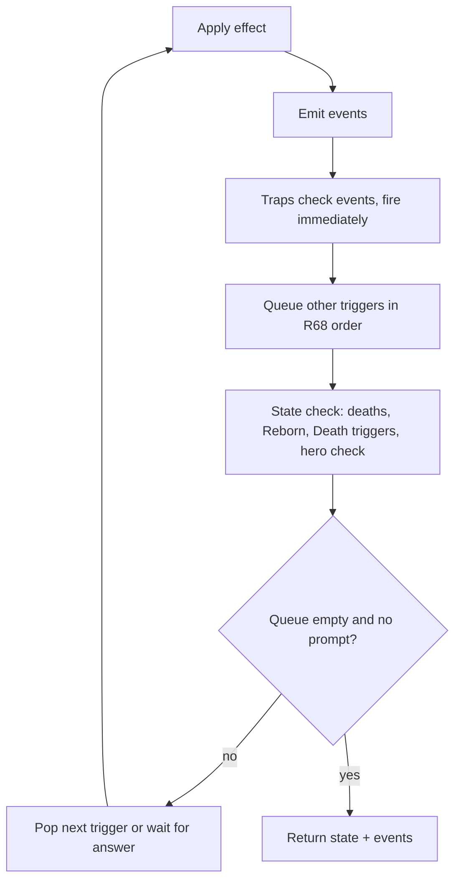

## 10. Engine implementation guide

The engine is a pure reducer over an immutable state that emits an event list; every card is a small script composed from shared primitives; every random and every prompt goes through state so replays and tests are exact.

### 10.1 State model

```ts
type GameState = {
  seed: string; rngCursor: number;
  turn: number;                 // player-turn counter, 1-based, cap 60 (R2, R389)
  active: PlayerId; phase: 'setup'|'mulligan'|'start'|'main'|'end'|'over';
  players: Record<PlayerId, PlayerState>;
  pending: PendingChoice | null; // exactly one open prompt at a time; the mulligans are the one exception (2.1, 10.6)
  triggerQueue: QueuedTrigger[];
  echoQueue: EchoRepeat[];      // Echo repeats a played card still owes (6.1, 10.5 step 6)
  declaredAttack: DeclaredAttack | null;  // the attack whose trap window is open (4.2 step 4, R44)
  dispatch: DispatchRecord[];   // events still owed to the traps and the trigger queue (10.3)
  work: WorkItem[];             // sequences a prompt interrupted, waiting to continue (9.3, 10.6, R113)
  workCursor: number;           // where the running pause cascade parks its next item (R113)
  delayed: DelayedEffect[];     // K-Pop Fanatic steal, Recycling Initiative, /fullsend exile
  counters: { drawn: number; played: number; destroyed: number; exiled: number }; // Ceaseless Void
  transientDefs: Record<string, CardDef>;  // Fuse and Craft a Card results, under ids that name their ingredients (R77, R179)
  reserved: ZoneRef[];          // zones a dying Reborn unit holds until it returns (R64)
  homes?: { instanceId: string; zone: ZoneRef }[];  // backrow zones an animated "on your turn" card returns to (R383)
  announcing?: { instanceId: string; player: PlayerId; faceDown?: true; countered?: true }[];  // plays and casts between their announce and §10.5 step 4, innermost last (R448)
  castsResolving?: { instanceId: string; player: PlayerId; random: boolean; targetEnemies: boolean; casts: number }[];  // casts in progress and their mode (R452, R453)
  lastSpell?: { defId: string; radiant: boolean };  // the last Spell either player played (C #57, R399, R451)
  marks?: { instanceId: string; mark: string; color: string; delayedId: string }[];  // marks on cards, such as #50's pending steal (R437)
  boardHistory: BoardSnapshot[]; // the field and its Locks at the start of each of the last BOARD_HISTORY_DEPTH turns (C+ #35, R419)
  lastBoards: Record<PlayerId, { defId: string; radiant: boolean }[]>;  // each seat's board as its last game ended, a setup input (C+ #29, R417)
  mulliganed: PlayerId[];       // whose mulligan has resolved, in seat order (2.1)
  mulligan?: Record<PlayerId, { prompt: PendingChoice; keep: string[] | null }>;  // both mulligans while they are open; keep is the sealed answer (R265, R266)
  result: null | { winner: PlayerId | 'draw'; reason: string };
  nextId: number; nextSeq: number;  // deterministic ids and R68's creation order
  applied: { nonce: string; events: GameEvent[] }[];  // nonce dedupe (9.3)
  castChain?: number;           // cards the running cast-on-draw chain has cast, so R58's cap bounds it (R217)
  fieldExits?: { count: number; last: Record<string, number> };  // the field's departures, which survive a pause (R174)
};
type PlayerState = {
  hero: { health: number; armor: number };  // Heroic Power lives on its instance (R43)
  mana: { current: number; max: number; nextTurnMod: number; permMod: number };
  hand: CardInstance[]; library: CardInstance[]; graveyard: CardInstance[]; exile: CardInstance[];
  units: (Pile | null)[5]; backrow: (CardInstance | null)[5];  // Pile = CardInstance[] top-first
  resolving: CardInstance[];    // cards mid-resolution: a Spell between its play and its GY (10.5 step 4)
  locks: { units: boolean[5]; backrow: boolean[5] };
  mods: PlayerModifier[];       // next-spell discount, this-turn discounts, Curvature, Twinspell echo, /fullsend's Combo draw; since v0.2.0 also price rules (`costRule`, R455), `enchantNextSpell` (C+ #14), `replacePlays` (C #23, R449), `turnEnds` (R456), `startOfTurnEffect` (a rest-of-game effect, R458) and `healToDamage` (C+ #22)
  turnLog: { playedIds: string[]; cardsPlayed: number; unspentAtEnd?: number; costsPaid?: number[]; playedByType?: Partial<Record<CardType, number>> };  // costsPaid: what each play paid, beside playedIds (R213); plays by type counted on both players' turns (C+ #37, R451)
  draws?: { turn: number; count: number };  // this player's draws on the running turn, whoever's it is (C #9, R457)
  gameLog?: { playedByTag: Partial<Record<Tag, number>>; lastFaceUpPlay?: { defId: string; radiant: boolean; chinese?: true; type: CardType } };  // never reset (C+ #64, T-AI-2, T-AI-5, R451)
  backrowPiles?: CardInstance[][];  // the cards beneath each backrow zone's top, lane by lane (R447)
  carried?: (CardInstance | null)[];  // the Unit each backrow zone carries (C+ #33, R446)
  drawOffer: { offeredTurn?: number; blockedUntil?: number }; fatigueCount: number;
  turnsStarted: number;         // drives the mana refresh (2.3)
  aiTurn: boolean;              // My Pawn: the AI policy plays out the rest of this turn
  handicap?: Handicap;          // an AI seat's resources in practice; absent = this spec's (9.9, R180)
  handCap?: number;             // this seat's hand size, once set for the rest of the game (M #79, R1143); absent = 10
};
type CardInstance = {
  id: string; defId: string; owner: PlayerId; controller: PlayerId; radiant: boolean;
  zone: Zone; position?: 'ATK'|'DEF'; summonedTurn?: number;
  damage: number; buffs: { attack: number; health: number }; grantedKeywords: Keyword[]; vanilla: boolean;
  costMod: number; costOverride?: number; x?: number; embiggened?: boolean;
  counters: { plague?: number; grade?: number }; memory: Record<string, unknown>;
  exertion: { attacked: boolean; switched: boolean }; statsOverride?: { attack: number; health: number };
  returnToHandAtEndOfTurn?: boolean;
  tauntSuppressedTurn?: number; // Indestructible would-destroy: no Taunt this turn (R46)
  faceUp?: boolean;             // backrow card revealed, e.g. a Field Trap that has fired (R33)
  lastDamagedBy?: string;       // instance id of the last damage source (R42)
  divineShieldSpent?: boolean;  // the shield absorbed a hit and is gone until granted again (6.1)
  markedDestroyed?: boolean;    // destroyed by an effect; the next state check collects it (4.5)
  rebornSpent?: boolean;        // came back through Reborn, so it no longer has it (4.5 step 4)
  knownAs?: { defId: string; radiant: boolean };  // what its owner was shown of it going into their library; absent = never shown (R311, R312, R433)
  tuning?: { attack?: number; health?: number; addKeywords?: Keyword[]; removeKeywords?: KeywordKind[]; x?: Record<string, number>; numbers?: Record<string, number>; set?: Record<string, number> };  // Degrade, Upgrade and KY's Constant (R386, R442); kept in every zone
  brittle?: { count: number; since: number; printed?: true };  // Brittle X (R385, R441, R638); kept in every zone but ticking on the field only, never copied
  berserk?: true;               // C+ #19.5's status, lost on leaving the field (R412)
  chinese?: true;               // shown in Chinese, kept everywhere (R1300)
  grantedTags?: Tag[];          // granted by an effect (R923)
  timesPlayed?: number;         // plays of this instance, the current one included (#31, R429); kept in every zone
  enchantments?: ({ kind: 'returnAfterResolve'; floor: number } | { kind: 'castOnDraw' } | { kind: 'targetEnemies' })[];  // riders kept in every zone (C+ #14, C+ #40, R443)
};
```

Everything a card needs to remember (Carnivorous Cube's meal, Heroic Power's chosen power, Combo-Index's grade, an Activate's uses in `memory.activations`, In Too Deep's quests in `memory.quest`, [[R404]]) lives on the instance so cloning, Fuse and replay stay trivial. `radiant`, `tuning`, the Brittle count, `timesPlayed` and the enchantments persist in every zone and through leaving the field ([[R78]]); so do `costMod` and `costOverride`, until the card reaches a graveyard or an exile pile, where it costs its printed cost again ([[R766]]) — save that #31's own end-of-turn return gives back the `costMod` it was played at, which [[§10.5]] step 7 notes in its `memory` beside `returnToHandAtEndOfTurn` as it lands it ([[R429]]); `buffs` and `grantedKeywords` persist in a hand and a deck too, and are carried onto the field ([[§10.4]]). Every field patch v0.2.0 added is plain data, so a paused state, a Rollback's history and a KY's Test in progress survive `JSON.parse(JSON.stringify(...))` and fold exactly from the log. `Zone` names the pile or field slot a card sits in plus two states that are no pile: `{ z: 'resolving' }`, a Spell between its play and its graveyard ([[§10.5]] step 4), and `{ z: 'gone' }`, a unit token that has ceased to exist and so is in no pile at all ([[§3.2]], [[R11]]). Fused and crafted cards get a generated `defId` in `transientDefs`, and that id names the ids it was fused from ([[R179]]). The fused scripts are code, which state cannot hold, so they live in the process's script registry under that id. A `t-<n>` count alone is unique only within one match, and two matches in one server process, or the practice AI's simulated worlds beside the real game, would otherwise run each other's scripts; an id that names the ingredients names one set of scripts wherever it is minted, so no fusion replaces another state's. And because the id names them, the engine rebuilds from the id alone any fused scripts the registry lacks — a state that came through JSON into a process that never ran its Fuse — whenever `reduce`, `legalActions` or `viewFor` is entered.

### 10.2 Actions

`reduce(state, action, rng) → { state, events, error? }`. Action types: `mulligan {keep[]}`, `play {instanceId, zone?, x?, embiggen?, tributes[], targets[], modes[]}` ([[R81]], its choices validated per [[R90]]; it may also carry a graveyard card under a play-from-graveyard permission and the Plague Counters that pay part of C #74's price; C #89's targeting cost discards at random as it is paid, so no action carries its discards, [[R682]]), `attack {attackerId, targetId}`, `switchPosition {instanceId}`, `activate {instanceId, ability?, targets[], modes[], tributes[]}` ([[R384]]; `activatePower {instanceId, targets[]}` is kept as its alias so old logs replay, [[R43]]), `answer {choiceId, selection}`, `offerDraw`, `answerDraw {accept}`, `concede`, `endTurn`, `setAutoEndTurn {enabled}` (the sender's own [[R82]] preference: accepted from either seat at any moment of a live game, it emits nothing and `legalActions` never offers it, [[R345]]), plus server-only `timeout` (answers the open prompt of the player whose clock expired with the AI policy, and ends the turn only when that is the active player; while the mulligans are open it answers that player's own mulligan by keeping the whole hand, [[R268]]), `disconnectExpired` (that player loses) and `ceilingReached` (the match ends in a draw), all per [[R79]]. Every action carries `playerId` and `nonce`. `legalActions(state, playerId)` is exported and is what both the client UI and the My Pawn AI consume; it lists `activate` from the same check that refuses one ([[R384]]).

### 10.3 Events and triggers

Every visible state change emits an event. This is the complete list, and BUILD's animation table has one row for each: `cardPlayed`, `cardResolved`, `summoned`, `damage`, `healthLost`, `healed`, `divineShieldLost`, `destroyed`, `enteredGraveyard`, `exiled`, `bounced`, `burned`, `fatigue`, `libraryOverflow`, `discarded`, `drawn`, `addedToHand`, `shuffledIn`, `buffed`, `keywordGranted`, `counterChanged`, `costChanged`, `modifierChanged`, `radiantSet`, `transformed`, `fused`, `positionSwitched`, `controlChanged`, `rotated`, `swapped`, `locked`, `trapFired`, `attackDeclared`, `attackCancelled`, `manaChanged`, `turnStarted`, `turnEnded`, `turnAutoEnded`, `promptOpened`, `promptAnswered`, `drawOffered`, `drawAnswered`, `gameOver`, and since patch v0.2.0 `cardAnnounced` (a play entering [[§10.5]]'s announce window, showing what `cardPlayed` would), `countered`, `stolen` (a steal off the field, hidden per zone), `unlocked`, `activated`, `animated`, `deanimated`, `crumbled` (a Brittle count reached 0), `degraded`, `upgraded`, `redirected`, `healthSet`, `questProgressed`, `questCompleted`, `rolledBack`, `chaosRolled` (the effects a Call to Chaos rolled, named to both players, [[R436]]), `flickered` ([[§6.3]] Flicker), `drawLimited` (a draw a draw limit stopped, [[§2.4]]), `turnCutShort` (a turn an effect ended, [[§6.3]] End the turn), `marked` (a mark on a card, such as #50's pending steal, [[R437]]), `numberChanged` (a number C+ #41 KY's Constant set, hidden per zone) and `glitched` (what a Glitch did, [[R676]]), and since patch v0.3.X `damageAbsorbed` (a hit the target's Armor took whole, a report nothing answers, redacted as `damage` is, [[R1361]]) and `translated` (a card both players read is shown in Chinese from now on, [[R1301]]) — 67 in all. Payloads patch v0.2.0 added to older events: `destroyed` names the controller it died under and whether it died Radiant ([[R89]]); `drawn` carries `turnDraw`, the draw's count on its turn, public ([[R457]]); `counterChanged` carries `placed` for a Plague placement ([[R471]]) and the kind `brittle` ([[R385]]). Since patch v0.3.X `damage` carries `absorbed`, the Armor's part of the hit ([[R1360]]), and `controlChanged` carries `how`, a steal or a give ([[R1366]]); both are absent where they have nothing to say, are the client's reports, and are left out of the events the trigger loop holds, so no rule reads them and no state hash moves for them. A new event type is added here and to BUILD M5-T4 together. Triggers are functions `(event, state) → Effect[]` registered by card scripts and by zone (hand triggers for Corpse Eater and C #33 Joro, deck triggers for C+ #37 Wardrum, graveyard triggers for C #47, backrow triggers for traps).

Resolution loop after any action or answer:



"Apply effect" means a whole script's effect list, so the state check never splits one effect ([[R59]]). Traps are checked before other triggers because they are responses (the end-of-turn trap window of [[§2.2]] is the one scheduled exception, [[R62]]); a trap that fires during the opponent's turn resolves to completion (including forced attacks and prompts for the trap's owner) before the opponent's action continues. Start-of-turn and end-of-turn are events too, so Mana Well, Moths and Combo-Index are ordinary triggers, and Bread and Butter and Intern Stimmy fire in the end-of-turn trap window. A replacement ([[§6.2]]) is not a trigger: it acts at its fixed point before the event it changes, and a trap that watches one fires there.

### 10.4 Stat and keyword layers

Compute a unit's view on every read, never store totals:

1. Base: printed stats of the base or radiant form (per `radiant`), or `statsOverride` for tokens summoned with X/X. A card that prints no Radiant form (`radiantFallback`) doubles its base form's stats, `statsOverride` included, when Radiant ([[R349]]).
2. Set-stat: Felinor Fiender adds the sum of your Felinors' layer-4 stats, twice that on its Radiant face ([[R362]]); T-AI-2 Scaling Law adds per AI generated card its controller has played this game.
3. Fused stats: part of the transient definition's printed stats ([[R77]]), so no separate layer at runtime.
4. Permanent buffs: `buffs` (Gary, Plastic Surgery, Friend of Felinors, Corpse Eater), then `tuning`'s stat delta ([[R386]]). A buff and a granted keyword given in a hand or a deck stay on the instance and are carried onto the field (C+ #40, C+ #77).
5. Auras: Jlockeed's Weapons, Suppressive Aura, Big D-fender, Spikey Pillow, Rush Token Farm, and the stats per Plague Counter of C #42 and C #69. Attack floors at 0; max health can fall to 0, which the state check turns into a death. An aura that sets attack to a value (C #88's Radiant "0 Attack") applies after every other layer.
6. Current health = max health − damage.

Keywords = printed (unless `vanilla`) ∪ `grantedKeywords` ∪ `tuning`'s added keywords ∪ aura grants ∪ position grants (Defense: Taunt, Armor +1) ∪ conditional keywords whose condition holds now (C #69), minus `tuning`'s removed keywords, minus Taunt while `tauntSuppressedTurn` is the current turn ([[R46]]) and minus Taunt whenever the union holds Indestructible ([[R347]]). Armor and Spell Damage are summed across all sources, and a numbered keyword carries `tuning`'s X delta. An animated card's unit face is layer 1 like any Unit's ([[R383]]).

### 10.5 Playing a card

1. Validate: legal zone, cost ≤ current mana after all modifiers, Tribute available, X or embiggen chosen, targets legal — every choice the play carried is checked against what the card declared and what the board allows ([[R90]]). The player's mana as this step begins is recorded for the card's Cry (`ctx.manaBeforePlay`, C #22).
2. Pay: mana, Tributes (sacrifice), and consume the next-spell discount if used.
3. A live `replacePlays` (C #23 Devil's Pact) replaces the play or cast by a new card here, and a tag rule makes a play carrying that tag Radiant (C+ #68), read at step 1 as [[R214]] reads Gifted Program ([[R449]]). Gifted Program may set `radiant` now: each one on the playing player's side is a static flag the engine reads against the turn log's `costsPaid` ([[R213]]). Step 1 has already asked the same question, to know the face the play resolves with ([[R214]]). Then any `onPlayHook` runs ([[R153]]).
3a. Announce: once the price is paid and before the card moves, emit `cardAnnounced { instanceId, player, type, costPaid, targets }` and open a window in which counters answer it, as traps answer any event (traps first, then other triggers, [[§10.3]]). A card set face-down is announced to the other player by its zone, its cost and the type "Trap" only ([[R448]]). The first counter to resolve cancels the play ([[§6.3]] Counter): it stops here, so step 4 never places the card or emits `cardPlayed`, nothing that answers `cardPlayed` (Sheepish, [[R17]]) sees it, and its Echo repeats never happen. The window can open a prompt, so steps 4–8 park on `state.work` while it is open ([[R113]]). A cast is announced too ([[R70]]).
4. Move the card to the field (Units, Field Spells, Traps) or to a resolving state (Spells), a card set face-down taking a fresh id ([[R227]]) — from the hand, or from a graveyard under a permission ([[§6.3]] Play); emit `cardPlayed`; increment `turnLog.cardsPlayed`, its plays by type, the game `played` counter, `gameLog.playedByTag` and the instance's `timesPlayed` ([[R429]]).
5. Resolve Combo checks, Quickstriker, /fullsend's Combo draw, then the card's own Cry or spell script (targets already chosen).
6. Echo: repeat step 5 with fresh prompts N times.
7. Spells go to the GY or exile (or back to hand under C+ #14's enchantment, or where a "would go to a graveyard" replacement sends them); Unstable Clone Machine and Bear Honeypot fire after resolution (Bear Honeypot only while its controller has an open unit zone, [[R430]]); Sheepish fires after a played Unit resolves, its Cry included ([[R427]]); Unlicensed Experimentation fires after a played permanent's Cry ([[R61]]).
8. Run the resolution loop.

### 10.6 Prompts (`state.pending`)

`PendingChoice = { id, playerId, kind: 'discover'|'target'|'mode'|'mulligan'|'hand'|'zone'|'tribute'|'direction'|'x'|'embiggen'|'number'|'answer'|'cell'|'reward'|'pick', options, min, max, resume }`. Patch v0.2.0's kinds: `number`, a number from a fixed range (C #18's 0 to 10, declared with the play); `answer`, one of a multiple-choice problem's options (C+ #42, whose key stays in `resume` and never leaves the engine, [[R420]]); `cell`, a board cell (C+ #62, one cell a prompt, [[R422]]); `reward`, a completed quest's reward (C #90, [[R404]]); and `pick`, a pick of one card or several, budgeted by count or by cost, from a pile, a hand or cards across zones (C #44, C #56, C #78's Radiant face). C #11 opens a `hand` prompt over the opponent's hand, and its Radiant face a `mode` prompt over the costs there. A mode prompt may be held by the other player (C #8): it is a `mode` prompt carrying that player's id, answered on the non-active player's clock ([[R79]]). `resume` names the script continuation and its captured data, so the reducer is re-entrant: `answer` re-invokes the script with the selection. Multi-step effects (Private Tutor, Craft a Card, Masochism Mask radiant) chain prompts. The opponent's view shows only that a prompt is open, never its options. The mulligan is the one exception to one prompt at a time: both players' mulligan prompts are open together, outside `state.pending`, as one sealed-bid step, and while it is open nothing moves but a mulligan and the actions that end a game ([[§2.1]], [[R265]], [[R266]]). A card's own play choices (zone, X, embiggen, Tribute, declared targets and modes) are not prompts; they travel in the `play` action, and the client builds them with the same pickers ([[R81]]). No card opens an `x`, `embiggen`, `zone`, `tribute` or `direction` prompt, since all five are play choices; the kinds stay for later sets. `hand` is reachable: an Echo repeat of Glowy Jelly Bean reopens its hand pick as a prompt, and a discard "of your choice" ("of their choice") asks its discarder while it resolves ([[R682]]; C #90's reward G does). `number` is reachable the same way: C #18 declares its number with the play (in `modes`), an Echo repeat reopens the pick as a `number` prompt, and a cast of an X card that is not random asks its caster for X as a `number` prompt, never an `x` one ([[R453]], [[R520]]; Zao Gao's discard was one too, until patch v0.1.1 made it random, [[R354]]).

### 10.7 Randomness, pools, scorers

- One PRNG (xoshiro128\*\* or mulberry32) seeded per match; `rng.next()` advances `rngCursor`, which is stored so replay resumes mid-log.
- `rng.pick(list)`, `rng.shuffle(list)`, `rng.coin()`, `rng.chance(p)`, `rng.lucky(x, roll, better)`.
- `catalog.query` (5.1) is the single source of random pools, over every set unless the card names one ([[R380]]); it never returns tokens, bar the Grapes in a Fruit pool and C+ #23's every-token pool ([[R382]]), nor the requesting def, by id, unless the effect names its pool ([[R387]]).
- Copy semantics: `cloneInstance(inst)` for "copy of this unit" keeps radiant, buffs, granted keywords, vanilla, `statsOverride` and `tuning`; resets damage, exertion, counters (a Brittle count included), the times-played count and summonedTurn ([[R57]], [[R429]]).
- Zephyrs scorer: for each candidate, simulate a dry-run score: lethal available → max; can clear the enemy board → high; hero below 10 and card heals → high; otherwise stats-per-mana plus draw value. Deterministic, ranks all non-token Core cards except Zephyrs itself, Discover offers the top 3. The weights are engine constants, tested against fixed states. C+ #27 Zephrys Zealotism uses the same scorer over the non-token Classic and Classic+ cards but itself to choose a whole hand ([[R416]]).
- AI policy (My Pawn, "Targets chosen randomly"), described here once and only pointed at from [[R44]] and [[R84]]: draw uniformly from `legalActions` minus the three action types the policy never takes — `concede`, `offerDraw` and `answerDraw`, held as one named constant ([[R84]]) — ending the turn when nothing else is left on that set and otherwise with probability 0.1 (`AI_END_TURN_PROBABILITY`); with a prompt open that set is only that prompt's answers (`legalActions` adds nothing to them but `concede`, [[R211]]), which is what answering prompts uniformly means ([[R44]]).

### 10.8 `viewFor(state, playerId)`

Returns the full public board, the viewer's hand and pending options (while the mulligans are open, the viewer's own mulligan until it answers, then only whether each player has answered and what the viewer kept, [[R266]]), the standing draw offer ([[R269]]), the viewer's own automatic-turn-end preference when they have turned it off ([[R345]]), counts for the opponent's hand and both libraries, the viewer's own library as a list without order ([[R310]]: each definition and face with a count, sorted by printed cost, then name, then id, never an instance id or a position; cards the viewer was never shown only as a count of unknown cards, [[R311]], [[R312]]), face-down markers for the opponent's backrow (traps show as unknown but carry their cost, the number the controller's own view shows, a deliberate reveal, [[R351]]; Field Spells are public), the viewer's own face-down traps marked `unrevealed` ([[R351]], [[R371]]), both graveyards and exile piles in full, mana, health, armor, clocks and the last N events for animation. A trap that changes control becomes visible to its new controller only ([[R33]]); a Field Trap that has fired is public. A fired trap's `trapFired` event names it to its controller only while the controller may read it where it is now ([[R154]], [[R763]]). The events up to a Glitch's reset or boards name no card the state no longer holds ([[R764]]). A card revealed out of a library (KY's Private Tutor) is revealed only as an option of the prompt that reveals it: the chooser sees it in full, the opponent sees only that a prompt is open ([[§10.6]]), and the rest of the library stays hidden from the opponent, and from the chooser beyond what their own list already says ([[R310]]).

The viewer's own cards also carry Hearthstone's yellow glow as `conditionActive: true`: a card in the viewer's hand during the viewer's own main phase with no prompt open, and a unit or backrow card the viewer controls, whenever the card's script `conditionMet` holds ([[§10.9]], [[R195]]), and a hand card also when a condition another card grants it holds ([[R662]]). The key is absent otherwise, never `false`, and never set on the opponent's cards. The viewer's own hand cards also carry `counteredOnPlay: true` when a card on the field the viewer may read would counter them at every price they could be played at now (C #87 Plague Chalice, [[R667]]), with the same three rules. A viewer's own hand card with an embiggen price ([[§2.3]]) carries `embiggenCost` beside its `cost`: what a play of it at the embiggen price costs now, every discount and surcharge applied, read by the same price function its play is charged by ([[R65]], [[R81]]). It can differ from the embiggen price plus whatever moved `cost`, since a threshold discount may reach the embiggen price and not the normal one ([[R363]]), so the client shows that price and never works one out. It is absent on every other card, and never on the opponent's cards.

A card whose text computes a number from the board carries what that number comes to now as `preview`, a list of `{ label, value }` its script's `preview` hook returns ([[§10.9]], [[R280]]), a value carrying `display` ([[R372]]) or `ids`, the cards it counts (C+ #44, #45, which mark the permanents they would exile), or, on C+ #44 and C+ #45's Radiant faces, `{ label, ids }`, the permanents they would exile now, never one the viewer may not read ([[R177]]): on the viewer's own hand cards, on a unit on top of its pile and on a face-up backrow card of either seat, and on a face-down card only for its controller. It is never on an opponent's hand card, a library card, a card dormant under a Stack, or a card in a graveyard, exile or the resolving zone, and it is absent when the hook returns nothing.

Patch v0.2.0's cards add to the view, each under the same rules of who may read what ([[§9.1]], [[R97]], [[R177]]):

- **The cards' own state.** A card view carries its Brittle count (on the field to both players, except on a face-down card, whose count only its controller reads until it is revealed, C+ #74; in a hand to its owner, [[R385]]), its current `params` values filled into its `{key}` text and its `tuning` wherever the viewer may read the card ([[R386]]; a change made inside a deck is seen when the card leaves it, [[R311]]), its `loc` (public, [[§5]]), its Activate uses this turn and whether it may be activated now ([[R384]]), whether it is animated and the backrow zone it returns to ([[R383]]), and C #90's open quests with their progress and the rewards on offer ([[R404]]).
- **Prompts that show cards.** A prompt that shows the opponent's hand (C #11, [[§6.3]] Look at a hand), deck cards (T-AI-1, C #78's Radiant fuse) or a last board's cards (C+ #29) reaches the chooser only, as #51's reveal does; C+ #42's options reach the chooser and its answer key reaches nobody, being in the prompt's `resume` data, which no view sends ([[R420]]). `state.lastBoards` and `state.boardHistory` never reach a view ([[R417]], [[R419]]).
- **A dealt deck** (All Random, [[R258]]; practice's fresh random deck) is listed to its owner, like a built one, only as far as its owner has been shown its cards: the rest are unknown cards ([[R433]]).
- **The game's end** reveals both hands to both players once `result` is set ([[R434]]).
- **Call to Chaos's rolls.** The effects #95, C+ #73 or Meditative #95 rolled are named in the event stream both players read, since the rules box reads "???" in play ([[R436]]).
- **A marked card** carries its mark in both views: #50 K-Pop Fanatic's pending steal on its target, for as long as the delayed steal waits ([[R437]]).
- **A Chinese card** carries `chinese: true` on every view of it the viewer may read — a hand card, a unit, a backrow card, a pile's card and a prompt's option — and on no view they may not read ([[R1301]]). `translated` reports a translation only where both players read the card; a change in a hand, a deck or on a face-down trap is silent ([[R440]]).
- **A card with a granted tag** carries `tags` on every view of it the viewer may read, where they differ from its definition's — and on no view they may not read ([[R923]]).
- **A set hand size** is public on both seats as `handCap`: Meditative #79's rest-of-game setting, absent until one is set ([[R1143]]).
- **A marked hand** shows its owner each mark on its card and the other player only the count, `handMarked`, never which ([[R1141]]).

Two marks since v0.1.1 name what a client would otherwise have to work out. A backrow Trap or Field Trap that has not flipped face-up carries `unrevealed: true` on its controller's own view of it, exactly where the other player sees a face-down marker ([[R33]], [[R351]], [[R371]]); the key is absent otherwise. A backrow card with a grade counter carries the letter it stands for beside it, `counters.gradeLetter` (#93, E to S), and a `preview` value may carry `display`, the word it prints as, such as that letter ([[R372]]).

### 10.9 Card scripts and tests

Each card is one file exporting `{ def, base: Script, radiant: Script }` where `Script = { cost?, cry?, death?, startOfGame?, entersHand?, resume?, delayed?, setStat?, startOfTurn?, endOfTurn?, aura?, triggers?, activate?, onPlayHook?, handTriggers?, staticFlags?, targets?, modes?, conditionMet?, preview? }` (patch v0.2.0 adds: `activations`, a card's Activate abilities, [[R384]]; `deckTriggers` and `graveyardTriggers` beside `handTriggers`, [[R464]]; `replacements`, the card's replacements as data, [[§6.2]], [[R460]]; `afterAttack`, run for the attacker after the state check closing each declared or forced combat it attacked in, on its pre-check snapshot, with `{ targetId, destroyedIds, survived, forced }`, C #13, #32, C+ #73.1, [[R426]]; `costAura`, `graveyardPlay`, `drawLimit`, `heroGuard`, `conditionalKeywords` and `plagueMultiplier`, pure reads like `aura`, [[R455]], [[R454]], [[R457]], [[R463]], [[R471]]; `targetingDiscards`, C #89, [[R450]]; `recordsPlayAs`, C #57, [[R451]]; `wouldCounter`, the static half of a counter trigger, C #87, [[R667]]; `targetChecks`, a filter's named predicate; and `ctx.manaBeforePlay`, the player's mana as [[§10.5]] step 1 began, C #22; a script reads a tunable number through `param(ctx, key)`, never a literal, [[R386]]) (`cost` is Ceaseless Void's computed cost, [[R55]]; `startOfGame` is Heroic Power's roll, [[R43]]; `entersHand` runs on each hand arrival, after `startOfGame`, [[R925]]) (`resume` is the named-continuation step table a prompt answer or a delayed effect re-enters, [[§10.6]], [[R81]], [[R113]]; `delayed` is the hook a scheduled delayed effect lands on unless the card names another key, resolved at its [[R62]] point, and [[R126]] is the rule that one reader resolves either spelling; `setStat` is [[§10.4]] layer 2's hook, returning a delta added to the printed face, [[R116]], summed across a Fuse's ingredients, [[R102]]) (`targets` and `modes` declare the card's play-time choices, [[R81]]) (`conditionMet` is [[R195]]'s read-only predicate: no writes, no random draws. It answers whether the card's printed condition holds now for its controller, asked with `zone: 'hand'` as if the card were played now and with `zone: 'field'` as the card on the field reads it, and `viewFor` surfaces it as `conditionActive`, [[§10.8]]; a fusion's hook is its ingredients' hooks or-ed, [[R196]]) (`preview` is [[R280]]'s read-only hook: no writes, no random draws; it returns the labelled numbers the card's formula comes to if it alone resolved now, asked with the same context `conditionMet` is, and `viewFor` surfaces them as `preview`, [[§10.8]]; a fusion's list is its ingredients' lists in order) and every hook returns `Effect[]` built from the primitives in section 6. A card never mutates state directly. Tests per card: one fixture per listed behaviour in section 8 (base and radiant), plus a replay test that folds the recorded log and compares the final state hash; a card with `conditionMet` also tests both answers of it against the branch its own resolution takes ([[R195]]). Property test: 1,000 random-policy games per seed set must never throw, never desync between two folds, and always terminate within the cap.

Catalog test: exactly 268 cards and 50 tokens — per set 100 and 11 (Core), 90 and 1 (Classic), 78 and 38 (Classic+) — with the indices, costs, types, tags, stats and rarities in section 8 and each set's rarity counts. End-to-end (Cypress) scope: a hotseat game to completion; each prompt kind exercised once; a trap firing on the opponent's turn; a reconnect mid-game restoring the same view; a room-code match between two browsers; a My Pawn turn played by the AI; the turn cap ending a game as a draw; an Animated trap springing; an Activate; a Counter on the opponent's turn; a Tribute onto a full board.

### 10.10 Client rendering

The client renders `viewFor` and animates from the event stream (each event type patch v0.2.0 added has its BUILD M5-T4 row too): `summoned` → card flies to zone; `damage` → number pops, shake; `damageAbsorbed` → a steel glint and a shield ([[R1363]]); `destroyed` → dissolve; `radiantSet` → glow; `attackDeclared` → lunge; `promptOpened` → modal; `controlChanged` → slide across the centre line; `positionSwitched` → rotate 90°; `fatigue` → the deck pile (the library, [[R373]]) comes up empty under a "Fatigue N" badge before the hit lands; `burned` → the card burns over the full hand under "Hand full"; `libraryOverflow` → "Deck full" on the pile as the refused card fizzles or drops to the graveyard ([[R318]]). Keep a table `eventType → animation` so each animation has an acceptance criterion.

The effects layer (`apps/web/src/fx`) decorates the same stream: a pooled particle system on one `<canvas>` overlay and short CSS flourishes anchored to the table's elements. It covers fire and embers, holy light, arcane motes, poison, smoke, impact flashes with a trauma-scaled board shake, damage and heal splats, spell projectiles, a summon slam with Legendary and Mythic light rays, the Divine Shield cocoon, the shield Armor flashes up as it takes a hit ([[R1363]]), buff arrows, the trap-reveal burst, the turn banner, mana sparkles, card-draw flight and the game-over sequence, which opens by replaying the killing blow. Because the board shows the view from before a burst until the burst ends, three stage effects act on the board's own elements while it plays: a stand-in carries a card the burst moves (a unit played or stolen) to the zone the next view shows it in, a card the burst has taken away stays hidden once its own motion ends, and an attacker's lunge is aimed at what it attacks. Each BUILD M5-T4 row names its effect in the FX column. The layer is presentation only and paces nothing ([[R200]]). Its speed setting scales the table, from 0.25× to 3× ([[R201]], [[R435]]). It reads the redacted stream and nothing else ([[R202]]).

A card face drawn in play shows the card as the view says it stands; the collection (the deck builder and its detail view) shows it as printed. In play — the hand, the field, the backrow, a prompt's options, the opponent's play held up, the log, a pile and the inspect overlays — a face reads the view's cost (a card in the viewer's library list, [[R310]], has none in the view and shows its printed face, as it went in), attack and health (a Unit in its owner's hand with the buffs [[R243]] names, a unit on the field through [[§10.4]]'s layers), the keywords it has now, the Vanilla marker, a match-made definition's own name, text, tags, keywords, type and stats ([[R243]]), and a #98 Heroic Power's text as the one power it rolled ([[R43]]). The rules box of a card with the Call to Chaos tag (#95) reads "???" in play, and #82's options are numbers ([[R247]]). The inspect overlays in play show a card's printed text beside its face wherever the two differ, except where play reads "???"; the collection prints both faces' catalog text for every card.

A pile can be looked through where the view lists its cards: a graveyard and an exile pile on either seat, newest first, and the viewer's own library ([[R313]]). A resting mouse opens a preview beside the pile, and a click, a tap, a long-press or Enter opens every card in a dialog. The library's list is grouped, one face per definition and face with its count ("2×"), in the view's order, under a title that gives its size and says the order is hidden; a card the viewer was never shown is drawn as a card back and counted as unknown ([[R312]]). The opponent's library is a count and opens nothing.

The log reads the whole game ([[R745]]). `view.events` is a window sized for animation ([[§10.8]]), so the client joins each view's window to the last one the same viewer was shown and keeps each line that leaves it as it read when its event arrived, its words and a definition's face but never an instance id, up to `LOG_HISTORY_LIMIT` lines: one history per viewer, empty for a new game, with a divider before each turn and one line where two windows share no event. Presentation only (CLAUDE.md rule 7).

Three marks ride on a face's text, in the collection and in play alike. A Radiant face prints its whole text, the catalog's `radiant.text`, and the words and numbers in it that the base face's text does not have are gold, bold and underlined, so the mark does not rest on colour alone; a Radiant unit's attack and health are marked the same way where a printed face shows them ([[R277]]). A name the card's `refs` list links ([[R279]]) is a reference: where the surface allows a control, a mouse or pen resting on it, a click, the keyboard focusing it, or a tap on a touch screen shows the named card's face beside it, the Radiant face where the text calls it Radiant and the base face otherwise; the hover preview, which takes no pointer events, shows the named cards' faces beside the card instead. And in play, a card whose view carries `preview` ([[§10.8]], [[R280]]) prints each value in braces after its label, "{7}", on its face in hand and on the field and in the overlays that show that face; the collection prints no value. None of this is a rule: the client reads it off the view and the public catalog and decides nothing (CLAUDE.md rule 7).

The backrow says what is face-down (v0.1.1). A back there wears the cost its view gives it as a gem where a face wears its cost, on both seats' boards, and a resting mouse or a long-press on it opens the back with "Face-down trap", its "(N) Cost" and that only the player who set it can see what it is; the showcase's back for a card the opponent set, and the log's line for it, give the same cost ([[R370]]). The viewer's own face-down trap, which they read ([[R33]]), is drawn as its face under a dashed frame, a diagonal veil and a "Face down" tag with a struck-through eye, "Face down — your opponent can't see this card", each a shape as well as a colour, the veil still under reduced motion ([[R371]]). #93's grade badge prints its letter ([[R372]]). Players read "Deck" for the rules' library and "Tribute" for Sacrifice in every word the client prints ([[R373]]), and "(N) Cost" for a specific cost as a noun, "costs (N)" as a verb ([[R432]]). None of this is a rule either.

Patch v0.2.0's client, which reads the view and decides nothing: an Activate control on any card whose view says it may be activated, generalising Heroic Power's ([[R384]]); Animated cards drawn in the unit row while animated and in the backrow otherwise, on both seats ([[R383]]); a Brittle badge ([[R385]]); Degrade and Upgrade marks and each `{key}` filled with its current value, every text drawn through `fillParams` so no placeholder shows ([[R386]], [[R482]]); a picker for each new prompt kind ([[§10.6]]) and In Too Deep's quest panel ([[R404]]); the collection's History section and a public Patch notes page, drawn from the shipped patch snapshots in `patches.json`'s ship order — pending fragments are not shown ([[R388]], [[R646]]); `loc` in the inspect overlay; glossary rows for every new keyword ([[§6]]'s Rule column, [[R373]]); a set filter in the deck builder; a dealt deck's unknown cards drawn as backs ([[R433]]); the opponent's hand revealed at the game's end ([[R434]]); the effects Call to Chaos rolled named to both players ([[R436]]); a reusable corruption mark on a marked card, purple for K-Pop Fanatic's pending steal ([[R437]]); visuals for keywords on the board such as Taunt and Divine Shield ([[R438]]); a visual timer over the last 30 seconds of a turn clock ([[R439]]); a flashier cue when #21 Hinder or #27 Blood Ridden Glowy Jelly Bean is cast on draw, so the opponent sees it; shorter reminder text for Cry and Tribute; hands that keep their size during battle when empty; and no queue counts in the Find a Match box, which duplicated the mode selection above it.

The Card Almanac ([[R630]]) is a public page, `/almanac`, linked from the site footer beside Patch notes, where anyone, signed in or not, browses every card the catalog holds, tokens included. It is the deck builder's browse pane, its filter bar, its card grid and its detail view, rendered by the same components, read-only: no collection and no ownership, no "owned only" control, no way to put a card in a deck, and a detail view whose line under the glossary gives the rarity and, for a token, "Token · not deckable". Its tag chips add Prime, AI and Token, which only tokens carry. The catalog ships in the bundle, so the page calls no endpoint and needs no account. Presentation only (CLAUDE.md rule 7): nothing it shows is a rule, and L3 still keeps every token out of every deck.

A card's flavour line and its artist credit ([[R660]]) are words about the card, not card data: a sidecar beside the catalog (`crates/cards/flavour.json`, keyed by catalog id), so editing one changes no definition and is no card patch. Every card and token has a flavour line, which never uses a rules word (the voice lines' list, [[§10.11]]); an artist is credited once the card's real art is theirs. Both show where a card is read at leisure, under its glossary: the hover preview, the touch sheet and the detail view, the deck builder's and the Almanac's. They never show on a face itself, or for a card the viewer cannot name. Real art is delivered as files in `apps/web/public/art/`, one per card id and face, under a fixed format, size and weight, and listed in the client's art manifest; a card the manifest does not list draws its procedural art.

A card's Chinese text ([[R1303]]) is words about the card in the same sense: a sidecar beside the catalog (`crates/cards/chinese.json`, keyed by catalog id, with the frame's words in `crates/cards/chinese-terms.json`), so editing one changes no definition and is no card patch. Every card and token has a Chinese name and both faces in Simplified Chinese. In a match, a card whose view carries `chinese: true` is drawn only from those tables — its name, text, type line, tags, keywords, glossary entries, refs and preview labels — and never falls back to English ([[R1301]]).

The homescreen's hand of cards ([[R374]]) rotates from the first visit ([[R704]]): every `ROTATION_INTERVAL_MS` (7 seconds) one slot swaps, left to right, for a card of the same rarity the hand is not showing, and the swap takes `ROTATION_SWAP_MS` (1.2 seconds), the card going out fizzling away (it greys, brightens and swells as it fades, as the board's refused card does, [[R318]]) while the new one fades in out of the same pale smoke. Until the device has logged `ROTATION_MIN_GAMES` (10) finished games ([[§9.11]], [[R639]]) the hand is dealt from, and swaps among, Core's non-token cards, every card equally likely; from then on it is dealt from, and swaps among, the non-token cards of every shipped set, and a card whose name and rules text print at the largest size, the two shortest length tiers of the card face's fit, is `FEATURE_WEIGHT_PLAIN` (4) times as likely as one whose text must be shrunk to fit. The hand stands still under reduced motion, while a pointer or focus is on it, while a card is open and while the page is hidden. Each face is a control: a click, a tap, or Enter or Space opens the card's detail view at full size; the card a swap is taking out is not one. Under the fold, "Your table" shows the record and the favourites the device kept, and a Clear control forgets them. Presentation only (CLAUDE.md rule 7).

The hero each seat plays is a portrait ([[R641]]): the card art of its roster entry in `CardArt`'s `oval`, health badged on its lower right and armor on its lower left, the existing hero test id and click and drag target unchanged so attacks land on it as before. Clicking your own portrait opens the emote menu — unless the hero is a legal target or a card or attacker is selected, in which case the click does what it always did; targeting always wins. The menu arcs the five voice lines above the portrait with the five emoji in a row below — the arc flattens and the lines wrap onto a second row on a phone held upright — fits a 380 px screen, slides itself back inside the screen's edges wherever a seat puts its portrait, and closes on a pick, a click outside, Escape, the start of any drag or targeting, or the end of the match; in hotseat only the active seat's portrait opens one. Emotes are available from the mulligan through the results screen, never on a series screen, and practice and hotseat run them locally. A voice-line emote speaks the sender portrait's own line ([[§10.11]]) under a text bubble; an emoji pops out of the portrait, bounces, holds and fades, a fade only under Reduce Motion ([[R644]]). One emote per player shows at once, a new one replacing it, and a muted player's never arrive ([[R643]]). The deck builder's portrait picker previews all ten as they play in a match.

### 10.11 Audio

The client plays sound from the same event stream it animates ([[§10.10]]), and none of it is a rule.
Audio reads the viewer's `PlayerView` and nothing else (CLAUDE.md rule 7), so it can reveal no more
than the screen does ([[R203]]).

- **Cue table.** `apps/web/src/audio/cues.ts` keeps `SOUND_CUES`, a total map over [[§10.3]]'s event
  types like BUILD M5-T4's animation table. Each row names its sound effect or states why the event
  is silent, so a new event type does not compile until it has a row.
- **Timing.** A cue plays when the animation runner starts the entry for its event, so sound and
  motion land together. Events the runner never plays (under reduced motion, the zero-length
  `gameOver`, or a queue drained at a game's end) play once, condensed, when the runner goes idle.
  A hotseat hand-over plays nothing. An event the previous view's window already carried never
  sounds again, even when [[R97]] has since revealed the card it names (the opponent playing a card it
  drew earlier in the window) or hidden it again.
- **Sound effects** are synthesized at runtime from Web Audio oscillators, filters and noise, one
  recipe per effect, with hits scaled by the amount of damage. The client ships no effect files.
  A card the viewer can name colours them from the public catalog ([[§5.1]]): a Unit's summon thud
  carries its family's accent (the card art's theme: its tribe or tag, Book, Pancake and AI included, else Token), a Legendary or
  Mythic Unit enters with a sting beside the effects layer's light rays ([[R202]]), and a Spell's
  shimmer rings in its family's chimes, a Field Spell's lower. Every other card the viewer can read
  stings as it is played, by its rarity, and a Legendary or Mythic Spell with the entrance ([[R669]]).
  [[R203]] bounds what may vary. A card's hooks may also play effects of their own ([[R655]]).
- **Armor and the niche moments** (patch v0.3.X). A hit Armor took half or more of clanks dully under
  its impact and one it took whole rings bright, each with the effects layer's shield ([[R1363]]); a
  hit that does far more than the health left crunches ([[R1364]]); a Brittle crumble, an unlock, a
  Counter, a fuse, a Nerf and a Buff each have a sound of their own, and a card transformed into a
  Sheep bleats ([[R1365]]); a steal and a give are told apart by the event's `how` ([[R1366]]). None
  varies with a card the viewer cannot read ([[R203]]).
- **The mix** ([[R669]]). An effect about a Unit on the field is panned to its lane. Every voice line
  dips the effects for its span, and the effects and voice lines share one light reverb.
- **Haptics** ([[R669]]). On a phone that can vibrate, a short tick for the viewer's own card landing, a
  hit and the viewer's turn start, behind a Vibration switch and never under Reduce Motion.
- **Voice lines.** Every Unit, tokens included, has a play line and a death line. Every Spell,
  Field Spell, Trap and Field Trap has a cast line. [[R204]] fixes the moment each is spoken. The lines
  are flavour and never restate rules text. They are pre-rendered to mono AAC at about 32 kbps under a total size cap that `gen:voice --check`
  holds (raised for patch v0.2.0's 206 new cards and tokens), and a missing file falls back to the
  browser's speech synthesis. One line speaks at a time, for its audible length only: a death line or a firing
  trap's line cuts in on a play or cast line, and any other line waits briefly for its turn ([[R204]]).
  Beside them sit the emote lines ([[R643]], [[R644]]): each hero portrait has its own Greetings, Well
  Played, Oops, Thanks and Threaten, rendered by the same pipeline as `emote-<portrait>-<line>` files
  that count toward the same size cap. An emote line speaks on the voice channel and obeys its volume
  and on/off; it cuts in on a play or cast line the way a death line does, and a card line that starts
  during one waits for it. Its text bubble shows even with voice off. The
  Almanac and the deck builder share a detail view whose mic dropdown previews the card's lines there;
  it changes nothing in a game.
- **Card hooks** ([[R655]]). A card's sounds sit on its hooks: a Unit's play, attack and death, and every
  other card's cast. A hook gives a voice line, a named sound effect (one of the recipes, at its own
  pitch and gain), or both, the effect first. An effect plays at the moment its hook's line would
  ([[R204]]), under the effects volume, never for a card the viewer cannot name ([[R203]]), and ducks the
  music like a line. A Unit's attack hook plays as its controller picks it up to attack, by dragging
  it or by clicking it to choose a target, and never on the drop or when the attack happens. The
  voices, the effects and every card's hooks are one hand-edited file that names each card beside its
  id.
- **Emote sounds.** Each emoji emote is a Web Audio synthesis on the effects channel, no files, like
  every other effect: Sob a wobbly falling whimper, Yawn a long falling breath, Laugh a quick bouncing
  "ha-ha", Angry a short growl, and Wah Wah the sad-trombone sting — four descending notes, the last
  held with vibrato ([[R644]]).
- **Autoplay.** Nothing plays before the first user gesture, on any screen. The audio context is
  created and resumed inside that gesture, which is what iOS requires. Nothing is scheduled while
  the context is suspended (before the first gesture takes, or after the system interrupts it): a
  cue asked for then is dropped, never saved up to play all at once when it resumes.
- **Music** ([[R631]]). Music plays on its own bus, under the master volume and mute. Every screen
  without a board plays the main menu theme. On a board, each player hears music driven by their
  own view: their station, their hero's health and their turn. A priority stack decides what plays:
  the result first (a victory, defeat or draw sting and its loop), then a Mythic card's theme or the shared
  Legendary entrance theme, then the station's low-health track, then the station's in-game track. While the opponent has the turn,
  the in-game track plays low-passed and a little quieter. There are four stations: Tavern, EDM,
  Lo-fi and Epic Orchestral. Each has two in-game tracks, rotated from match to match, plus a
  low-health track and a match-start sting. A few cards switch their caster's station for the rest
  of the match. A change waits for the playing track's next bar line and crossfades. The music
  ducks under voice lines and the biggest effects. Every track quotes one motif. The tracks are
  composed as scores, rendered with an MIT-licensed SoundFont into AAC files under a size cap that
  `gen:music --check` holds (raised for the card intros, [[R1352]]), and loop seamlessly. Their
  sources and licences are in `assets/music/LICENSES.md`.
- **Card intros** ([[R1350]]–[[R1352]], after Hearthstone's legendary music). Every Legendary and
  Mythic card, and every token printed Legendary or Mythic, has a few bars of its own, 3 to 6 seconds
  that play once: a score per card, on the motif, derived from its id, set and tags and hand-tuned
  for the Mythics and the best-known Legendaries, rendered with the rest of the music and named by
  the card's `intro` in `music-cards.json`. It plays on the music bus at the moment [[R204]] gives
  the card's play or cast line, only for a card the viewer can read and never for a Trap's set, with
  dynamic music on; it ducks the rest of the music for its span, the theme the card brings included,
  and [[R669]]'s entrance sting and the card's line stay. It follows the music volume and the mute,
  plays under Reduce Motion, and holds nothing practice's pacing waits on. A second Legendary played
  meanwhile, the game's end, a hand-over or the board leaving cuts it short with a short fade.
- **Settings.** Master, effects, voice and music volume, mute, voice on or off, the music station,
  dynamic music on or off, ducking, and keeping the music playing in a background tab. That last one
  is off by default: the music fades out when the page is hidden or the window loses focus, and back
  in on return, unless the player turns it on. The dialog groups them in tabs (Gameplay, Visuals,
  Audio and Account), and opens on the tab the player used last on that device. All are kept on the
  device, and for an active account on the account too ([[R633]], [[R634]]), so they follow the player to
  another device; they change nothing in the game. Muting, or turning voice lines off, also stops the line
  that is speaking. With dynamic music off, only the station's in-game track plays.
